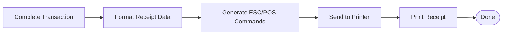

**Figure 1.3: Use Case Overview Diagram**

---

**Figure A.1: Electron.js Desktop Architecture Diagram**

---

**Figure C.1: IPC Communication Diagram**

**Key IPC Channels:**

- **Authentication:** `auth:login`, `auth:logout`, `auth:validate-token`
- **Staff Management:** `staff:create`, `staff:update`, `staff:list`
- **Student Management:** `student:create`, `student:update`, `student:search`
- **Book Management:** `book:create`, `book:update`, `book-copy:add`
- **Circulation:** `circulation:issue`, `circulation:return`, `circulation:renew`
- **Reports:** `report:generate`, `report:export`
- **Barcode:** `barcode:scan`, `barcode:validate`

---

**Simplified IPC Flow:**

---

**Figure F.1: Barcode Scanner Integration Diagram**

**Barcode Operations:**
- **Book Issue:** Scan student ID → Scan book accession number
- **Book Return:** Scan book accession number
- **Student Lookup:** Scan student register number
- **Book Search:** Scan ISBN

**Hardware:** USB barcode scanner (keyboard emulation mode, plug-and-play)

---

**Figure G.1: Thermal Printer Integration Diagram**

**Receipt Types:**
- **Issue Receipt:** Student name, book title, issue date, due date
- **Return Receipt:** Student name, book title, return date, fine amount
- **Fine Receipt:** Student name, fine amount, payment date, receipt number

**Hardware:** Thermal printer (USB/Bluetooth, ESC/POS support, 58mm/80mm)

---

**Figure H.1: Desktop Application Deployment Diagram**

**Deployment Components:**
- **Installer:** Windows .exe created with `electron-builder`
- **Application:** `C:\Program Files\GPTK Library Management System`
- **Database:** `AppData\Roaming\gptk-library-system\library.db`
- **Configuration:** `config.json` (settings, printer config)
- **Logs:** Audit logs and error logs

**System Requirements:** Windows 10/11, 4GB RAM, 500MB disk space

---

**Figure B.1: SQLite Database Schema Diagram**

**Database Tables:** 8 tables (staff, students, books, book_copies, circulation, fines, audit_logs, config)

**Key Relationships:**
- Students borrow book copies through circulation
- Staff manage all operations and are logged in audit_logs
- Fines are generated from overdue circulation records

