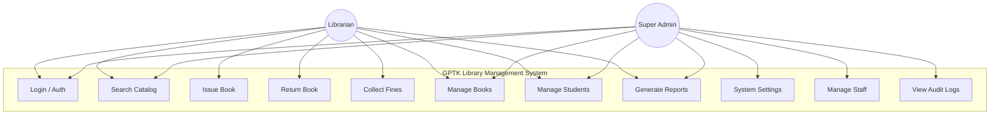
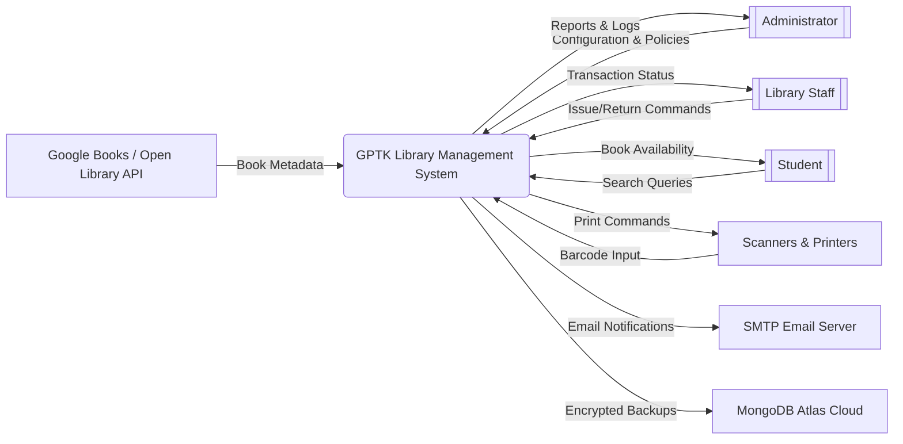

# GPTK Library Management System (LMS)
## Requirement Phase Documents

## 1. Introduction

### 1.1 Purpose
The purpose of this Software Requirements Specification (SRS) is to describe the functional and non-functional requirements for the **GPTK Library Management System (LMS)**. This document serves as a guide for developers, quality assurance testers, and project stakeholders to ensure that the final product meets the specified needs. It covers the system's intended behavior, interface designs, constraints, and data structures.

### 1.2 Scope
The GPTK LMS is a desktop-based application developed using Electron.js, React, and Node.js. It is designed to modernize and automate the operations of the GPTK Library. The system facilitates:
-   **Catalog Management**: Adding, editing, and tracking books.
-   **Circulation Control**: Managing issues, returns, and renewals.
-   **Student Database**: Maintaining records of library members.
-   **Financial Oversight**: Tracking fines and generating receipts.
-   **Reporting**: Providing real-time analytics on inventory and utilization.
The system operates primarily offline (Local-First) but includes cloud synchronization capabilities for data backup.

### 1.3 Definitions, Acronyms, and Abbreviations
-   **LMS**: Library Management System.
-   **SRS**: Software Requirements Specification.
-   **RBAC**: Role-Based Access Control (Admin vs. Staff).
-   **ISBN**: International Standard Book Number.
-   **Electron**: A framework for building native applications with web technologies.
-   **SPA**: Single Page Application.
-   **HOD**: Head of Department.

---

## 2. Overall Description

### 2.1 Product Perspective
Electronic management of library resources is essential for efficiency. The GPTK LMS replaces manual ledger systems with a streamlined digital interface. It is a self-contained product that integrates with:
-   **Local File System**: For storing the SQLite database and logs.
-   **MongoDB Atlas (Optional)**: For cloud backups.
-   **SMTP Server**: For sending email notifications.

### 2.2 Product Functions
The major functions of the system include:
1.  **Authentication**: Secure login with RBAC.
2.  **Inventory Management**: Full lifecycle management of books (Acquisition to Disposal).
3.  **Circulation**: Barcode-enabled Issue, Return, and Renewal processes.
4.  **Fine Management**: Automatic calculation of overdue/damage fines.
5.  **User Management**: Administration of Staff and Student profiles.
6.  **Analytics**: Dashboard metrics and downloadable PDF reports.

### 2.3 User Characteristics
-   **Administrator (Root/Admin)**: Technical or managerial staff responsible for system configuration, policy setting, and staff oversight.
-   **Library Staff**: Operational staff responsible for daily transactions (issues/returns). Expected to have basic computer literacy.
-   **Student**: Indirect users who receive value via emails and efficient service but do not operate the software interface.

### 2.4 Assumptions and Dependencies
-   It is assumed that the college assigns unique Register Numbers to all students.
-   The library has a barcode scanner available for efficient circulation.
-   An active internet connection is required only for external API calls (e.g., retrieving book covers, sending emails).

---

## 3. Functional Requirements

### 3.1 Functional Requirements Table
| Req ID | Feature | Priority | Description |
| :--- | :--- | :--- | :--- |
| **FR-001** | **Authentication** | High | System must support RBAC (Admins/Staff) with secure Login/Logout. |
| **FR-002** | **Dashboard** | Medium | Display real-time KPI cards and connection status. |
| **FR-003** | **Book Management** | High | CRUD operations for Books, Copy Management, and Bulk Import. |
| **FR-004** | **Student Management** | High | Register, Edit, Block, and Promote students. |
| **FR-005** | **Circulation (Issue)** | Critical | Issue books to valid students after liability checks. |
| **FR-006** | **Circulation (Return)** | Critical | Process returns, calculate overdue fines, and handle damaged books. |
| **FR-007** | **Fines & Payments** | High | Track student liabilities and generate fee receipts. |
| **FR-008** | **Reports** | Medium | Generate daily/monthly Transaction and Inventory reports. |
| **FR-009** | **Profile Management** | Low | Allow staff to change their own passwords. |
| **FR-010** | **System Settings** | High | Configure Fine Rates, Backup rules, and Hardware (Printers/Scanners). |
| **FR-011** | **Backup & Sync** | Critical | Automated local backups and optional Cloud Sync (MongoDB). |
| **FR-012** | **Audit Logging** | High | Log all critical data changes for security auditing. |

### 3.2 Detailed Functional Requirements

#### 3.2.1 Navigation & Layout
-   **Sidebar**: Context-Aware, RBAC Filtering, Collapsible.
-   **Header**: Personalization (Font/Theme), User Profile, Logout.
-   **Footer**: Copyright and version info.

#### 3.2.2 Public Routes
-   **Landing Page**: Dual-Language, Accessibility controls.
-   **Login**: Unified access, visual feedback, session management.
-   **Forgot Password**: OTP-based recovery.

#### 3.2.3 Dashboard Modules
-   **Dashboard Home**: KPI Cards, Visual Analytics, Recent Events.
-   **Catalog Management**: Search, Filters, Smart Table, Bulk Import/Export, Physical Copy Management.
-   **Student Management**: Smart Table, Bulk Promote/Demote, CRUD Operations.
-   **Department Management**: Manage Departments, HOD Signatures.
-   **Circulation Module**: High-performance Issue (F1), Return (F2), Renew (F3) tabs.
-   **Financial Management**: Track fines, generate receipts, waivers.
-   **Staff Management**: RBAC assignment, Security Lifecycle.
-   **Admin Management**: Root protection, Broadcast notifications.
-   **Audit Logs**: Immutable system logs.
-   **Policy Manager**: Borrowing rules, Fine rates.
-   **Settings Manager**: Appearance, Hardware (Scanner/Printer), Data Sync.
-   **System Health**: Real-time diagnostics.

---

## 4. Non-Functional Requirements

### 4.1 Non-Functional Requirements Table
| Req ID | Category | Priority | Description |
| :--- | :--- | :--- | :--- |
| **NFR-001** | **Performance** | High | Dashboard load < 2s; Scanner input < 100ms. |
| **NFR-002** | **Availability** | Critical | 100% Offline functionality for core circulation. |
| **NFR-003** | **Reliability** | High | Zero data corruption on crash (WAL mode); Automated backups. |
| **NFR-004** | **Security** | Critical | Bcrypt password hashing; Role-Based Access Control (RBAC). |
| **NFR-005** | **Usability** | Medium | Accessibility (High Contrast) and Function Key support. |
| **NFR-006** | **Scalability** | Medium | Support 50,000+ Book records without UI lag. |
| **NFR-007** | **Compliance** | High | Audit logs for all financial/security actions. |
| **NFR-008** | **Portability** | Low | Portable `AppData` structure for easy migration. |

### 4.2 Performance
-   **Response Time**: Dashboard load < 2s.
-   **Scanner Input**: Barcode processing < 100ms.
-   **Database**: Verify Borrower queries < 50ms.

### 4.3 Reliability & Availability
-   **Offline Mode**: 100% offline functionality.
-   **Crash Recovery**: SQLite WAL mode.
-   **Backup**: Automated smart backup.

### 4.4 Security
-   **Hashing**: Bcrypt for passwords.
-   **RBAC**: API endpoint verification.
-   **Config Locking**: Critical settings protected.

### 4.5 Usability
-   **Accessibility**: High Contrast, Font Scaling.
-   **Keyboard Support**: F1-F3 function keys.
-   **Localization**: English/Kannada.

---

## 5. External Interfaces

### 5.1 User Interfaces
-   **GUI Framework**: React.js with Custom Design System.
-   **Style Guide**: Clean & Minimalist, Dark/Light mode.
-   **Responsiveness**: Optimized for 1366x768+.

### 5.2 Hardware Interfaces
-   **Barcode Scanners**: USB HID support.
-   **Printers**: Thermal (58mm/80mm) and A4 Laser/Inkjet.

### 5.3 Software Interfaces
-   **OS**: Windows API.
-   **Database**: SQLite3.
-   **Email**: SMTP Servers.

### 5.4 Communications Interfaces
-   **Local Loopback**: HTTP/WS to localhost.
-   **Cloud Sync**: HTTPS (TLS 1.2+).
-   **APIs**: Google Books / Open Library.

---

## 6. Constraints
-   **OS Compatibility**: Targeted primarily for Windows 10/11 environments.
-   **Offline First**: Must function fully without an internet connection.
-   **Hardware**: Minimum 4GB RAM.
-   **Regulatory & Standards**: Data Privacy (GDPR principles), Financial Auditability.
-   **Technical Constraints**: Single Instance only, Port Availability (default 3001).

---

## 7. Required Diagrams

### 7.1 System Use Case Diagram

### 7.2 System Context Diagram

