# System Design Diagrams

This document consolidates the key system design diagrams and tables for the GPTK Library Management System (LMS).

## 1. System Context Diagram (Level 0 DFD)
This diagram illustrates the high-level boundaries of the LMS and its interactions with external entities.

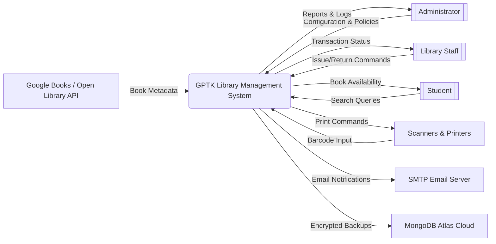
```mermaid
graph LR
    %% Central System
    System(GPTK Library Management System)

    %% External Entities (Users)
    Admin[[Administrator]]
    Staff[[Library Staff]]
    Student[[Student]]

    %% External Systems (Software/Hardware)
    Google[Google Books / Open Library API]
    Cloud[MongoDB Atlas Cloud]
    SMTP[SMTP Email Server]
    Hardware[Scanners & Printers]

    %% Data Flows (Inbound)
    Admin -->|Configuration & Policies| System
    Staff -->|Issue/Return Commands| System
    Student -->|Search Queries| System
    Hardware -->|Barcode Input| System
    Google -->|Book Metadata| System

    %% Data Flows (Outbound)
    System -->|Reports & Logs| Admin
    System -->|Transaction Status| Staff
    System -->|Book Availability| Student
    System -->|Print Commands| Hardware
    System -->|Email Notifications| SMTP
    System -->|Encrypted Backups| Cloud
```

---

## 2. Use Case Diagram
Visualizes the primary interactions between the three key Actors (Admin, Staff, Student) and the System's major Use Cases.

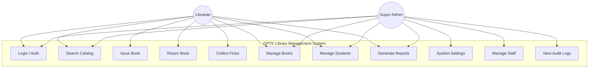
```mermaid
graph TD
    %% Actors
    Admin((Super Admin))
    Staff((Librarian))

    %% Boundary
    subgraph "GPTK Library Management System"
        %% Common
        UC_Login[Login / Auth]
        UC_Search[Search Catalog]

        %% Circulation
        UC_Issue[Issue Book]
        UC_Return[Return Book]
        UC_Fine[Collect Fines]

        %% Management
        UC_MgmtBook[Manage Books]
        UC_MgmtStud[Manage Students]
        UC_Report[Generate Reports]
        
        %% Admin Only
        UC_Config[System Settings]
        UC_Staff[Manage Staff]
        UC_Audit[View Audit Logs]
    end

    %% Relationships
    %% Admin
    Admin --> UC_Login
    Admin --> UC_Search
    Admin --> UC_MgmtBook
    Admin --> UC_MgmtStud
    Admin --> UC_Config
    Admin --> UC_Staff
    Admin --> UC_Report
    Admin --> UC_Audit

    %% Staff
    Staff --> UC_Login
    Staff --> UC_Search
    Staff --> UC_Issue
    Staff --> UC_Return
    Staff --> UC_Fine
    Staff --> UC_MgmtBook
    Staff --> UC_MgmtStud
    Staff --> UC_Report
```

---

## 3. Requirement Traceability Matrix (RTM)
Mapping of Functional Requirements to specific Use Cases and their Implementation Status.

| Req ID | Feature | Related Use Case | Status | Test Case Ref |
| :--- | :--- | :--- | :--- | :--- |
| **FR-001** | Authentication & RBAC | UC_Login | Implemented | TC-AUTH-01 |
| **FR-002** | Dashboard & KPI | N/A (UI) | Implemented | TC-DASH-01 |
| **FR-003** | Book Management | UC_MgmtBook | Implemented | TC-BOOK-01 |
| **FR-004** | Student Management | UC_MgmtStud | Implemented | TC-STUD-01 |
| **FR-005** | Circulation: Issue | UC_Issue | Implemented | TC-CIRC-01 |
| **FR-006** | Circulation: Return | UC_Return | Implemented | TC-CIRC-02 |
| **FR-007** | Fines & Payments | UC_Fine | Implemented | TC-FINE-01 |
| **FR-008** | Reports Generation | UC_Report | Implemented | TC-RPT-01 |
| **FR-009** | Profile Management | UC_Login | Implemented | TC-PROF-01 |
| **FR-010** | System Configuration | UC_Config | Implemented | TC-CONF-01 |
| **FR-011** | Backup & Cloud Sync | UC_Config | Implemented | TC-BACK-01 |
| **FR-012** | Audit Logging | UC_Audit | Implemented | TC-AUDIT-01 |

---

## 4. Activity Diagram (Circulation Cycle)
Detailed workflow for the core Issue and Return processes.

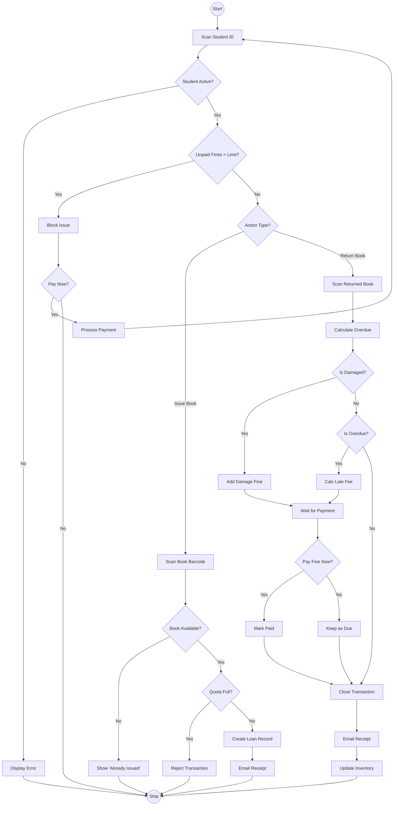
```mermaid
graph TD
    Start((Start)) --> Scan[Scan Student ID]
    Scan --> CheckSt{Student Active?}
    
    CheckSt -- No --> Err1[Display Error] --> End((Stop))
    CheckSt -- Yes --> CheckFine{Unpaid Fines > Limit?}
    
    CheckFine -- Yes --> Block[Block Issue] --> Pay{Pay Now?}
    Pay -- Yes --> ProcessPay[Process Payment] --> Scan
    Pay -- No --> End
    
    CheckFine -- No --> SelectMode{Action Type?}
    
    %% ISSUE BRANCH
    SelectMode -- Issue Book --> ScanBk[Scan Book Barcode]
    ScanBk --> Avail{Book Available?}
    Avail -- No --> Err2[Show 'Already Issued'] --> End
    Avail -- Yes --> Limit{Quota Full?}
    Limit -- Yes --> Reject[Reject Transaction] --> End
    Limit -- No --> Issue[Create Loan Record]
    Issue --> PrtIss[Email Receipt] --> End
    
    %% RETURN BRANCH
    SelectMode -- Return Book --> ScanRet[Scan Returned Book]
    ScanRet --> Calc[Calculate Overdue]
    Calc --> DMG{Is Damaged?}
    
    DMG -- Yes --> AddFine[Add Damage Fine] --> TotalWait
    DMG -- No --> Overdue{Is Overdue?}
    
    Overdue -- Yes --> CalcDays[Calc Late Fee] --> TotalWait
    Overdue -- No --> Close[Close Transaction]
    
    TotalWait[Wait for Payment] --> PayRet{Pay Fine Now?}
    
    PayRet -- Yes --> ClearFine[Mark Paid] --> Close
    PayRet -- No --> KeepDebt[Keep as Due] --> Close
    
    Close --> PrtRet[Email Receipt] --> Restock[Update Inventory] --> End
```

---

## 5. Flowchart (System Master Workflow)
High-level flow from application startup to major modules.

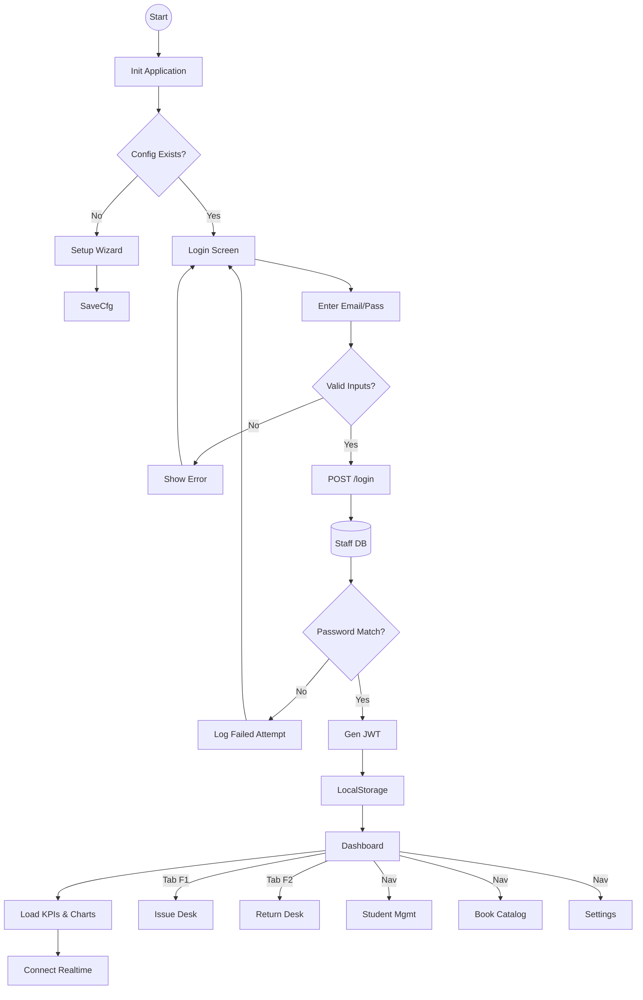
```mermaid
graph TD
    %% --- ENTRY PHASE ---
    Start((Start)) --> AppLoad[Init Application]
    AppLoad --> ChkSetup{Config Exists?}
    ChkSetup -- No --> FirstRun[Setup Wizard] --> SaveCfg
    ChkSetup -- Yes --> LoginUI[Login Screen]
    
    %% --- AUTHENTICATION ---
    LoginUI --> Creds[Enter Email/Pass]
    Creds --> AuthVal{Valid Inputs?}
    AuthVal -- No --> AuthErr[Show Error] --> LoginUI
    AuthVal -- Yes --> API_Auth[POST /login]
    
    API_Auth --> DB_A[(Staff DB)]
    DB_A --> HashCheck{Password Match?}
    HashCheck -- No --> AuthFail[Log Failed Attempt] --> LoginUI
    HashCheck -- Yes --> Token[Gen JWT] --> Store[LocalStorage] --> Dash[Dashboard]

    %% --- DASHBOARD HUB ---
    Dash --> Parallel[Load KPIs & Charts]
    Parallel --> Socket[Connect Realtime]
    
    Dash -->|Tab F1| Circ_Iss[Issue Desk]
    Dash -->|Tab F2| Circ_Ret[Return Desk]
    Dash -->|Nav| Ppl_Mgmt[Student Mgmt]
    Dash -->|Nav| Bk_Mgmt[Book Catalog]
    Dash -->|Nav| Sys_Conf[Settings]
```

---

## 6. Data Flow Diagram (DFD Level 1)
Detailed data flow showing interactions between internal processes and data stores.

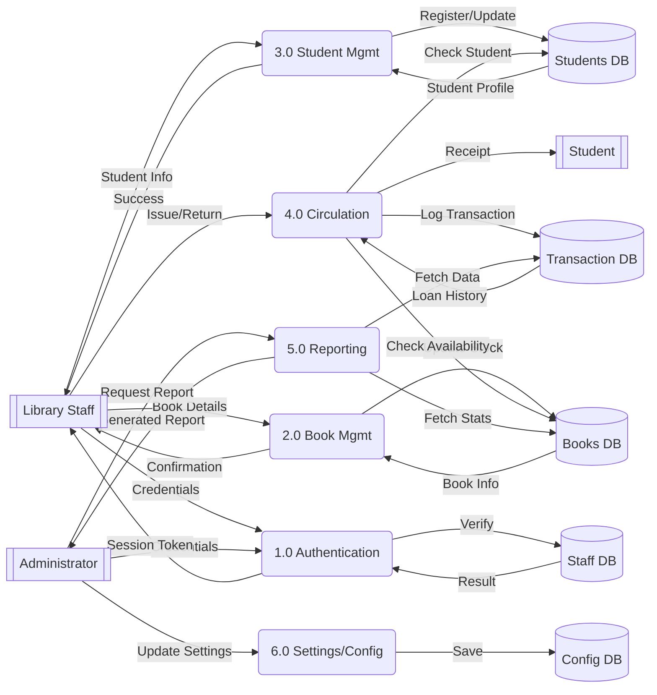
```mermaid
graph LR
    %% Entities
    Staff[[Library Staff]]
    Student[[Student]]
    Admin[[Administrator]]

    %% Processes
    P1(1.0 Authentication)
    P2(2.0 Book Mgmt)
    P3(3.0 Student Mgmt)
    P4(4.0 Circulation)
    P5(5.0 Reporting)
    P6(6.0 Settings/Config)

    %% Data Stores
    DS1[(Staff DB)]
    DS2[(Books DB)]
    DS3[(Students DB)]
    DS4[(Transaction DB)]
    DS5[(Config DB)]

    %% Flow: Auth
    Staff -->|Credentials| P1
    Admin -->|Credentials| P1
    P1 -->|Verify| DS1
    DS1 -->|Result| P1
    P1 -->|Session Token| Staff

    %% Flow: Book Mgmt
    Staff -->|Book Details| P2
    P2 -->|Update Stock| DS2
    DS2 -->|Book Info| P2
    P2 -->|Confirmation| Staff

    %% Flow: Student Mgmt
    Staff -->|Student Info| P3
    P3 -->|Register/Update| DS3
    DS3 -->|Student Profile| P3
    P3 -->|Success| Staff

    %% Flow: Circulation
    Staff -->|Issue/Return| P4
    P4 -->|Check Availability| DS2
    P4 -->|Check Student| DS3
    P4 -->|Log Transaction| DS4
    DS4 -->|Loan History| P4
    P4 -->|Receipt| Student

    %% Flow: Reports
    Admin -->|Request Report| P5
    P5 -->|Fetch Data| DS4
    P5 -->|Fetch Stats| DS2
    P5 -->|Generated Report| Admin

    %% Flow: Config
    Admin -->|Update Settings| P6
    P6 -->|Save| DS5
```

---

## 7. System Architecture Diagram
This logical diagram illustrates the Local-First, Hybrid Architecture of the application.

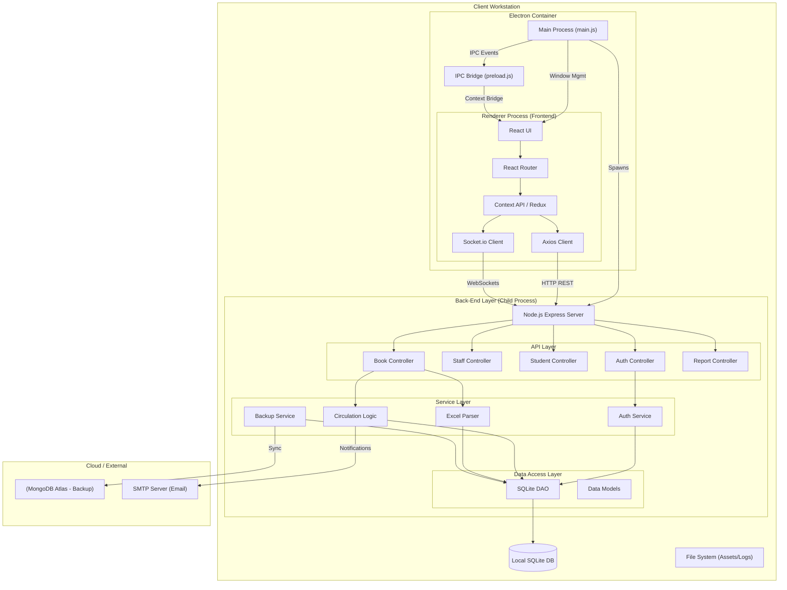
```mermaid
graph TD
    subgraph "Client Workstation"
        subgraph "Electron Container"
            Main["Main Process (main.js)"]
            IPC["IPC Bridge (preload.js)"]
            
            subgraph "Renderer Process (Frontend)"
                UI[React UI]
                Router[React Router]
                State["Context API / Redux"]
                Axios[Axios Client]
                SocketC["Socket.io Client"]
            end
        end
        
        subgraph "Back-End Layer (Child Process)"
            Server[Node.js Express Server]
            
            subgraph "API Layer"
                AuthC[Auth Controller]
                StaffC[Staff Controller]
                StudC[Student Controller]
                BookC[Book Controller]
                RepC[Report Controller]
            end
            
            subgraph "Service Layer"
                AuthS[Auth Service]
                CircS[Circulation Logic]
                ExcelS[Excel Parser]
                BackupS[Backup Service]
            end
            
            subgraph "Data Access Layer"
                DAO[SQLite DAO]
                Models[Data Models]
            end
        end
        
        DB[(Local SQLite DB)]
        FS["File System (Assets/Logs)"]
    end
    
    subgraph "Cloud / External"
        Mongo["(MongoDB Atlas - Backup)"]
        SMTP["SMTP Server (Email)"]
    end

    %% -- Connections --
    Main -- "Spawns" --> Server
    Main -- "Window Mgmt" --> UI
    
    UI --> Router
    Router --> State
    State --> Axios
    State --> SocketC
    
    Axios -- "HTTP REST" --> Server
    SocketC -- "WebSockets" --> Server
    
    Server --> AuthC
    Server --> StaffC
    Server --> StudC
    Server --> BookC
    Server --> RepC
    
    AuthC --> AuthS
    BookC --> ExcelS
    BookC --> CircS
    
    AuthS --> DAO
    CircS --> DAO
    ExcelS --> DAO
    BackupS --> DAO
    
    DAO --> DB
    BackupS -- "Sync" --> Mongo
    CircS -- "Notifications" --> SMTP
    
    Main -- "IPC Events" --> IPC
    IPC -- "Context Bridge" --> UI
```

---

## 8. Class Diagram
Represents the object-oriented structure mapping Frontend Components to Backend Controllers.

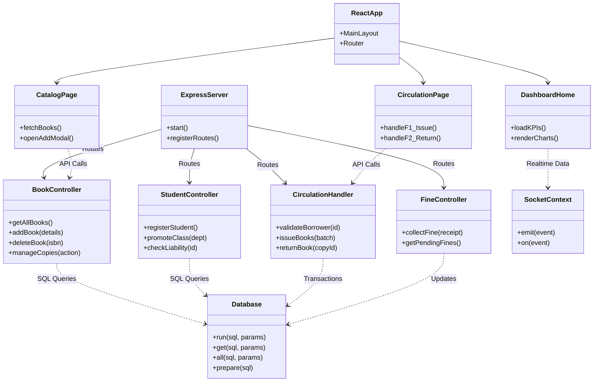
```mermaid
classDiagram
    %% --- Backend Structure ---
    class ExpressServer {
        +start()
        +registerRoutes()
    }
    
    class Database {
        +run(sql, params)
        +get(sql, params)
        +all(sql, params)
        +prepare(sql)
    }

    class BookController {
        +getAllBooks()
        +addBook(details)
        +deleteBook(isbn)
        +manageCopies(action)
    }

    class StudentController {
        +registerStudent()
        +promoteClass(dept)
        +checkLiability(id)
    }

    class CirculationHandler {
        +validateBorrower(id)
        +issueBooks(batch)
        +returnBook(copyId)
    }

    class FineController {
        +collectFine(receipt)
        +getPendingFines()
    }

    %% Relationships
    ExpressServer --> BookController : Routes
    ExpressServer --> StudentController : Routes
    ExpressServer --> CirculationHandler : Routes
    ExpressServer --> FineController : Routes
    
    BookController ..> Database : SQL Queries
    StudentController ..> Database : SQL Queries
    CirculationHandler ..> Database : Transactions
    FineController ..> Database : Updates

    %% --- Frontend Structure ---
    class ReactApp {
        +MainLayout
        +Router
    }

    class SocketContext {
        +emit(event)
        +on(event)
    }

    class CatalogPage {
        +fetchBooks()
        +openAddModal()
    }

    class CirculationPage {
        +handleF1_Issue()
        +handleF2_Return()
    }

    class DashboardHome {
        +loadKPIs()
        +renderCharts()
    }

    %% Frontend Relationships
    ReactApp --> DashboardHome
    ReactApp --> CatalogPage
    ReactApp --> CirculationPage
    
    CatalogPage ..> BookController : API Calls
    CirculationPage ..> CirculationHandler : API Calls
    DashboardHome ..> SocketContext : Realtime Data
```

---

## 9. ER Diagram (Entity Relationship Diagram)
Visualizes the Relational Database Schema.

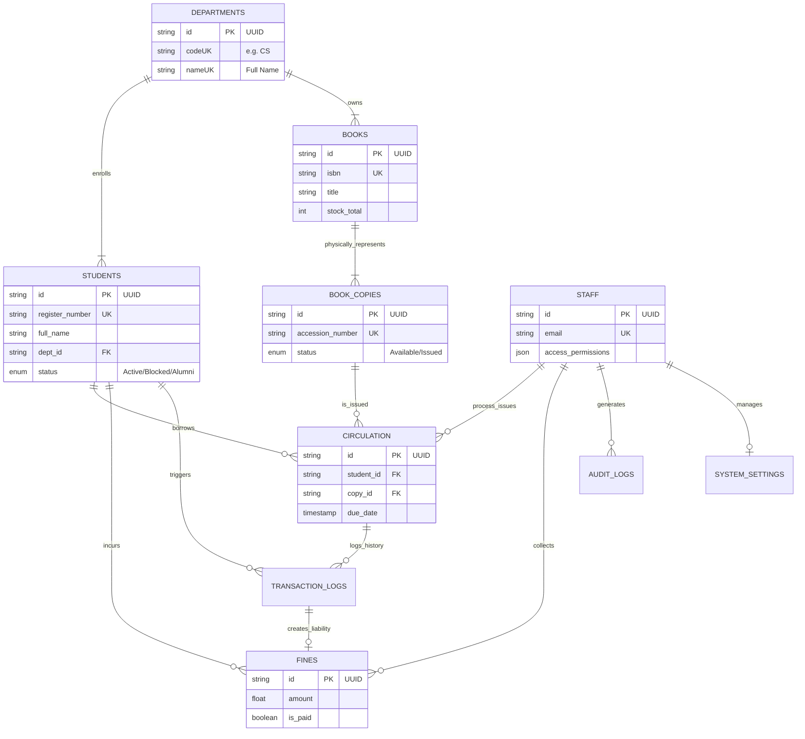
```mermaid
erDiagram
    DEPARTMENTS ||--|{ STUDENTS : "enrolls"
    DEPARTMENTS ||--|{ BOOKS : "owns"
    
    STUDENTS ||--o{ CIRCULATION : "borrows"
    STUDENTS ||--o{ FINES : "incurs"
    STUDENTS ||--o{ TRANSACTION_LOGS : "triggers"
    
    BOOKS ||--|{ BOOK_COPIES : "physically_represents"
    BOOK_COPIES ||--o{ CIRCULATION : "is_issued"
    
    STAFF ||--o{ CIRCULATION : "process_issues"
    STAFF ||--o{ FINES : "collects"
    STAFF ||--o{ AUDIT_LOGS : "generates"
    STAFF ||--o| SYSTEM_SETTINGS : "manages"
    
    CIRCULATION ||--o{ TRANSACTION_LOGS : "logs_history"
    TRANSACTION_LOGS ||--o| FINES : "creates_liability"
    
    DEPARTMENTS {
        string id PK "UUID"
        string codeUK "e.g. CS"
        string nameUK "Full Name"
    }
    
    STUDENTS {
        string id PK "UUID"
        string register_number UK
        string full_name
        string dept_id FK
        enum status "Active/Blocked/Alumni"
    }
    
    STAFF {
        string id PK "UUID"
        string email UK
        json access_permissions
    }
    
    BOOKS {
        string id PK "UUID"
        string isbn UK
        string title
        int stock_total
    }
    
    BOOK_COPIES {
        string id PK "UUID"
        string accession_number UK
        enum status "Available/Issued"
    }
    
    CIRCULATION {
        string id PK "UUID"
        string student_id FK
        string copy_id FK
        timestamp due_date
    }
    
    FINES {
        string id PK "UUID"
        float amount
        boolean is_paid
    }
```

---

## 10. Component Diagram
Shows the physical components of the deployment, focusing on the desktop application structure.

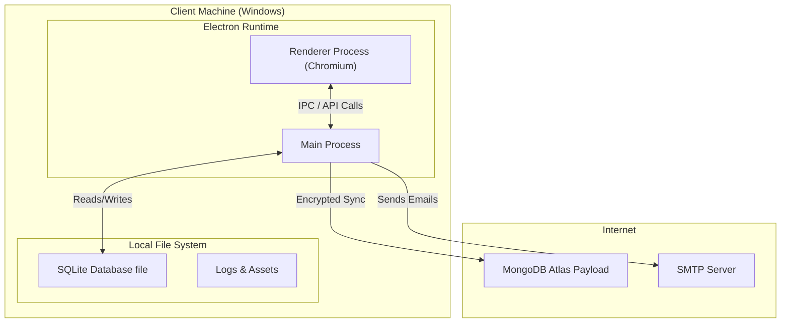
```mermaid
graph TD
    subgraph Client["Client Machine (Windows)"]
        direction TB
        subgraph Electron["Electron Runtime"]
            Main["Main Process"]
            Renderer["Renderer Process (Chromium)"]
        end
        
        subgraph FS["Local File System"]
             SQLite["SQLite Database file"]
             Logs["Logs & Assets"]
        end
        
        Main <-->|Reads/Writes| SQLite
        Renderer <-->|IPC / API Calls| Main
    end
    
    subgraph Cloud["Internet"]
        Mongo["MongoDB Atlas Payload"]
        SMTP["SMTP Server"]
    end
    
    Main -->|Encrypted Sync| Mongo
    Main -->|Sends Emails| SMTP
```

---

## 11. Sequence Diagram
This diagram models the dynamic behavior of the **Issue Book** process, tracing the execution flow across system layers.

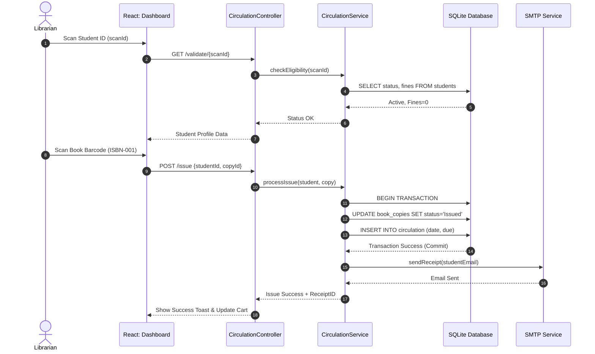
```mermaid
sequenceDiagram
    autonumber
    actor Staff as Librarian
    participant UI as React: Dashboard
    participant API as CirculationController
    participant Svc as CirculationService
    participant DB as SQLite Database
    participant Email as SMTP Service

    Staff->>UI: Scan Student ID (scanId)
    UI->>API: GET /validate/{scanId}
    API->>Svc: checkEligibility(scanId)
    Svc->>DB: SELECT status, fines FROM students
    DB-->>Svc: Active, Fines=0
    Svc-->>API: Status OK
    API-->>UI: Student Profile Data

    Staff->>UI: Scan Book Barcode (ISBN-001)
    UI->>API: POST /issue {studentId, copyId}
    API->>Svc: processIssue(student, copy)
    
    Svc->>DB: BEGIN TRANSACTION
    Svc->>DB: UPDATE book_copies SET status='Issued'
    Svc->>DB: INSERT INTO circulation (date, due)
    DB-->>Svc: Transaction Success (Commit)
    
    Svc->>Email: sendReceipt(studentEmail)
    Email-->>Svc: Email Sent
    
    Svc-->>API: Issue Success + ReceiptID
    API-->>UI: Show Success Toast & Update Cart
```

---

## 12. Communication (Collaboration) Diagram
Structure diagram showing objects involved in the **Return Book** process and the messages they exchange.

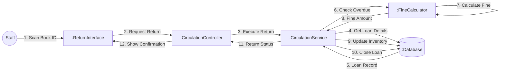
```mermaid
graph LR
    %% Objects
    Staff((:Staff))
    UI[:ReturnInterface]
    Ctrl[:CirculationController]
    Svc[:CirculationService]
    Rule[:FineCalculator]
    DB[(:Database)]

    %% Links & Messages
    Staff -- 1. Scan Book ID --> UI
    UI -- 2. Request Return --> Ctrl
    Ctrl -- 3. Execute Return --> Svc
    
    Svc -- 4. Get Loan Details --> DB
    DB -- 5. Loan Record --> Svc
    
    Svc -- 6. Check Overdue --> Rule
    Rule -- 7. Calculate Fine --> Rule
    Rule -- 8. Fine Amount --> Svc
    
    Svc -- 9. Update Inventory --> DB
    Svc -- 10. Close Loan --> DB
    
    Svc -- 11. Return Status --> Ctrl
    Ctrl -- 12. Show Confirmation --> UI
```

---

## 13. State Diagram (Book Lifecycle)
Models the state transitions of a **Book Copy** entity throughout the circulation process.

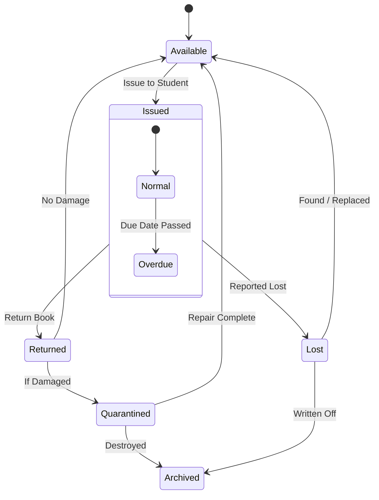
```mermaid
stateDiagram-v2
    [*] --> Available
    
    Available --> Issued: Issue to Student
    Issued --> Returned: Return Book
    
    Returned --> Quarantined: If Damaged
    Quarantined --> Available: Repair Complete
    Quarantined --> Archived: Destroyed
    
    Returned --> Available: No Damage
    
    Issued --> Lost: Reported Lost
    Lost --> Available: Found / Replaced
    Lost --> Archived: Written Off
    
    state Issued {
        [*] --> Normal
        Normal --> Overdue: Due Date Passed
    }
```

---

## 14. Deployment Diagram
Illustrates the physical deployment of artifacts on hardware nodes.

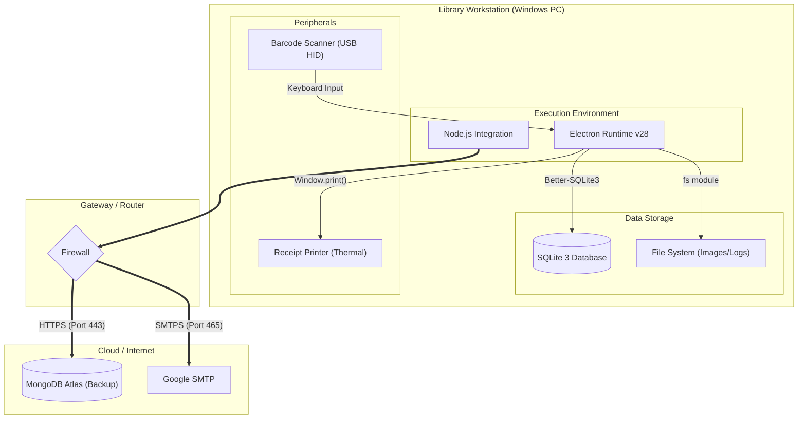
```mermaid
graph TD
    subgraph "Library Workstation (Windows PC)"
        direction TB
        subgraph "Execution Environment"
            Electron["Electron Runtime v28"]
            Node["Node.js Integration"]
        end
        
        subgraph "Data Storage"
            SQLite[("SQLite 3 Database")]
            Assets["File System (Images/Logs)"]
        end
        
        subgraph "Peripherals"
            Scanner["Barcode Scanner (USB HID)"]
            Printer["Receipt Printer (Thermal)"]
        end
        
        Electron -->|"Better-SQLite3"| SQLite
        Electron -->|"fs module"| Assets
        Scanner -->|"Keyboard Input"| Electron
        Electron -->|"Window.print()"| Printer
    end
    
    subgraph "Gateway / Router"
        Firewall{"Firewall"}
    end
    
    subgraph "Cloud / Internet"
        Atlas[("MongoDB Atlas (Backup)")]
        Gmail["Google SMTP"]
    end
    
    Node ==> Firewall
    Firewall ==>|"HTTPS (Port 443)"| Atlas
    Firewall ==>|"SMTPS (Port 465)"| Gmail
```

---

## 15. Network Diagram
Depicts the network topology of the deployment within the Library infrastructure.

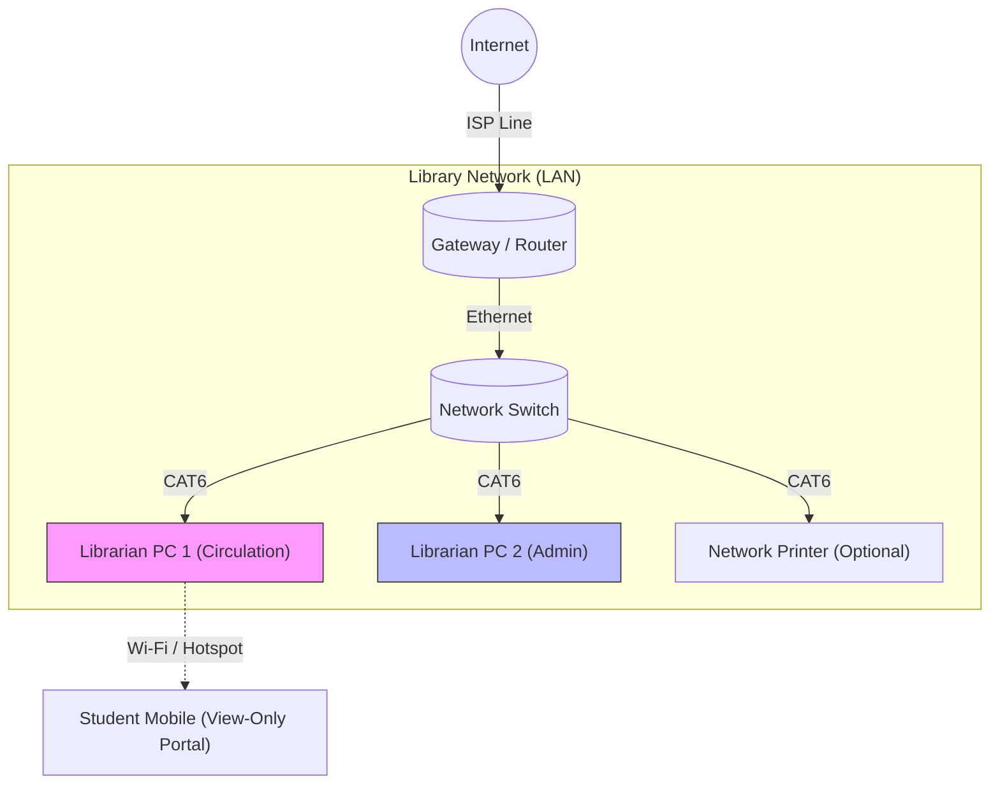
```mermaid
graph TB
    Internet((Internet))
    
    subgraph "Library Network (LAN)"
        Router[("Gateway / Router")]
        Switch[("Network Switch")]
        
        PC1["Librarian PC 1 (Circulation)"]
        PC2["Librarian PC 2 (Admin)"]
        Printer["Network Printer (Optional)"]
    end
    
    Internet -- "ISP Line" --> Router
    Router -- "Ethernet" --> Switch
    Switch -- "CAT6" --> PC1
    Switch -- "CAT6" --> PC2
    Switch -- "CAT6" --> Printer
    
    PC1 -.->|Wi-Fi / Hotspot| StudentDevice["Student Mobile (View-Only Portal)"]
    
    style PC1 fill:#f9f,stroke:#333
    style PC2 fill:#bbf,stroke:#333
```

---

## 16. UI Wireframe Diagram (Main Layout)
Abstraction of the application's primary user interface structure.

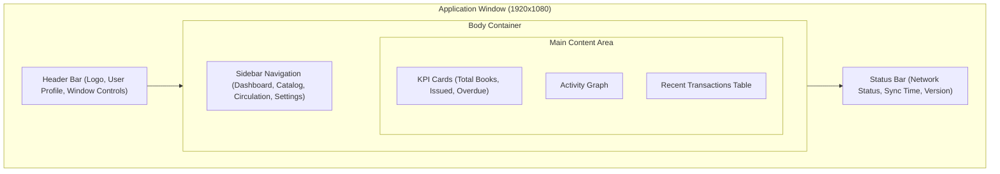
```mermaid
graph TD
    subgraph AppWindow ["Application Window (1920x1080)"]
        Header["Header Bar (Logo, User Profile, Window Controls)"]
        
        subgraph BodyContainer ["Body Container"]
            direction LR
            Sidebar["Sidebar Navigation (Dashboard, Catalog, Circulation, Settings)"]
            
            subgraph MainContent ["Main Content Area"]
                Stats["KPI Cards (Total Books, Issued, Overdue)"]
                Chart["Activity Graph"]
                Table["Recent Transactions Table"]
            end
        end
        
        Footer["Status Bar (Network Status, Sync Time, Version)"]
    end
    
    Header --> BodyContainer
    BodyContainer --> Footer
    Sidebar ~~~ MainContent
```

---

## 17. Navigation / Screen Flow Diagram
Visualizes the screen transitions and user journey states through the application.

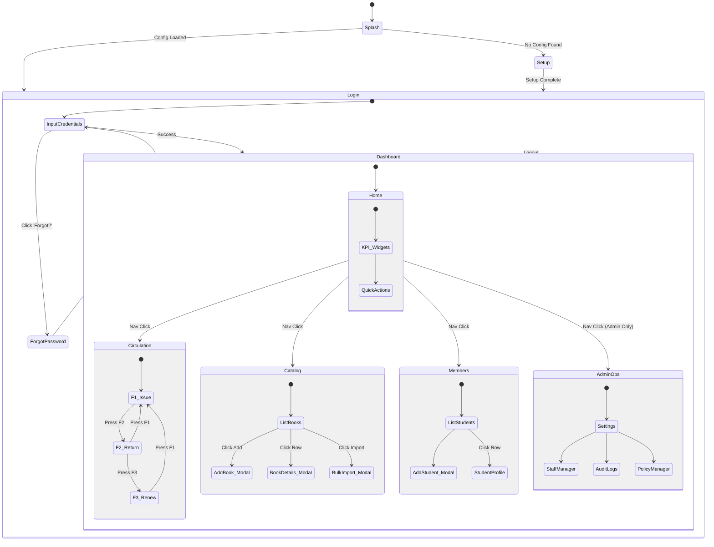
```mermaid
stateDiagram-v2
    [*] --> Splash
    Splash --> Setup: No Config Found
    Splash --> Login: Config Loaded
    
    Setup --> Login: Setup Complete
    
    state Login {
        [*] --> InputCredentials
        InputCredentials --> ForgotPassword: Click 'Forgot?'
        ForgotPassword --> InputCredentials: Reset Complete
        InputCredentials --> Dashboard: Success
    }
    
    state Dashboard {
        [*] --> Home
        
        state Home {
            [*] --> KPI_Widgets
            KPI_Widgets --> QuickActions
        }
        
        state Circulation {
            [*] --> F1_Issue
            F1_Issue --> F2_Return: Press F2
            F2_Return --> F1_Issue: Press F1
            F2_Return --> F3_Renew: Press F3
            F3_Renew --> F1_Issue: Press F1
        }
        
        state Catalog {
            [*] --> ListBooks
            ListBooks --> AddBook_Modal: Click Add
            ListBooks --> BookDetails_Modal: Click Row
            ListBooks --> BulkImport_Modal: Click Import
        }
        
        state Members {
            [*] --> ListStudents
            ListStudents --> AddStudent_Modal
            ListStudents --> StudentProfile: Click Row
        }
        
        state AdminOps {
            [*] --> Settings
            Settings --> StaffManager
            Settings --> AuditLogs
            Settings --> PolicyManager
        }
        
        Home --> Circulation: Nav Click
        Home --> Catalog: Nav Click
        Home --> Members: Nav Click
        Home --> AdminOps: Nav Click (Admin Only)
    }
    
    Dashboard --> Login: Logout
```

---

## 18. Security Architecture Diagram
Illustrates security application layers, including Authentication, RBAC, and Data Protection mechanisms.

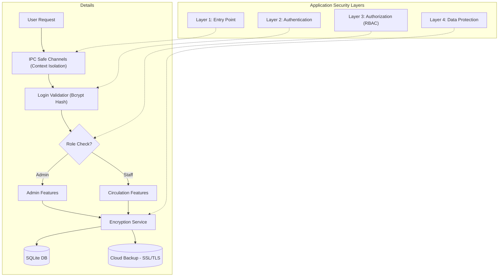
```mermaid
graph TD
    subgraph "Application Security Layers"
        L1["Layer 1: Entry Point"]
        L2["Layer 2: Authentication"]
        L3["Layer 3: Authorization (RBAC)"]
        L4["Layer 4: Data Protection"]
    end

    subgraph "Details"
        U["User Request"] --> IPC["IPC Safe Channels (Context Isolation)"]
        IPC --> Auth["Login Validatior (Bcrypt Hash)"]
        
        Auth --> CheckRole{"Role Check?"}
        CheckRole -- Admin --> AdminFeat["Admin Features"]
        CheckRole -- Staff --> StaffFeat["Circulation Features"]
        
        AdminFeat --> Enc["Encryption Service"]
        StaffFeat --> Enc
        
        Enc --> DB[("SQLite DB")]
        Enc --> Backup[("Cloud Backup - SSL/TLS")]
    end
    
    L1 -.-> IPC
    L2 -.-> Auth
    L3 -.-> CheckRole
    L4 -.-> Enc
```

---

## 19. Data Lifecycle Diagram
Tracks the flow of data from creation and processing to storage and eventual archiving or purging.

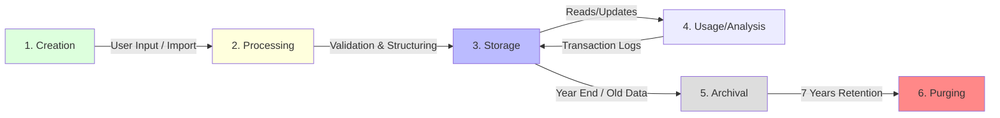
```mermaid
graph LR
    Create[1. Creation]
    Process[2. Processing]
    Store[3. Storage]
    Use[4. Usage/Analysis]
    Archive[5. Archival]
    Purge[6. Purging]

    Create -->|User Input / Import| Process
    Process -->|Validation & Structuring| Store
    Store -->|Reads/Updates| Use
    Use -->|Transaction Logs| Store
    
    Store -->|Year End / Old Data| Archive
    Archive -->|7 Years Retention| Purge
    
    style Create fill:#dfd
    style Process fill:#ffd
    style Store fill:#bbf
    style Archive fill:#ddd
    style Purge fill:#f88
```

---

## 20. CI/CD Pipeline Diagram
Visualizes the automated build and deployment pipeline for the Electron Application.

```mermaid
graph LR
    Dev[Developer]
    Repo[GitHub Repository]
    CI[GitHub Actions CI]
    Build[Build Agent]
    Artifact[Release Artifacts]
    Deploy[Deployment]

    Dev -->|git push| Repo
    Repo -->|Webhook| CI
    
    subgraph "CI Pipeline"
        CI -->|1. Checkout| Check[Checkout Code]
        Check -->|2. Install| Install[npm install]
        Install -->|3. Test| ESLint[Lint & Unit Tests]
        ESLint -->|4. Build| Electron[Electron Builder]
    end
    
    Electron -->|Generic/NSIS| Build
    
    Build -->|Windows .exe| Artifact
    
    Artifact -->|Manual Download| Deploy
    Deploy -->|Install| PC[Staff PC]
```

---

## 21. Version Control Workflow Diagram
Illustrates the Git branching strategy (Git Flow) used for development.

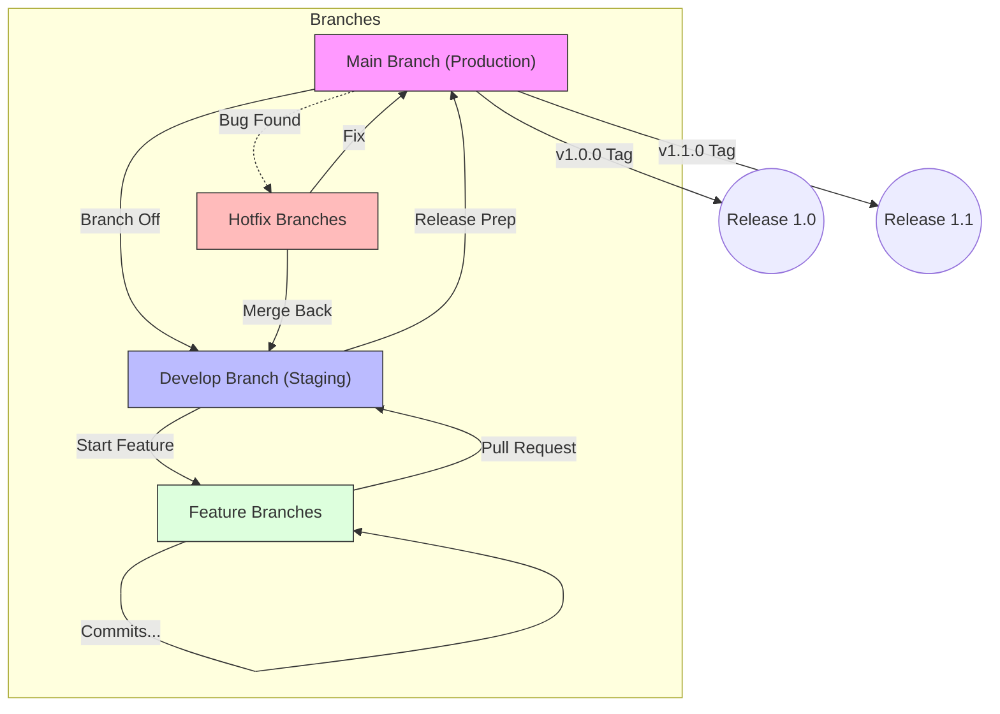
```mermaid
graph TD
    subgraph "Branches"
        Main["Main Branch (Production)"]
        Dev["Develop Branch (Staging)"]
        Feat["Feature Branches"]
        Hothub["Hotfix Branches"]
    end

    %% Time flow from left to right implied or top down
    
    Main -->|v1.0.0 Tag| Rel1((Release 1.0))
    Main -->|Branch Off| Dev
    
    Dev -->|Start Feature| Feat
    Feat -->|Commits...| Feat
    Feat -->|Pull Request| Dev
    
    Dev -->|Release Prep| Main
    Main -->|v1.1.0 Tag| Rel2((Release 1.1))
    
    Main -.->|Bug Found| Hothub
    Hothub -->|Fix| Main
    Hothub -->|Merge Back| Dev
    
    style Main fill:#f9f,stroke:#333
    style Dev fill:#bbf,stroke:#333
    style Feat fill:#dfd,stroke:#333
    style Hothub fill:#fbb,stroke:#333
```
