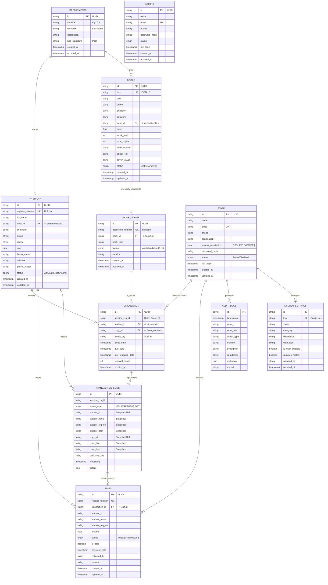

# GPTK Library Management System (LMS)
## Technical & Functional Documentation

**Version:** 2.0 (Live Codebase Analysis)
**Last Updated:** 30/01/2026
**Status:** In Development / Testing

---

## 1. Introduction

### 1.1 Purpose
The purpose of this Software Requirements Specification (SRS) is to describe the functional and non-functional requirements for the **GPTK Library Management System (LMS)**. This document serves as a guide for developers, quality assurance testers, and project stakeholders to ensure that the final product meets the specified needs. It covers the system's intended behavior, interface designs, constraints, and data structures.

### 1.2 Scope
The GPTK LMS is a desktop-based application developed using Electron.js, React, and Node.js. It is designed to modernize and automate the operations of the GPTK Library. The system facilitates:
-   **Catalog Management**: Adding, editing, and tracking books.
-   **Circulation Control**: Managing issues, returns, and renewals.
-   **Student Database**: Maintaining records of library members.
-   **Financial Oversight**: Tracking fines and generating receipts.
-   **Reporting**: Providing real-time analytics on inventory and utilization.
The system operates primarily offline (Local-First) but includes cloud synchronization capabilities for data backup.

### 1.3 Definitions, Acronyms, and Abbreviations
-   **LMS**: Library Management System.
-   **SRS**: Software Requirements Specification.
-   **RBAC**: Role-Based Access Control (Admin vs. Staff).
-   **ISBN**: International Standard Book Number.
-   **Electron**: A framework for building native applications with web technologies.
-   **SPA**: Single Page Application.
-   **HOD**: Head of Department.

### 1.4 References
-   GPTK LMS User Manual.
-   GPTK LMS Test Cases Document.
-   IEEE Std 830-1998: Recommended Practice for Software Requirements Specifications.

---

## 2. Overall Description

### 2.1 Product Perspective
Electronic management of library resources is essential for efficiency. The GPTK LMS replaces manual ledger systems with a streamlined digital interface. It is a self-contained product that integrates with:
-   **Local File System**: For storing the SQLite database and logs.
-   **MongoDB Atlas (Optional)**: For cloud backups.
-   **SMTP Server**: For sending email notifications.

### 2.2 Product Functions
The major functions of the system include:
1.  **Authentication**: Secure login with RBAC.
2.  **Inventory Management**: Full lifecycle management of books (Acquisition to Disposal).
3.  **Circulation**: Barcode-enabled Issue, Return, and Renewal processes.
4.  **Fine Management**: Automatic calculation of overdue/damage fines.
5.  **User Management**: Administration of Staff and Student profiles.
6.  **Analytics**: Dashboard metrics and downloadable PDF reports.

### 2.3 User Characteristics
-   **Administrator (Root/Admin)**: Technical or managerial staff responsible for system configuration, policy setting, and staff oversight.
-   **Library Staff**: Operational staff responsible for daily transactions (issues/returns). Expected to have basic computer literacy.
-   **Student**: Indirect users who receive value via emails and efficient service but do not operate the software interface.

### 2.4 Constraints
-   **OS Compatibility**: Targeted primarily for Windows 10/11 environments.
-   **Offline First**: Must function fully without an internet connection (except for emails/cloud sync).
-   **Hardware**: Requires a minimum of 4GB RAM for smooth Electron performance and a standard barcode scanner.
-   **Regulatory & Standards**:
    -   **Data Privacy**: Student personal data (Phone/Email) must be protected and not exported without authorization.
    -   **Auditability**: Financial transactions (Fines) cannot be deleted, only 'Waived' with remarks, to maintain fiscal integrity.
-   **Technical Constraints**:
    -   **Single Instance**: Only one instance of the application should run at a time to prevent SQLite database locks.
    -   **Port Availability**: Backend requires a free port (default 17221) to function; auto-negotiation or manual override is provided.

### 2.5 Assumptions and Dependencies
-   It is assumed that the college assigns unique Register Numbers to all students.
-   The library has a barcode scanner available for efficient circulation.
-   An active internet connection is required only for external API calls (e.g., retrieving book covers, sending emails).

### 2.6 External Interface Requirements

#### 2.6.1 User Interfaces
-   **GUI Framework**: The interface is built using **React.js** with a custom Design System (CSS Variables for themes).
-   **Style Guide**: Adheres to a "Clean & Minimalist" aesthetic with dark/light mode support.
-   **Responsiveness**: The layout is optimized for Desktop (1366x768 and above) but is fluid enough for 1280x720 screens.
-   **Standard Elements**: Consistent use of Modals for forms, Toasts for notifications, and Data Tables for lists.

#### 2.6.2 Hardware Interfaces
-   **Barcode Scanners**: The system supports standard USB HID Barcode Scanners. Scanned input is treated as keyboard keystrokes ending with `Enter`.
-   **Printers**:
    -   **Thermal Receipt Printers**: 58mm/80mm ESC/POS command compatibility for fine receipts.
    -   **Standard Laser/Inkjet**: A4 PDF generation for reports and ID cards.

#### 2.6.3 Software Interfaces
-   **Operating System**: Relies on Windows API for file system access (`fs` module) and window management.
-   **Database Engine**: Direct interface with **SQLite3** engine via `sqlite3` node module.
-   **Email Clients**: Interfaces with SMTP servers (Gmail/SendGrid/Outlook) via standard TCP ports (587/465).

#### 2.6.4 Communications Interfaces
-   **Local Loopback**: Frontend communicates with Backend via `http://localhost:<port>` and `ws://localhost:<port>`.
-   **Cloud Sync (HTTPS)**: Uses encrypted HTTPS (TLS 1.2+) to communicate with MongoDB Atlas APIs.
-   **Book Metadata APIs**: Connects to Google Books API / Open Library API (JSON over HTTP) to fetch book details by ISBN.

### 2.7 System Use Case Diagram

This diagram visualizes the primary interactions between the three key Actors (Admin, Staff, Student) and the System's major Use Cases.


---

### 2.8 System Context Diagram

This Level 0 Data Flow Diagram (DFD) illustrates the boundaries of the GPTK LMS and its interactions with external entities.


---


## 3. Functional Requirements

This section details the specific functional requirements organized by module.

### 3.0 Requirement Summary Table
| Req ID | Feature | Priority | Description |
| :--- | :--- | :--- | :--- |
| **FR-001** | **Authentication** | High | System must support RBAC (Admins/Staff) with secure Login/Logout. |
| **FR-002** | **Dashboard** | Medium | Display real-time KPI cards and connection status. |
| **FR-003** | **Book Management** | High | CRUD operations for Books, Copy Management, and Bulk Import. |
| **FR-004** | **Student Management** | High | Register, Edit, Block, and Promote students. |
| **FR-005** | **Circulation (Issue)** | Critical | Issue books to valid students after liability checks. |
| **FR-006** | **Circulation (Return)** | Critical | Process returns, calculate overdue fines, and handle damaged books. |
| **FR-007** | **Fines & Payments** | High | Track student liabilities and generate fee receipts. |
| **FR-008** | **Reports** | Medium | Generate daily/monthly Transaction and Inventory reports. |
| **FR-009** | **Profile Management** | Low | Allow staff to change their own passwords. |
| **FR-010** | **System Settings** | High | Configure Fine Rates, Backup rules, and Hardware (Printers/Scanners). |
| **FR-011** | **Backup & Sync** | Critical | Automated local backups and optional Cloud Sync (MongoDB). |
| **FR-012** | **Audit Logging** | High | Log all critical data changes for security auditing. |

### 3.1. Navigation & Layout
The application uses a persistent `MainLayout` wrapper for all dashboard routes.
-   **Sidebar**:
    -   **Context-Aware**: Highlights active route.
    -   **RBAC Filtering**: Hides menu items based on user permissions (e.g., 'Settings' hidden for non-Admins).
    -   **Collapsible**: Toggles between text+icon and icon-only modes for space efficiency.
-   **Header**:
    -   **Personalization**: Font Size, Language, and Theme toggles.
    -   **User Profile**: Displays current user name/role.
    -   **Logout**: Clears local session and redirects to Login.
-   **Footer**:
    -   Displays copyright year dynamic and version info.

### 3.2. Public Routes
-   **Landing Page (`/`)**: Gateway page.
    -   **Features**:
        -   **Dual-Language Support**: Toggle between English and Kannada.
        -   **Appearance Controls**: Font Scalling (85-130%), Theme Toggle (Dark/Light).
        -   **Restricted Access**: Login is restricted to Staff/Admins only.
        -   **Accessibility**: High Contrast mode warning system.
-   **Login (`/login`)**: Unified login for Staff and Admins.
    -   **Features**:
        -   **Unified Access**: Accepts both Staff and Admin email credentials.
        -   **Visual Feedback**: "Shake" animation on invalid credentials.
        -   **Input Validation**: Highlights specific fields (Email vs Password) based on error codes (e.g., `ERR_USER_NOT_FOUND`).
        -   **Session Management**: Stores JWT in `localStorage` ('auth_token') and user details ('user_info').
        -   **UI Controls**: Includes Language, Font, and Theme toggles similar to Landing Page.
-   **Forgot Password (`/forgot-password`)**: OTP-based recovery.
    -   **Workflow**:
        1.  **Identity Verification**: User enters email -> System sends 6-digit OTP (via configured Email Service).
        2.  **OTP Validation**: User enters OTP -> System verifies against DB.
        3.  **Secure Reset**: User sets new password -> System updates hash and revokes temporary OTP.
    -   **Security**:
        -   **Step-Enforcement**: Users cannot jump to Step 3 without passing Step 2.
        -   **Error Handling**: Specific alerts for `ERR_EMAIL_DISABLED` and `ERR_AUTH_OTP_INV`.
-   **Print Report (`/print/report`)**: Dedicated route for printing documents without UI chrome.

### 3.3. Dashboard Modules (`/dashboard/*`)

#### **Dashboard Home (`/dashboard`)**
The central hub for library operations, featuring **Real-Time Updates** via Socket.io.
-   **KPI Cards**:
    -   **Total Books/Students**: Quick access to respective managers.
    -   **Issued Today**: Modal view of day's issues.
    -   **Overdue**: Modal view of active loans past due date.
    -   **Fines**: Total collected amount (paid fines).
    -   **Lost/Damaged**: Count of unavailable inventory.
-   **Visual Analytics**:
    -   **Pie Chart**: Book distribution by Department.
    -   **Bar Chart**: Student strength by Department.
    -   **Trending**: Top 5 most issued books (Vertical Bar).
-   **Recent Activity**: Live stream of the last 10 system audit logs (Admin only).
-   **Role-Based Visibility**: Widgets hide automatically if the user lacks permission (e.g., 'Fines' hidden if no 'CIRCULATION' access).


#### **Catalog Management (`/dashboard/books`)**
The central command center for library inventory. This module lists all bibliographic records and provides granular control over physical copies.

##### **1. Toolbar & Navigation**
-   **Search Bar**:
    -   **Scope**: Performs a real-time "fuzzy" search across **Title**, **Author**, and **ISBN** fields.
    -   **Behavior**: Debounced input triggers backend query (SQL `LIKE %...%`).
-   **Filters**:
    -   **Department**: Dropdown to filter books by specific department (e.g., "Computer Science", "Physics"). defaults to "All Departments".
-   **Sorting**:
    -   **Recently Added**: Sorts by `created_at` (Descending).
    -   **Title (A-Z)**: Alphabetical sort.
    -   **Availability**: Sorts by `available_copies` (High to Low) to quickly identify stocked items.
-   **Action Buttons**:
    -   **Bulk Delete (Dynamic)**: Appears ONLY when one or more books are selected.
    -   **Export**: Opens Export Modal.
    -   **Import**: Opens CSV Import Modal.
    -   **Add Book**: Opens Smart Add Modal.

##### **2. Book List Interface (Smart Table)**
-   **Visuals**:
    -   **Cover Preview**: Hovering over the cover thumbnail expands it for a better view.
    -   **Availability Badge**: Color-coded progress bar:
        -   **Green**: High Availability (>30%).
        -   **Yellow**: Low Stock (<30%).
        -   **Red**: Out of Stock (0 available).
-   **Selection Logic**:
    -   **Single Select**: Checkbox for individual rows.
    -   **Global Select**: Header checkbox offers a **Smart Popup**:
        -   "Select Page" (Current 10/20 items).
        -   "Select All Global" (All items in database matching filter).
-   **Row Actions**:
    -   **View (`Eye`)**: Opens Book Detail Modal (Read-Only view of metadata & copies).
    -   **Edit (`Pencil`)**: Opens Edit Modal to modify metadata.
    -   **Manage Copies (`Layers`)**: Opens dedicated modal for physical copy tracking.
    -   **Delete (`Trash`)**: Safe delete with dependency check.

##### **3. CRUD Operations**
-   **Add Book (Smart Modal)**:
    -   **Auto-Fetch**: Entering an ISBN triggers a background search to Google Books/Open Library. If found, it auto-fills Title, Author, Publisher, and Cover URL.
    -   **Auto-ID**: "Auto ID" button generates a unique internal ISBN (`AG-{Random}`) for items without barcodes.
    -   **Initial Copies**: "Total Copies" field auto-generates that many physical records (e.g., 5 copies = `ISBN-001` to `ISBN-005`).
-   **Edit Book**:
    -   **Constraint**: `ISBN` is permanently locked to preserve relational integrity.
    -   **Modifiable**: Title, Author, Price, Shelf Location, Cover URL.
-   **Delete Book**:
    -   **Safety Check**: Backend pre-check verifies if *any* copy of the book is currently `Issued`.
    -   **Blocking**: If issued, deletion is **Rejected** with an error: "Cannot delete: X copies are currently issued."
    -   **Success**: If safe, performs a **Cascade Delete** (Removes Book + All Available Copies).
    -   **History**: Updates historical `transaction_logs` to suffix the book title with `(Deleted)` so past reports remain accurate.

##### **4. Physical Copy Management (`Manage Copies`)**
-   **Accession Logic**:
    -   **Add Copies**: Appends new copies starting from the *last highest* accession number (e.g., if `978-005` exists, adding 2 creates `978-006`, `978-007`).
-   **Status Control**:
    -   Toggle status of individual copies: `Available` ↔ `Lost` ↔ `Damaged` ↔ `Maintenance`.
    -   **Restriction**: `Issued` status is read-only here (managed by Circulation).
-   **Cleanup**: Delete individual copies (e.g., if a specific volume is permanently destroyed).

##### **5. Smart Bulk Import Modal (`SmartBulkImportModal`)**
A sophisticated data ingestion tool handling CSV, XLSX, and XLS formats.

-   **Step 1: File Upload**:
    -   **Drag & Drop Zone**: Accepts files up to **20MB**.
    -   **Template**: Provides a downloadable "Sample Template" with correct headers.
    -   **Validation**: Blocks files exceeding size limit immediately.
-   **Step 2: Intelligent Parsing & Mapping**:
    -   **Fuzzy Header Matching**: Automatically maps CSV columns to DB fields (e.g., maps "Book Title" -> `title`, "Author Name" -> `author`) using a Levenshtein distance algorithm.
    -   **Date Normalization**: Robustly parses dates from:
        -   Excel Serial Numbers (e.g., `44562`).
        -   ISO formats (`2024-01-20`).
        -   Regional formats (`20/01/2024` or `20-01-2024`).
-   **Step 3: Preview & Clean Data**:
    -   **Real-Time Validation**:
        -   **Errors (Red)**: Missing required fields, invalid numbers using regex.
        -   **Warnings (Orange)**: Potential issues like suspicious email formats.
        -   **Duplicates (Purple)**: Detects duplicate Keys (e.g., ISBN) within the file itself.
    -   **Batch Operations Toolbar**:
        -   **Find & Replace**: Bulk edit values across a selected column.
        -   **Transform Text**: One-click utilities: `UPPERCASE`, `lowercase`, `Title Case`, `Trim Whitespace`.
        -   **Remove Duplicates**: Instantly purges internal duplicates from the preview.
    -   **Stats Bar**: Interactive filter tabs showing counts for `Valid`, `Warnings`, `Errors`, and `Duplicates`. Clicking a tab filters the table view.
-   **Step 4: Import Execution**:
    -   **Blocker**: Import button is **Disabled** if critical `Errors` exist.
    -   **Override**: Allows proceeding with `Warnings` or `Duplicates` (after confirmation).

##### **6. Data Export**
-   **Formats**: PDF (Printable list) or CSV (Raw data).
-   **Scope**: Exports either "Selected Rows" or "All Filtered Data".


#### **Members Management (Students) (`/dashboard/students`)**
Comprehensive module for managing student life-cycles, from admission to graduation.

##### **1. Student List & Filters**
-   **Smart Table**:
    -   **Columns**: #, Profile (Avatar/Initials), Name, Register No, Department, Semester, Status, Actions.
    -   **Status Indicators**:
        -   **Active (Green)**: Good standing.
        -   **Blocked (Red)**: Suspended privileges (e.g., severe overdue).
        -   **Graduated (Purple)**: Alumni status.
-   **Search & Filter**:
    -   **Multi-Field Search**: Context-aware search across Name and Register Number.
    -   **Filters**: Drill down by **Department** and **Semester** (1-6, Alumni).
-   **Selection Logic**:
    -   **Global Select**: Header checkbox enables operations on the entire dataset (e.g., "Select All 1500 students") vs. just the current page.

##### **2. Academic Promotion Structure (Smart Promotion)**
-   **Bulk Promote**:
    -   **Logic**:
        -   **Sem 1-5**: Automatically increments Semester by +1 (e.g., Sem 2 -> Sem 3).
        -   **Sem 6**: Transitions to **"Alumni"** semester and sets Status to **"Graduated"**.
    -   **Safety**: Wrapped in a database transaction. If any record fails, the entire batch rolls back.
-   **Bulk Demote**:
    -   **Logic**: Reverses the promotion logic (e.g., Sem 3 -> Sem 2). "Alumni" reverts to "Sem 6" & "Active".
-   **Defaulter Check**: Report available to identify students with pending books/fines before promotion (optional pre-check).

##### **3. CRUD & Life-Cycle**
-   **Add Student**:
    -   **Validation**: Enforces unique `Register Number` and `Email`.
    -   **Fields**: Full Name, Father's Name, DOB (Required), Dept, Sem, Contact Info.
-   **Edit Student**:
    -   **Modifiable**: All fields except system-generated IDs. Status can be manually toggled to `Blocked`/`Active`.
-   **Delete Student (Liability Protected)**:
    -   **Pre-Check**: System scans `circulation` (Active Loans) and `fines` (Unpaid Fines).
    -   **Blocking**:
        -   **If Liabilities Exist**: Deletion is **Blocked**. Error: "Cannot delete: Student has X active loans / Y unpaid fines."
        -   **If Clean**: As detailed below.
    -   **Anonymization (GDPR Compliance)**:
        -   **Permanent Delete**: Removes record from `students` table.
        -   **History Preservation**: Updates past `transaction_logs` and `fines` history:
            -   Sets `student_id` to `NULL`.
            -   Appends `(Deleted)` to the historical `student_name` field (e.g., "John Doe (Deleted)").

##### **4. Bulk Operations**
-   **Bulk Delete**: Accepts a list of IDs. Runs the **Liability Check** for *each* student. Only deletes those with 0 liabilities; returns error report for others.
-   **Import/Export**:
    -   **Import**: Uses the **Smart Bulk Import** modal (see above).
    -   **Export**: Generates reports including Register No, Name, Dept, and current Status.

#### **Department Management (`/dashboard/departments`)**
Foundational structure for categorizing books and students.
-   **Fields**: Name (Unique), Code (Unique), Description.
-   **HOD Signature**: Upload digital signature for generating automated No-Due Certificates/Reports.
-   **Live Counters**: Displays real-time count of **Books** and **Students** associated with each department.
-   **Integrity**: Prevents deletion if linked resources exist (Foreign Key checks).

| Module | Route | Controller (Backend) | Key Functionality |
| :--- | :--- | :--- | :--- |
| **Catalog** | `/books` | `bookController.js` | Add/Edit books, Manage Copies, Print Barcodes. |
| **Members** | `/students` | `studentController.js` | Register, Bulk Import, Promote/Demote, Liability Checks. |
| **Departments** | `/departments` | `departmentController.js` | Manage Depts, Upload HOD Signatures, Resource Counts. |
| **Circulation** | `/circulation` | `circulationHandler.js` | **F1: Issue, F2: Return, F3: Renew**. High-speed barcode scanning interface. |
| **Fines** | `/fines` | `fineController.js` | Track unpaid dues, Collect payments (partial/full), Waive off, Receipt Generation. |

#### **Circulation Module (`/dashboard/circulation`)**
High-performance interface designed for speed, using **F-Keys** (F1, F2, F3) for tab switching.

##### **1. Issue Tab (F1)**
-   **Student Identification**:
    -   **Search**: Accepts Register Number or Name (with Auto-Complete).
    -   **Digital ID View**: Displays Student Photo, Department, and **Digital Signatures** (Principal & HOD) for instant verification.
    -   **Validation Logic**:
        -   **Account Status**: Must be 'Active'.
        -   **Loan Limit**: Checks `Active Loans + Cart Size <= Max Loans` (Default: 5).
        -   **Liability Block**: Blocks issue if `Unpaid Fines + Est. Overdue Fines > Limit` (Default: ₹500).
-   **Book Scanning (Cart System)**:
    -   **Batch Issue**: Scan multiple barcodes into a "Cart" before confirming.
    -   **Conflict Check**: Prevents adding duplicate copies or currently 'Issued' books.
    -   **ISBN Resolution**: Auto-fetches Book Title/Author from internal DB for confirmation.
-   **Completion**:
    -   **Transaction**: Generates a Session ID.
    -   **Receipt**: Sends an instant **Email Receipt** to the student with Due Dates.

##### **2. Return Tab (F2)**
-   **Smart Search**:
    -   Locate active loans by Student Name, RegNo, or **Book ISBN/Accession**.
    -   **Grouping**: Displays loans grouped by Student in an accordion layout.
-   **Return Modal**:
    -   **Condition Reporting**:
        -   **Good**: Standard return.
        -   **Damaged**: Triggers fine input (Default: ₹100).
        -   **Lost**: Triggers fine input (Default: ₹500).
    -   **Fine Calculation**:
        -   **Overdue**: `(Days Late * Daily Rate)`.
        -   **Total**: `Overdue Fine + Damage/Lost Penalty`.
    -   **Replacements**:
        -   **Lost w/ Replacement**: Workflow to mark old copy as 'Lost', waive the fine, and auto-accession the **new replacement copy** under the same ISBN.

##### **3. Renew Tab (F3)**
-   **Policy Check**:
    -   Verifies `Renewal Count < Max Renewals` (Default: 1).
    -   Checks if book is reserved (future feature).
-   **Action**: Extends `Due Date` by `Renewal Days` (Default: 15) from today.
-   **Audit**: Logs the renewal event in `transaction_logs`.

#### **Financial & Fine Management (`/dashboard/fines`)**
Detailed ledger of all financial liabilities.

-   **Workflow**:
    1.  **Detection**: Fines are generated automatically upon 'Return' (Overdue/Damage) or 'Audit' (Lost).
    2.  **Payment Collection**:
        -   Select single or multiple fines for a student.
        -   **Receipt**: Auto-generates unique Receipt ID (`REC-...`).
        -   **Log**: entries created in `transaction_logs` with type `FINE_PAID`.
    3.  **Waiver**:
        -   Authorized staff can "Waive Off" fines with a mandatory **Reason**.
        -   Logs transaction as `FINE_WAIVED`.
-   **Email Receipts**: Automatic PDF-style email sent to student upon payment/waiver.

#### **Transaction History (`/dashboard/history`)**
Electronic audit trail of all circulation activities.

-   **Filters & Search**:
    -   **Time Ranges**: Today, This Week, This Month, This Year, or All Time.
    -   **Context**: Filter by `Department` (e.g., "Civil Engineering") or `Status` (ISSUE/RETURN/RENEW).
    -   **Search**: Instant lookup by Student Name or Book Title.
-   **Smart Table**:
    -   **Columns**: Student, Book Details (Title + Accession), Date/Time, Action Type (Color-coded).
    -   **Detail View**: Clicking a row reveals full metadata (e.g., Return Condition, Fine Amount, Remarks).
-   **Data Export**:
    -   **Formats**: PDF, CSV, Excel.
    -   **Scope**: Exports either the "Current Filtered View" or "Selected Specific Rows".

#### **Staff Management (`/dashboard/staff`)**
Secure interface for managing library personnel and their system privileges.

-   **Role-Based Access Control (RBAC)**:
    -   **Permissions**: Granular access control assigned per staff member:
        -   `CIRCULATION`: Access to Issue/Return/Renew (F1-F3) and Fine collection.
        -   `MEMBERS`: Ability to Register, Edit, or Promote students.
        -   **CATALOG**: Authority to Add/Edit/Delete books and manage copies.
        -   **REPORTS**: Read-only access to system analytics.
-   **Security Lifecycle**:
    -   **Onboarding**: New accounts are created with a default password (`password123`) which they must change on first login.
    -   **Instant Revocation**:
        -   **Disable**: Action immediately locks the account (Status -> 'Disabled') without deleting data. Useful for suspensions or long leave.
        -   **Reset Password**: Admin can force-reset a forgotten password back to default.
    -   **Safe Deletion**:
        -   **Constraint**: Prevents deletion of the "SYSTEM" account.
        -   **Data Integrity**: Before deletion, the system unlinks the Staff ID from all their past actions (Issues, Fines) by setting `performed_by = NULL`, preserving the audit trail without broken references.
-   **Activity Monitoring**:
    -   **Real-Time Stats**: Live counters for Total Staff, Active vs. Disabled, and their Total Transactions.
    -   **Audit Trail**: Every action taken by a staff member is logged against their ID in `transaction_logs` and `audit_logs`.

#### **Admin Management (`/dashboard/admins`)**
High-level system administration and communication.

-   **Root Admin Protection**:
    -   **Immutability**: The primary root account (`veerkotresh@gmail.com`) is hardcoded to be **undeletable** and **cannot be disabled**. This prevents accidental system lockouts.
-   **Admin Lifecycle**:
    -   **Creation**: New admins are initialized with the default password `password123`.
    -   **Privileges**: All admins have full access to Staff, Catalog, and Students, but purely "Admin" management rights are equal (peer-management), except for Root protection.
-   **Communication Hub (Broadcast) (`/dashboard/notifications`)**:
    -   **Composer**: Rich text editor for sending mass emails.
        -   **Target Audience**:
            -   **Specific Students**: Multi-select search.
            -   **Overdue**: Auto-targets all students with active overdue books.
            -   **Issued**: Targets all students with active loans.
    -   **Channel**: Uses configured SMTP service (managed in Settings).
    -   **History**: Logs all sent broadcasts with recipient count and status (Sent/Failed).
#### **Audit Logs (`/dashboard/audit`)**
Immutable system logs for security and compliance.
-   **Scope**: Tracks Login/Logout, Staff Actions (Create/Edit/Delete), and System Errors.
-   **Structure**: Each entry contains:
    -   **Timestamp**: Exact time of action (IST).
    -   **Actor**: Who performed the action (Name + Role).
    -   **Action**: Type (e.g., `CREATE`, `UPDATE`, `DELETE`, `LOGIN`, `ISSUE`).
    -   **Module**: Affected area (e.g., `Auth`, `Books`, `Circulation`).
    -   **Description**: Human-readable summary.
    -   **Metadata**: Technical details (JSON) like IP address or specific changed fields.
-   **Features**:
    -   **Detailed Filtering**: Filter by Date Range, Module, Actor Role, or Action Type.
    -   **Smart Export**: Download logs as **CSV**, **Excel**, or **PDF** for external auditing.
    -   **Security**: Read-only for all staff; only Root Admin can export.
    -   **Real-Time**: Logs appear instantly via WebSockets.
| **Fines** | `-` | `fineController.js` | Fine collection, Receipt generation, Waivers. (Integrated in Return/Profile). |
#### **Policy Manager (`/dashboard/policy`)**
Centralized configuration for library rules and fines.
-   **Borrowing Rules**:
    -   **Limits**: Define `Max Books` per student (e.g., 5).
    -   **Durations**: Set default `Loan Period` (e.g., 15 days) and `Renewal Period` (e.g., 10 days).
    -   **Renewal Cap**: Restrict consecutive renewals (e.g., Max 2 times).
-   **Financial Rules**:
    -   **Daily Fine**: Overdue penalty rate (e.g., ₹1.00 per day).
    -   **Lost Book Penalty**: Fixed surcharge (e.g., ₹500) added to book replacement cost.
    -   **Damaged Book Penalty**: Fixed fine (e.g., ₹100).
-   **Security**:
    -   **Password Protected**: Any change to policy requires **Admin Password** re-entry to prevent unauthorized tampering.
    -   **Version Control**: System tracks policy versions (e.g., v1.3 -> v1.4) on every save.
#### **Settings Manager (`/settings`)**
System-wide configuration and hardware management.
-   **Appearance**:
    -   **Themes**: Light, Dark, or System Sync.
    -   **Accessibility**: High Contrast Mode and Font Scaling (80% - 150%).
    -   **Language**: Toggle between English and Regional (Kannada - `kn`).
-   **Hardware Integration**:
    -   **Barcode Scanner**: Configure Input Mode (Keyboard/Serial) and Prefix Stripping. Includes a live test area.
    -   **Printer**: Select default device (System/POS/PDF) and Paper Size (58mm/80mm/A4). Support for **Auto-Print** receipts.
-   **Data Management**:
    -   **Cloud Sync**: Connect to **MongoDB Atlas** for off-site backups.
    -   **Smart Backup**: Detects and uploads only modified tables ("dirty tables") to save bandwidth.
    -   **Automation**: Schedule backups (Daily/Weekly/On Close).
    -   **Restore**: Full system restoration from Local JSON or Cloud.
-   **Security**:
    -   **Session**: Configure Auto-Lock timeout (default 5 mins) or Custom duration.
    -   **Sensitive Actions**: Modifying Email, Backup, or Security settings requires re-entering the **Admin Password**.
#### **System Health (`/dashboard/health`)**
Real-time diagnostics and performance monitoring.
-   **Core Metrics**:
    -   **Computing**: CPU Load (%) and Memory Usage (Used/Free).
    -   **Storage**: Disk Space usage for the application directory.
    -   **Network**: Application-level internet access check (Ping `google.com`) and Latency (ms).
-   **Database Health**:
    -   **Connectivity**: Runs `SELECT 1` heartbeat query to ensure SQLite is responsive.
    -   **Integrity**: Monitors database file size and existence.
-   **Smart Score**:
    -   Calculates a **Health Score (0-100)** based on resource pressure.
    -   **Deductions**: -0.6 pts per 1% CPU > 50%, -1 pt per 1% Disk > 80%, -20 pts for Offline.
    -   **Status**: Graded as **Optimal** (90+), **Good**, **Fair**, or **Critical**.
#### **Department Management (`/dashboard/departments`)**
Organize academic divisions.
-   **Structure**: Manage Department Name (e.g., "Computer Science") and Code (e.g., "CS").
-   **Stats**: View real-time Student and Book counts per department.
-   **Actions**: Create, Edit, Delete (with confirmation safety).

#### **Fine Management (`/dashboard/fines`)**
Centralized financial oversight.
-   **Status View**: Tabbed interface for **Pending** (Unpaid) vs **History** (Paid/Waived) fines.
-   **Collections**:
    -   **Cash Payment**: Collect fines and generate an instant **Digital Receipt**.
    -   **Waivers**: Admin override to waive fines with a mandatory "Reason" for audit trails.

#### **Authentication & Public Access**
-   **Landing Page (`/`)**: Public portal with "Access Portal" gateway.
-   **Login (`/login`)**: Secure entry.
    -   **Features**: Shake animation on error, Visibility toggle, and Language/Theme/Font controls.
-   **Forgot Password (`/forgot-password`)**:
    -   3-Step Flow: Email Verify -> OTP -> Reset Password.
    -   security: Checks if email service is enabled in settings before attempting.

#### **User Profile (`/dashboard/profile`)**
Self-service account management.
-   **Overview**: View assigned Role, Designation, and Email.
-   **Security**: Change Password functionality (requires Old Password verification).

#### **Reports & Analytics (`/dashboard/reports`)**
Comprehensive statistical overview of library performance.

-   **Three-Pillared Analytics**:
    1.  **Circulation Reports**:
        -   **KPIs**: Active Issues, Monthly Returns, Critical Overdue count.
        -   **Trend Chart**: Comparative line graph of Issues vs. Returns (7/30/90 Days).
        -   **Top Movers**: "Top 5 Most Borrowed Books" leaderboard.
    2.  **Financial Reports**:
        -   **Ledger**: Total Collected vs. Pending vs. Waived amounts.
        -   **Revenue Trend**: Daily collection graph.
    3.  **Inventory Reports**:
        -   **Valuation**: Total asset value estimation.
        -   **Distribution**: Pie charts showing "Books by Department" and "Copy Status" (Available/Issued/Lost).
-   **Real-Time Data**:
    -   Dashboards update instantly via **WebSockets** when any circulation/fine event occurs.
-   **Export & Print**:
    -   **One-Click Print**: Generates a clean, stripped-down version of the report for thermal/A4 printing.
    -   **CSV/PDF Export**: Download raw statistical data for external analysis.

#### **Audit Logs (`/dashboard/audit`)**
Immutable system logs for security and compliance.
-   **Scope**: Tracks Login/Logout, Staff Actions (Create/Edit/Delete), and System Errors.
-   **Security**: Read-only for all staff; only Root Admin can export.
| **System Health**| `/health` | `healthController.js` | Diagnostics for DB status, API latency, and disk usage. |

---

## 4. Non-Functional Requirements

### 4.0 Requirement Summary Table
| Req ID | Category | Priority | Description |
| :--- | :--- | :--- | :--- |
| **NFR-001** | **Performance** | High | Dashboard load < 2s; Scanner input < 100ms. |
| **NFR-002** | **Availability** | Critical | 100% Offline functionality for core circulation. |
| **NFR-003** | **Reliability** | High | Zero data corruption on crash (WAL mode); Automated backups. |
| **NFR-004** | **Security** | Critical | Bcrypt password hashing; Role-Based Access Control (RBAC). |
| **NFR-005** | **Usability** | Medium | Accessibility (High Contrast) and Function Key support. |
| **NFR-006** | **Scalability** | Medium | Support 50,000+ Book records without UI lag. |
| **NFR-007** | **Compliance** | High | Audit logs for all financial/security actions. |
| **NFR-008** | **Portability** | Low | Portable `AppData` structure for easy migration. |

### 4.1 Performance Requirements
-   **Response Time**: Application should load to the Dashboard within 2 seconds.
-   **Scanner Input**: Barcode processing (Scan to Cart) must occur within 100ms.
-   **Database**: SQLite queries for "Verify Borrower" must execute in <50ms.

### 4.2 Reliability & Availability
-   **Offline Mode**: The system (Issue/Return) must function 100% offline.
-   **Crash Recovery**: Application must restart without data corruption (SQLite WAL mode).
-   **Backup**: Automated "Smart Backup" to local disk on every application close.

### 4.3 Security Requirements
-   **Password Hashing**: All user passwords must be hashed using bcrypt.
-   **RBAC enforcement**: API endpoints must verify `access_permissions` for every request.
-   **Configuration Locking**: Critical settings must require re-entry of Admin Password.

### 4.4 Usability
-   **Accessibility**: Support for High Contrast Mode and Font Scaling.
-   **Keyboard Support**: Full operation via Function Keys (F1, F2, F3).
-   **Localization**: English and Kannada support.

---

---
---

## 5. Functional Design Specification (FDD)

This section details how the user interacts with the system, including strict Role definitions, Business Rules, and Screen Flows.

### 5.1. User Roles & Permissions (RBAC)
The system enforces strict security boundaries using a tiered Role-Based Access Control model.

#### 5.1.1 User Role Definitions
*   **Super Admin ("Root")**: Has unrestricted access to all modules, including system configuration, security policies, and database backups. Can manage other staff accounts.
*   **Librarian (Staff)**: Focused on day-to-day operations. Can issue/return books, manage students, and view catalogs. **Cannot** delete audit logs, change fine policies, or access system health settings.
*   **Student / Guest**: Indirect users who utilize library resources. They do not have system access or direct interaction with the application interface.

#### 5.1.2 Permission Matrix
| Module | Super Admin | Librarian |
| :--- | :---: | :---: |
| **Auth** | Login / Reset Others | Login / Reset Self |
| **Circulation** | Issue / Return / Override | Issue / Return |
| **Catalog (Books)** | Add / Edit / Delete | Add / Edit |
| **Students** | Create / Edit / Block | Create / Edit |
| **Fines** | Collect / Waive | Collect Only |
| **Staff Mgmt** | Full Access | No Access |
| **Settings** | Full Access | Read Only |
| **Reports** | Generate / Export | Generate |
| **Audit Logs** | View / Export | No Access | No Access |

### 5.2. Use Case Descriptions
Detailed breakdown of primary system interactions.

#### Table 5.2.1: Issue Book (UC-01)
| Field | Description |
| :--- | :--- |
| **Use Case ID** | **UC-01** |
| **Use Case Name** | **Issue Book** |
| **Actors** | Librarian (Staff), Administrator |
| **Pre-Conditions** | 1. Student account is 'Active'.<br>2. Book status is 'Available'.<br>3. Student has not exceeded borrowing limit. |
| **Trigger** | Staff scans Student ID card or enters Register Number. |
| **Main Flow** | 1. **Identify**: System fetches Student Profile.<br>2. **Validate**: System checks for Unpaid Fines > Limit.<br>3. **Scan**: Staff scans Book Barcode(s).<br>4. **Commit**: Staff clicks 'Issue Books'.<br>5. **Update**: System updates Book -> 'Issued', creates Loan Record.<br>6. **Notify**: Email receipt sent to Student. |
| **Post-Conditions** | Book is marked 'Issued'; Due Date is set; Inventory count decreases. |
| **Exceptions** | **E1: Book Reserved**: Alert staff, block issue.<br>**E2: Fine Limit Exceeded**: Block issue until fine is paid. |

#### Table 5.2.2: Return Book (UC-02)
| Field | Description |
| :--- | :--- |
| **Use Case ID** | **UC-02** |
| **Use Case Name** | **Return Book** |
| **Actors** | Librarian (Staff), Administrator |
| **Pre-Conditions** | Book is currently marked as 'Issued'. |
| **Trigger** | Staff scans Book Barcode at Return Desk. |
| **Main Flow** | 1. **Scan**: Staff scans Book Barcode.<br>2. **Calculate**: System calculates Duration & Overdue Fines.<br>3. **Assess**: Staff checks physical condition (Good/Damaged).<br>4. **Commit**: System processes return.<br>5. **Settlement**: If Fine > 0, Add to Student Ledger.<br>6. **Notify**: Email receipt sent to Student. |
| **Post-Conditions** | Book is 'Available'; Student loan count decreases; Fine added (if any). |
| **Alternate Flows** | **A1: Lost Book**: Staff creates 'Lost' transaction; Cost added to student dues. |

### 5.3. Business Rules
*   **BR-01 (Liability Limit)**: Students cannot borrow new books if pending fines exceed ₹500.
*   **BR-02 (Renewal Cap)**: A specific book copy can be renewed max 3 times consecutively.
*   **BR-03 (Admin Override)**: Only Admins can waive fines > ₹100; Staff is limited to waivers < ₹100.
*   **BR-04 (Safe Delete)**: Students with unreturned books cannot be deleted/archived.
*   **BR-05 (Audit Trail)**: Financial records (Fines) are immutable; they can only be marked 'Paid' or 'Waived', never deleted.

### 5.4. Screen Flow (Navigation Logic)
*   **Public**: Landing -> Login -> (Auth Check) -> Dashboard.
*   **Circulation**: Dashboard -> Circulation Desk -> (Scan ID) -> Student Profile -> (Scan Book) -> Checkout.
*   **Report**: Dashboard -> Reports -> Select Date Range -> Preview -> Export PDF.

---

### 5.5. Detailed Activity Diagrams

#### 5.5.1 Master Operational Workflow
This comprehensive map details the complete system lifecycle.


#### 5.5.2 Core Circulation Activity (Issue / Return Cycle)


#### 5.5.3 Data Management Pipeline (Admin Ops)
Reflects the flow of managing system assets and configuration.


#### 5.5.4 Authentication Activity (Login)


#### 5.5.5 Student Registration Activity


#### 5.5.6 Staff Management Activity


#### 5.5.7 Fine Payment Activity


#### 5.5.8 Report Generation Activity


#### 5.5.9 Cloud Sync Activity


### 5.6. UI Navigation Flow
This state diagram visualizes the screen transitions and user journey through the application.


---

## 6. System Architecture (Technical Design)

The GPTK LMS is a **Desktop Application** built on a **Local-First, Hybrid Architecture**. It combines the performance of a native desktop app with the flexibility of modern web technologies.

### 6.1. Technology Stack

| Component | Technology | Version | Purpose / Usage |
| :--- | :--- | :--- | :--- |
| **Runtime** | **Electron** | v40.0 | Native desktop container, process management, and OS integration. |
| **Frontend** | **React.js** | v19 | User Interface, Component state management (SPA). |
| **Backend** | **Node.js + Express** | Latest | REST API, Business Logic, and File System operations. |
| **Database** | **SQLite3** | v5.x | Serverless, local relational database for offline persistence. |
| **Real-time** | **Socket.io** | v4.x | Bi-directional event communication (Live Dashboards). |
| **Styling** | **CSS / Styled Components** | - | Responsive design and theming. |
| **Build Tool** | **Vite / Webpack** | - | Asset bundling and hot module replacement (HMR). |

### 6.2. Architecture Diagram (Logical)


### 6.3. System Class Diagram (Code Structure)
This diagram represents the object-oriented structure of the application, mapping Frontend Components to Backend Controllers.


### 6.3. Key Architectural Features
-   **Local-First Data:** All data is stored in `AppData/GPTK Library Manager/DB/lms.sqlite`. This ensures zero-latency operations and full offline capability.
-   **Unified Process:** The Backend API (`server.js`) is launched programmatically by the Electron Main process (`main.js`) on app startup.
-   **Frameless UI:** The application uses a custom title bar (min/max/close controls) implemented via Electron IPC (`ipcMain` / `ipcRenderer`).
-   **Smart Backup:** A `changeDetection` service hooks into the Database layer to detect write operations (`INSERT`, `UPDATE`, `DELETE`) and mark the system as "dirty" to trigger backups or syncs.

---

## 7. Database Schema (SQLite)

The database matches a **Relational Model** with strict Key references.

### 7.0. Entity Relationship Diagram (ERD)


### 7.1. Core Entities

#### `departments` (Academic Units)
| Column | Type | Constraints | Description |
| :--- | :--- | :--- | :--- |
| **id** | TEXT | PRIMARY KEY | UUID v4 |
| **code** | TEXT | UNIQUE | e.g., "CS", "CV" |
| **name** | TEXT | UNIQUE | Full Department Name |
| **description** | TEXT | | Optional details |
| **hod_signature** | TEXT | | Path to signature image |
| **created_at** | TEXT | | ISO Timestamp |
| **updated_at** | TEXT | | ISO Timestamp |

#### `students` (Borrowers)
| Column | Type | Constraints | Description |
| :--- | :--- | :--- | :--- |
| **id** | TEXT | PRIMARY KEY | UUID v4 |
| **register_number** | TEXT | UNIQUE | College Roll No. |
| **full_name** | TEXT | NOT NULL | Student Name |
| **dept_id** | TEXT | FK -> departments.id | |
| **semester** | TEXT | | Current Semester |
| **email** | TEXT | NOT NULL | Contact Email |
| **phone** | TEXT | | Mobile Number |
| **dob** | TEXT | NOT NULL | Date of Birth |
| **father_name** | TEXT | | Guardian Name |
| **address** | TEXT | | Residential Address |
| **profile_image** | TEXT | | Local file path |
| **status** | TEXT | ENUM | Active, Blocked, Alumni, Deleted |
| **created_at** | TEXT | | ISO Timestamp |
| **updated_at** | TEXT | | ISO Timestamp |

#### `staff` (Librarians & Assistants)
| Column | Type | Constraints | Description |
| :--- | :--- | :--- | :--- |
| **id** | TEXT | PRIMARY KEY | Staff ID / UUID |
| **name** | TEXT | NOT NULL | Staff Name |
| **email** | TEXT | UNIQUE | Login ID |
| **phone** | TEXT | | Contact Number |
| **designation** | TEXT | | Job Title |
| **access_permissions** | TEXT | JSON | Array e.g., `["ISSUER", "VIEWER"]` |
| **password_hash** | TEXT | NOT NULL | Bcrypt Hash |
| **status** | TEXT | ENUM | Active, Disabled, Deleted |
| **last_login** | TEXT | | Last Session Time |
| **created_at** | TEXT | | ISO Timestamp |
| **updated_at** | TEXT | | ISO Timestamp |

#### `admins` (Superusers)
| Column | Type | Constraints | Description |
| :--- | :--- | :--- | :--- |
| **id** | TEXT | PRIMARY KEY | UUID |
| **name** | TEXT | NOT NULL | Admin Name |
| **email** | TEXT | UNIQUE | Root Admin Email |
| **phone** | TEXT | | Contact Number |
| **password_hash** | TEXT | NOT NULL | Bcrypt Hash |
| **status** | TEXT | ENUM | Active, Disabled |
| **last_login** | TEXT | | Last Session Time |
| **created_at** | TEXT | | ISO Timestamp |
| **updated_at** | TEXT | | ISO Timestamp |

#### `books` (Catalog Metadata)
| Column | Type | Constraints | Description |
| :--- | :--- | :--- | :--- |
| **id** | TEXT | PRIMARY KEY | UUID |
| **isbn** | TEXT | UNIQUE | Identifier (ISBN-13) |
| **title** | TEXT | NOT NULL | Book Title |
| **author** | TEXT | NOT NULL | Author Name |
| **publisher** | TEXT | | Publisher Name |
| **category** | TEXT | | e.g., "Reference", "Lending" |
| **dept_id** | TEXT | FK -> departments.id | Owner Department |
| **price** | REAL | | Asset Value |
| **stock_total** | INTEGER | DEFAULT 0 | Computed Total |
| **total_copies** | INTEGER | DEFAULT 0 | Computed Copies |
| **shelf_location** | TEXT | | Location Code |
| **ebook_link** | TEXT | | URL/Path to PDF |
| **cover_image** | TEXT | | Path to cover file |
| **cover_image_url** | TEXT | | Legacy Support |
| **status** | TEXT | ENUM | Active, Deleted, Archived |
| **created_at** | TEXT | | ISO Timestamp |
| **updated_at** | TEXT | | ISO Timestamp |

#### `book_copies` (Physical Inventory)
| Column | Type | Constraints | Description |
| :--- | :--- | :--- | :--- |
| **id** | TEXT | PRIMARY KEY | UUID |
| **accession_number** | TEXT | UNIQUE | Barcode Label ID |
| **book_id** | TEXT | FK -> books.id | Reference to Master Record |
| **book_isbn** | TEXT | FK -> books.isbn | Redundant Link for Search |
| **status** | TEXT | ENUM | Available, Issued, Lost, Maintenance |
| **location** | TEXT | | Dynamic Location (if diff from master) |
| **created_at** | TEXT | | ISO Timestamp |
| **updated_at** | TEXT | | ISO Timestamp |

### 7.2. Circulation & Finance

#### `circulation` (Active Loans)
*Tracks books currently out of the library.*
| Column | Type | Constraints | Description |
| :--- | :--- | :--- | :--- |
| **id** | TEXT | PRIMARY KEY | UUID |
| **session_txn_id** | TEXT | | Group ID for Batch Issues |
| **student_id** | TEXT | FK -> students.id | Borrower |
| **copy_id** | TEXT | FK -> book_copies.id | Specific Copy |
| **issued_by** | TEXT | | Staff ID |
| **issue_date** | TEXT | | ISO Timestamp |
| **due_date** | TEXT | | ISO Timestamp |
| **last_renewed_date** | TEXT | | Date of last extension |
| **renewal_count** | INTEGER | DEFAULT 0 | Count of extensions |
| **created_at** | TEXT | | ISO Timestamp |

#### `transaction_logs` (History)
*Decoupled history. Stores SNAPSHOTS of data.*
| Column | Type | Constraints | Description |
| :--- | :--- | :--- | :--- |
| **id** | TEXT | PRIMARY KEY | UUID |
| **session_txn_id** | TEXT | | Link to Original Session |
| **action_type** | TEXT | | ISSUE, RETURN, RENEW, LOST |
| **student_id** | TEXT | | Reference ID (Nullable) |
| **student_name** | TEXT | SNAPSHOT | Name at time of txn |
| **student_reg_no** | TEXT | SNAPSHOT | Roll No at time of txn |
| **student_dept** | TEXT | SNAPSHOT | Dept at time of txn |
| **copy_id** | TEXT | | Reference ID (Nullable) |
| **book_title** | TEXT | SNAPSHOT | Title at time of txn |
| **book_isbn** | TEXT | SNAPSHOT | ISBN at time of txn |
| **performed_by** | TEXT | | Staff ID who acted |
| **timestamp** | TEXT | | Log Date |
| **details** | TEXT | JSON | Remarks, Metadata |

#### `fines` (Financial Records)
| Column | Type | Constraints | Description |
| :--- | :--- | :--- | :--- |
| **id** | TEXT | PRIMARY KEY | UUID |
| **receipt_number** | TEXT | UNIQUE | Auto-Generated ID |
| **transaction_id** | TEXT | FK -> logs.id | Link to Loan Event |
| **student_id** | TEXT | | Reference ID |
| **student_name** | TEXT | SNAPSHOT | Name for Receipt |
| **student_reg_no** | TEXT | SNAPSHOT | Roll No for Receipt |
| **amount** | REAL | | Fine Amount |
| **status** | TEXT | ENUM | Unpaid, Paid, Waived |
| **is_paid** | INTEGER | BOOL | 1 = Paid |
| **payment_date** | TEXT | | Date of Collection |
| **collected_by** | TEXT | | Staff ID |
| **remark** | TEXT | | Waiver/Payment Note |
| **created_at** | TEXT | | ISO Timestamp |
| **updated_at** | TEXT | | ISO Timestamp |

### 7.3. System configuration

#### `system_settings`
| Column | Type | Constraints | Description |
| :--- | :--- | :--- | :--- |
| **id** | TEXT | PRIMARY KEY | UUID |
| **key** | TEXT | UNIQUE | Config Key (e.g., `circ.fine`) |
| **value** | TEXT | | Config Value |
| **category** | TEXT | | Grouping |
| **description** | TEXT | | Help Text |
| **data_type** | TEXT | | string, json, number |
| **is_user_editable** | INTEGER | DEFAULT 1 | 0 = System Protected |
| **requires_restart** | INTEGER | BOOL | 1 if restart needed |
| **updated_by** | TEXT | | Staff ID |
| **updated_at** | TEXT | | ISO Timestamp |

#### `broadcast_logs` (Communication)
| Column | Type | Constraints | Description |
| :--- | :--- | :--- | :--- |
| **id** | TEXT | PRIMARY KEY | UUID |
| **sender_id** | TEXT | | Staff who sent it |
| **sent_at** | TEXT | | ISO Timestamp |
| **subject** | TEXT | | Message Title |
| **message_body** | TEXT | | Content |
| **target_group** | TEXT | | Students / Staff / Dept |
| **recipient_count** | INTEGER | | Count of targets |
| **status** | TEXT | ENUM | Sent / Failed |

#### `password_resets` (Security)
| Column | Type | Constraints | Description |
| :--- | :--- | :--- | :--- |
| **email** | TEXT | PRIMARY KEY | User Email |
| **otp** | TEXT | NOT NULL | One Time Password |
| **expires_at** | TEXT | NOT NULL | Expiry Timestamp |
| **created_at** | TEXT | | ISO Timestamp |

#### `email_config` (SMTP)
| Column | Type | Constraints | Description |
| :--- | :--- | :--- | :--- |
| **id** | TEXT | PRIMARY KEY | UUID |
| **service_status** | INTEGER | BOOL | 1 = Enabled |
| **provider** | TEXT | | Gmail / SendGrid / Custom |
| **smtp_host** | TEXT | | Server Address |
| **smtp_port** | INTEGER | | Port (465/587) |
| **smtp_secure** | INTEGER | BOOL | SSL/TLS |
| **smtp_user** | TEXT | | Username |
| **smtp_pass** | TEXT | | Password/App Key |
| **cloud_api_key** | TEXT | | For API Providers |
| **cloud_region** | TEXT | | Region Code |
| **from_email** | TEXT | | Sender Address |
| **from_name** | TEXT | | Sender Name |
| **triggers** | TEXT | JSON | Enabled Alerts |
| **updated_at** | TEXT | | ISO Timestamp |

#### `policy_config` (Rules Engine)
| Column | Type | Constraints | Description |
| :--- | :--- | :--- | :--- |
| **id** | TEXT | PRIMARY KEY | UUID |
| **policy_version** | INTEGER | | Version Number |
| **active_from** | TEXT | | Date Rule is active |
| **profiles** | TEXT | JSON | Borrower Limits (Student/Staff) |
| **financials** | TEXT | JSON | Fine Rates & Penalties |
| **holidays** | TEXT | JSON | Calendar Config |
| **security** | TEXT | JSON | Security Settings |
| **updated_at** | TEXT | | ISO Timestamp |

#### `audit_logs`
| Column | Type | Constraints | Description |
| :--- | :--- | :--- | :--- |
| **id** | TEXT | PRIMARY KEY | UUID |
| **timestamp** | TEXT | DEFAULT NOW | ISO Timestamp |
| **actor_id** | TEXT | | User ID |
| **actor_role** | TEXT | | Admin / Staff |
| **action_type** | TEXT | | LOGIN, CREATE, DELETE |
| **module** | TEXT | | Affected Area |
| **description** | TEXT | | Human Readable Log |
| **ip_address** | TEXT | | Client IP |
| **metadata** | TEXT | JSON | Diff of changes |
| **remark** | TEXT | | Optional Note |

#### `sync_queue` (Cloud Sync)
| Column | Type | Constraints | Description |
| :--- | :--- | :--- | :--- |
| **table_name** | TEXT | | Table modified |
| **record_id** | TEXT | | Row affected |
| **operation** | TEXT | | INSERT / UPDATE / DELETE |
| **status** | TEXT | ENUM | pending, synced, failed |
-   **No .env files**: All runtime config is stored here and editable by Admins.

---


## 9. API Reference Specification

The backend exposes a RESTful API running on `localhost:PORT` (default 5000).
**Base URL**: `http://localhost:5000/api`
**Auth Header**: `Authorization: Bearer <jwt_token>`

### 9.1. Auth & Session Management
| Method | Endpoint | Access | Description | Request Body / Query |
| :--- | :--- | :--- | :--- | :--- |
| **POST** | `/auth/login` | Public | Authenticate user (Staff/Admin) | `{ "email": "...", "password": "..." }` |
| **POST** | `/auth/forgot-password` | Public | Send OTP for reset | `{ "email": "..." }` |
| **POST** | `/auth/verify-otp` | Public | Verify Reset OTP | `{ "email": "...", "otp": "..." }` |
| **POST** | `/auth/reset-password` | Public | Set new password | `{ "email": "...", "otp": "...", "newPassword": "..." }` |
| **POST** | `/auth/change-password` | User | Change current user pass | `{ "oldPassword": "...", "newPassword": "..." }` |

### 9.2. Book Catalog Module
| Method | Endpoint | Access | Description | Request Body / Query |
| :--- | :--- | :--- | :--- | :--- |
| **GET** | `/books` | Public | List & Search Books | `?q=search&page=1&limit=20` |
| **GET** | `/books/:isbn` | Public | Get Book Details (Master) | - |
| **POST** | `/books` | Staff | Create New Book | `{ "isbn": "...", "title": "...", "author": "...", "category": "...", "price": 0, "stock_total": 0 }` |
| **PUT** | `/books/:isbn` | Staff | Update Book Metadata | `{ "title": "...", "shelf_location": "...", "status": "Active" }` |
| **DELETE** | `/books/:isbn` | Admin | Delete Book Master | - |
| **POST** | `/books/:isbn/add-copies` | Staff | Add Physical Copies | `{ "count": 5 }` |
| **PUT** | `/books/copy/:id` | Staff | Update Copy Status | `{ "status": "Lost/Maintenance" }` |
| **DELETE** | `/books/copy/:id` | Admin | Remove Specific Copy | - |
| **POST** | `/books/bulk` | Admin | Bulk Upload CSV/Excel | `FormData: { "file": <binary> }` |

### 9.3. Student & Borrower Management
| Method | Endpoint | Access | Description | Request Body / Query |
| :--- | :--- | :--- | :--- | :--- |
| **GET** | `/students` | Staff | List Students | `?dept=CS&status=Active&page=1` |
| **GET** | `/students/defaulters` | Staff | List Overdue Users | `?days_overdue=7` |
| **GET** | `/students/:id` | Staff | Get Student Profile | - |
| **POST** | `/students` | Staff | Register Student | `{ "register_number": "...", "name": "...", "dept_id": "...", "email": "..." }` |
| **PUT** | `/students/:id` | Staff | Update Profile | `{ "phone": "...", "address": "..." }` |
| **DELETE** | `/students/:id` | Admin | Delete Account | - |
| **POST** | `/students/promote` | Admin | Batch Promote Sem | `{ "dept": "CS", "from_sem": "3", "to_sem": "5" }` |
| **POST** | `/students/promotion-scan` | Admin | Scan for Promote | `{ "dept": "CS" }` |
| **POST** | `/students/bulk-import` | Admin | Import Students | `FormData: { "file": <binary> }` |
| **POST** | `/students/bulk-delete` | Admin | Delete Multiple | `{ "ids": ["uuid1", "uuid2"] }` |
| **POST** | `/students/export` | Staff | Export List to Excel | `?format=xlsx` |
| **POST** | `/students/photo/upload` | Staff | Upload Profile Pic | `FormData: { "id": "...", "photo": <binary> }` |
| **GET** | `/students/photo/stats` | Staff | Photo Compliance | - |

### 9.4. Circulation (Issue / Return)
| Method | Endpoint | Access | Description | Request Body / Query |
| :--- | :--- | :--- | :--- | :--- |
| **GET** | `/circulation/validate-borrower/:id` | Staff | Check Eligibility | - |
| **POST** | `/circulation/issue` | Staff | Issue Book | `{ "student_id": "...", "copy_id": "..." }` |
| **POST** | `/circulation/return` | Staff | Return Book | `{ "copy_id": "..." }` |
| **POST** | `/circulation/renew` | Staff | Renew Loan | `{ "loan_id": "..." }` |
| **GET** | `/circulation/history` | Staff | Transaction Logs | `?start_date=...&end_date=...` |
| **GET** | `/circulation/loans/:studentId` | Staff | Active Loans (User) | - |
| **GET** | `/circulation/holders/:isbn` | Staff | Who has this book? | - |
| **GET** | `/circulation/next-accession/:isbn` | Staff | Suggest Barcode | - |
| **GET** | `/circulation/policy-defaults` | Staff | Get Return Rules | - |
| **POST** | `/circulation/resolve-scan` | Staff | Identify Barcode | `{ "barcode": "..." }` |

### 9.5. Financials & Fine Management
| Method | Endpoint | Access | Description | Request Body / Query |
| :--- | :--- | :--- | :--- | :--- |
| **GET** | `/fines` | Staff | Global Fine Search | `?status=Unpaid` |
| **GET** | `/fines/student/:studentId` | Staff | User Fines | - |
| **GET** | `/fines/receipt/:receiptId` | Staff | Get Receipt ID | - |
| **POST** | `/fines/collect` | Staff | Collect Payment | `{ "fine_ids": ["..."], "amount": 100, "mode": "Cash" }` |
| **POST** | `/fines/waive` | Admin | Waive Fine | `{ "fine_id": "...", "reason": "Medical" }` |
| **POST** | `/fines/update` | Admin | Correct Amount | `{ "fine_id": "...", "new_amount": 50 }` |
| **POST** | `/fines/resend-receipt` | Staff | Email Receipt | `{ "receipt_number": "..." }` |

### 9.6. System Configuration & Settings
| Method | Endpoint | Access | Description | Request Body / Query |
| :--- | :--- | :--- | :--- | :--- |
| **GET** | `/settings/app` | Admin | Get All Configs | - |
| **PUT** | `/settings/app` | Admin | Update Config | `{ "settings": [{ "key": "circ.limit", "value": 3 }] }` |
| **POST** | `/settings/change-password` | Admin | Force Pass Change | `{ "userId": "...", "newPass": "..." }` |
| **POST** | `/settings/factory-reset` | Root | Wipe Database | `{ "confirm": true, "password": "..." }` |
| **POST** | `/settings/backup/create` | Admin | Trigger Local Backup | - |
| **POST** | `/settings/cloud/backup` | Admin | Push to Cloud | - |
| **POST** | `/settings/cloud/restore` | Admin | Pull from Cloud | - |
| **POST** | `/settings/test-email` | Admin | Validate SMTP | `{ "to": "..." }` |
| **GET** | `/settings/principal-signature` | Admin | Get HOD Sig | - |

### 9.7. Administrative Operations
| Method | Endpoint | Access | Description | Request Body / Query |
| :--- | :--- | :--- | :--- | :--- |
| **GET** | `/admin` | Root | List Admins | - |
| **POST** | `/admin` | Root | Create Admin | `{ "name": "...", "email": "...", "password": "..." }` |
| **POST** | `/admin/broadcast` | Admin | Send System Msg | `{ "target": "students", "message": "..." }` |
| **GET** | `/admin/broadcast/history` | Admin | View Sent Msgs | - |
| **GET** | `/audit` | Admin | View Audit Logs | `?module=AUTH` |
| **GET** | `/audit/stats` | Admin | Log Statistics | - |
| **GET** | `/health` | Public | Ping Backend | - |
| **GET** | `/health/connectivity` | Public | Check Internet | - |

### 9.8. Policy & Departments
| Method | Endpoint | Access | Description | Request Body / Query |
| :--- | :--- | :--- | :--- | :--- |
| **GET** | `/policy` | Public | Get Rules | - |
| **PUT** | `/policy` | Admin | Update Rules | `{ "student_limit": 5, "fine_per_day": 10 }` |
| **GET** | `/departments` | Public | List Departments | - |
| **POST** | `/departments` | Admin | Add Department | `{ "code": "CS", "name": "Computer Sci" }` |
| **DELETE** | `/departments/:id` | Admin | Remove Dept | - |

### 9.9. Analytics & Reporting
| Method | Endpoint | Access | Description | Request Body / Query |
| :--- | :--- | :--- | :--- | :--- |
| **GET** | `/dashboard/stats` | Staff | KPI Cards | - |
| **GET** | `/dashboard/charts` | Staff | Graph Data | - |
| **GET** | `/reports/circulation` | Admin | Issue/Return Rpt | `?start=...&end=...` |
| **GET** | `/reports/financial` | Admin | Revenue Rpt | `?start=...&end=...` |
| **GET** | `/reports/inventory` | Admin | Stock Rpt | - |

---

## 10. Electron Main Process Details
**File:** `electron/main.js`

1.  **Backend Injection**:
    -   Starts the Express server (`backend/server.js`) as a direct dependency.
    -   Injects `USER_DATA_PATH` so the backend knows where to find the database file, ensuring portability.
2.  **Window Management**:
    -   Creates a 1200x800 (default) frameless window.
    -   Restores previous window state (maximized, position) from `window-state.json`.
3.  **IPC Channels**:
    -   `window-minimize`, `window-maximize`, `window-close`: Handle custom title bar actions.
    -   `shutdown`: Listens for backend signals to close the app gracefully.

---

## 11. Security Implementation

1.  **Authentication**:
    -   JWT (JSON Web Token) based stateless auth.
    -   Tokens are stored in the client and sent via `Authorization: Bearer` headers.
2.  **Role-Based Access Control (RBAC)**:
    -   **Admins**: Full access to Settings, Policy, and Staff Management.
    -   **Staff**: Access determined by `access_permissions` JSON in DB (e.g., can issue books but not delete them).
3.  **Data Safety**:
    -   `requires_restart` flag in `system_settings` ensures critical config changes (like Port or DB Path) are applied safely.
    -   Automated "Smart Backups" isolate data before risky operations.

---
---

## 12. Logic Flow & Data Maps (Detailed)

This section details the technical lifecycle of data, including exact **JSON Payloads**, **Database Operations**, and **Visual Diagrams**.

### 11.0. Grand Unified Data Flow (System Logic Map)
This diagram illustrates how all functional modules interconnect and impact the shared database state.


### 11.1. Authentication Flow (Login Page)
**Route**: `/login`
1.  **Request** (`POST /api/auth/login`):
    ```json
    {
      "email": "veerkotresh@gmail.com",
      "password": "password123" // Plaintext
    }
    ```
2.  **Backend Logic** (`authController.js`):
    -   **Query**: `SELECT * FROM admins WHERE email = ?` (Falls back to `staff` if not found).
    -   **Crypto**: `bcrypt.compare(password, user.password_hash)`.
    -   **Status Check**: Rejects if `status === 'Disabled'`.
3.  **Response** (`200 OK`):
    ```json
    {
      "token": "eyJhbGciOiJIUzI1...", // JWT (Payload: { id, role, email })
      "user": {
        "id": "admin-seed-123",
        "name": "System Admin",
        "email": "veerkotresh@gmail.com",
        "role": "admin"
      }
    }
    ```
#### Visual Flow (Login)


### 11.2. Circulation: Issue Transaction
**Route**: `/dashboard/circulation` (F1 Tab)
1.  **Validation Request** (`GET /api/circulation/validate-borrower/:id`):
    -   **Backend**: Calculates `unpaid_fines + (overdue_books * daily_rate)`.
    -   **Response**:
        ```json
        {
          "valid": true, // or false
          "liability": 450.00,
          "limit": 500.00,
          "alert_msg": null
        }
        ```
2.  **Commit Issue** (`POST /api/circulation/issue`):
    ```json
    {
      "student_id": "uuid-student-001",
      "books": [
        { "copy_id": "uuid-copy-A", "isbn": "978-3-16", "accession": "978-001" },
        { "copy_id": "uuid-copy-B", "isbn": "978-1-44", "accession": "978-002" }
      ]
    }
    ```
3.  **Backend Transaction**:
    -   **Batch Insert**: Creates `circulation` rows for each book.
    -   **Update**: Sets `book_copies.status = 'Issued'`.
    -   **Audit**: Inserts `transaction_logs` with `action_type: 'ISSUE'`.

#### Visual Flow (Issue)


### 11.3. Circulation: Return & Fines
**Route**: `/dashboard/circulation` (F2 Tab)
1.  **Return Request** (`POST /api/circulation/return`):
    ```json
    {
      "loan_id": "uuid-loan-123",
      "return_date": "2026-01-28", // ISO Date
      "condition": "Damaged", // Good / Damaged / Lost
      "remarks": "Cover torn"
    }
    ```
2.  **Logic**:
    -   **Overdue Calc**: `DateDiff(return_date, due_date) * fine_per_day`.
    -   **Damage Calc**: Reads `policy_financial.damagedFineAmount` (e.g., ₹100).
3.  **Data Persistence**:
    -   **Delete**: Removes row from `circulation`.
    -   **Insert Fine**:
        ```sql
        INSERT INTO fines (amount, status, type) VALUES (150.0, 'Unpaid', 'DAMAGE_OVERDUE');
        ```

#### Visual Flow (Return)


### 12.4. Catalog: Add New Book
**Route**: `/dashboard/books` -> "Add Book"
1.  **Payload** (`POST /api/books`):
    ```json
    {
      "isbn": "9781234567890",
      "title": "Clean Code",
      "author": "Robert C. Martin",
      "dept_id": "uuid-dept-cs", // or "Computer Science" (Legacy fallback)
      "category": "Reference",
      "price": 4500.00,
      "total_copies": 5, // Auto-generates 5 physical copies
      "shelf_location": "R1-S2"
    }
    ```
2.  **Backend Lifecycle**:
    -   **Master**: Inserts into `books` table.
    -   **Inventory**: Generates 5 `book_copies` rows with auto-incremented `accession_number` (e.g., 978123-001 to 005).

#### Visual Flow (Add Book)


### 12.5. Students: Registration
**Route**: `/dashboard/students`
1.  **Payload** (`POST /api/students`):
    ```json
    {
      "full_name": "John Doe",
      "register_number": "USN-001", // UNIQUE check
      "dept_id": "uuid-dept-civil",
      "semester": "3",
      "email": "john@college.edu",
      "phone": "9876543210",
      "dob": "2005-08-15"
    }
    ```
#### Visual Flow (Student Reg)
```mermaid
sequenceDiagram
    participant FE as Frontend
    participant BE as Backend
    participant DB as Database

    FE->>BE: POST /students
    BE->>DB: CHECK EXISTS (RegNo / Email)
    
    alt Exists
        DB-->>BE: Found
        BE-->>FE: Error 409 (Duplicate)
    else New
        BE->>DB: INSERT INTO students
        BE-->>FE: Success
    end
```

### 12.6. Dashboard: Initialization
**Route**: `/dashboard`
1.  **Parallel Load**:
    -   `GET /api/dashboard/kpi` -> Returns `{ books: 1200, students: 450, issued: 45 }`.
    -   `GET /api/dashboard/activity` -> Returns `[{ action: "ISSUE", details: "...", time: "10:30 AM" }]`.
2.  **Socket Event** (`dashboard_update`):
    -   Backend emits JSON diff when any user issues/returns a book.
    -   Frontend merges diff into state (Live Counter update).

#### Visual Flow (Dashboard)
```mermaid
sequenceDiagram
    participant UI as Dashboard UI
    participant BE as Backend
    participant SOC as Socket.io
    
    UI->>BE: Promise.all([KPI, Activity, Chart])
    BE-->>UI: Return Data JSON
    
    Note over BE, UI: Real-Time Updates
    BE->>SOC: emit('dashboard_update')
    SOC-->>UI: Update Active Counts
```

### 12.7. Staff: RBAC Configuration
**Route**: `/dashboard/staff`
1.  **Create Payload** (`POST /api/staff`):
    ```json
    {
      "name": "Librarian A",
      "email": "lib@gptk.bed",
      "permissions": ["CIRCULATION", "MEMBERS", "CATALOG"] // JSON Array
    }
    ```
2.  **DB Storage**:
    -   Permissions stored as serialized JSON string: `'["CIRCULATION", "MEMBERS", "CATALOG"]'`.

#### Visual Flow (Staff RBAC)
```mermaid
sequenceDiagram
    participant A as Admin
    participant BE as Backend
    participant DB as Database
    
    A->>BE: POST /staff (Permissions Array)
    BE->>BE: JSON.stringify(permissions)
    BE->>BE: bcrypt.hash(default_password)
    BE->>DB: INSERT INTO staff
    BE-->>A: Created
```

### 12.8. Smart Backup (Background Service)
**Service**: `cloudBackupService.js`
1.  **Trigger**: `changeDetection` service marks table `circulation` as Dirty.
2.  **Sync Payload** (Sent to MongoDB):
    ```json
    {
      "table": "circulation",
      "rows": [ ... ], // Full table dump or Delta
      "timestamp": 1740000000
    }
    ```

#### Visual Flow (Smart Backup)
```mermaid
graph LR
    BE[Backend Write] -->|Hook| CD[Change Detection]
    CD -->|Mark Dirty| MEM[Memory Set]
    MEM -->|Cron/Click| SYNC[Backup Service]
    SYNC -->|Fetch Rows| DB[(SQLite)]
    SYNC -->|JSON Upload| BKT[(MongoDB Atlas)]
```

### 12.9. Fine Collection (Payment)
**Route**: `/dashboard/fines`
1.  **Pay Request** (`POST /api/fines/pay`):
    ```json
    {
      "fine_ids": ["uuid-fine-1", "uuid-fine-2"],
      "payment_mode": "Cash",
      "remarks": "Paid at counter"
    }
    ```
2.  **Response**:
    ```json
    {
      "success": true,
      "receipt_no": "REC-2026-8871",
      "total_paid": 50.00
    }
    ```

#### Visual Flow (Payment)
```mermaid
sequenceDiagram
    participant FE as Frontend
    participant BE as Backend
    participant DB as Database
    participant MAIL as Email Service
    
    FE->>BE: POST /pay (Fine IDs)
    BE->>DB: UPDATE fines SET status='Paid'
    BE->>DB: INSERT transaction_logs (FINE_PAID)
    BE->>MAIL: Send Receipt PDF
    BE-->>FE: Success + Receipt No
```

### 12.10. Reports: Generator
**Route**: `/dashboard/reports`
1.  **Query Params**: `GET /api/reports/txn?start=2026-01-01&end=2026-01-31`
2.  **Response** (Array of Objects):
    ```json
    [
      { "date": "2026-01-05", "issued": 12, "returned": 8, "fines_collected": 120.0 },
      { "date": "2026-01-06", "issued": 15, "returned": 10, "fines_collected": 50.0 }
    ]
    ```
#### Visual Flow (Reports)
```mermaid
sequenceDiagram
    participant FE as Frontend
    participant BE as Backend
    participant DB as Database
    
    FE->>BE: GET /reports (Date Range)
    BE->>DB: SELECT ... GROUP BY date
    DB-->>BE: Aggregated Data
    BE-->>FE: JSON Data
    
    opt Export PDF
        FE->>FE: jsPDF.generate()
    end
```

### 12.11. Settings Configuration
**Route**: `/dashboard/settings`
1.  **Update Payload** (`POST /api/settings`):
    ```json
    {
      "settings": [
        { "key": "app.header_title", "value": "My Library" },
        { "key": "server.port", "value": "3002" } // requires_restart: true
      ]
    }
    ```
2.  **Effect**:
    -   **DB**: Updates `system_settings` table.
    -   **Response**: `{ "success": true, "restart_required": true }` if Port/Path changed.
#### Visual Flow (Settings)
```mermaid
sequenceDiagram
    participant A as Admin
    participant BE as Backend
    participant DB as Database
    
    A->>BE: POST /settings (Bulk)
    BE->>DB: UPSERT system_settings
    BE->>BE: Check 'requires_restart' flag
    BE-->>A: Success (Restart Needed?)
```

### 12.12. Broadcast: Bulk Email
**Route**: `/dashboard/notifications`
1.  **Send Request** (`POST /api/notifications/send`):
    ```json
    {
      "target_group": "OVERDUE_STUDENTS",
      "subject": "Return Reminder",
      "body": "<p>Please return books by Monday.</p>", // HTML
      "force_send": false
    }
    ```
2.  **Backend Job**:
    -   **Query**: `SELECT email FROM students WHERE id IN (SELECT student_id FROM circulation)`.
    -   **Queue**: Adds 50 emails to `nodemailer`.
    -   **Log**: Inserts `broadcast_logs` (Status: 'Processing').

#### Visual Flow (Broadcast)
```mermaid
sequenceDiagram
    participant A as Admin
    participant BE as Backend
    participant DB as Database
    participant SMTP as Email Provider
    
    A->>BE: POST /send (Target: Overdue)
    BE->>DB: SELECT emails FROM Overdue Students
    BE->>SMTP: Queue Emails
    BE->>DB: INSERT broadcast_logs
    BE-->>A: Job Started
```

### 12.13. Password Recovery (3-Step)
**Route**: `/forgot-password`
1.  **Request OTP** (`POST /api/auth/forgot-password`):
    -   **Input**: `{ "email": "staff@college.edu" }`
    -   **DB**: Inserts `{ email, otp: "123456", expires_at: "..." }` into `password_resets`.
2.  **Verify OTP** (`POST /api/auth/verify-otp`):
    -   **Input**: `{ "email": "...", "otp": "123456" }`
    -   **Response**: `{ "valid": true, "temp_token": "zx99..." }` (Used for step 3).
3.  **Reset** (`POST /api/auth/reset-password`):
    -   **Input**: `{ "new_password": "...", "temp_token": "..." }`
    -   **Action**: Hashes new password -> Updates Staff DB.

#### Visual Flow (Password Reset)
```mermaid
sequenceDiagram
    participant User
    participant BE as Backend
    participant DB as Database
    participant Email
    
    User->>BE: Forgot Password (Email)
    BE->>DB: Create OTP
    BE->>Email: Send Code
    
    User->>BE: Verify OTP
    BE->>DB: Check Valid & Not Expired
    BE-->>User: Temp Token
    
    User->>BE: Reset (New Pass + Token)
    BE->>DB: Update Hash
    BE-->>User: Success
```

### 12.14. System Health Diagnostics
**Route**: `/dashboard/health`
1.  **Response** (`GET /api/health`):
    ```json
    {
      "os": { "cpu_load": 12, "freemem": 4096 }, // % and MB
      "db": { "connected": true, "latency_ms": 2 },
      "network": { "internet": true, "ping_ms": 45 },
      "storage": { "used_percent": 34, "path": "D:/AppData" },
      "score": 98 // Computed 0-100
    }
    ```
#### Visual Flow (Health)
```mermaid
graph LR
    Tick[Poll 5s] --> FE[Frontend]
    FE --> API[GET /health]
    API -->|Ping| Net{Internet}
    API -->|Select 1| DB{SQLite}
    API -->|Stats| DS{Disk}
    API -->|Comp| SC[Score Calc]
    SC --> FE
```

### 12.15. Departments: Signature Upload
**Route**: `/dashboard/departments`
1.  **Upload** (`POST /api/departments`):
    -   **Headers**: `Content-Type: multipart/form-data`
    -   **Form Data**: `name="Civil", code="CV", signature=[File Blob]`
2.  **Storage**:
    -   **File**: Saves image to `UserData/Uploads/signatures/sig-cv.png`.
    -   **DB**: Stores path `uploads/signatures/sig-cv.png` in `hod_signature` column.

#### Visual Flow (Signature)
```mermaid
sequenceDiagram
    participant A as Admin
    participant BE as Backend
    participant FS as FileSystem
    participant DB as Database
    
    A->>BE: Upload Form (Image)
    BE->>FS: Write Stream (sig.png)
    BE->>DB: INSERT department (path/to/sig)
    BE-->>A: Saved
```

### 12.16. Policy Security Gate
**Route**: `/dashboard/policy`
1.  **Verification** (`POST /api/auth/verify-password`):
    -   **Input**: `{ "password": "entered_admin_pass" }`
    -   **Response**: `{ "verified": true }` (Allows frontend to unlock "Save" button).
2.  **Save Policy** (`POST /api/policy`):
    ```json
    {
      "category": "policy_financial",
      "value": { "dailyFineRate": 2.0, "lostFineAmount": 600 } // JSON Stringified
    }
    ```

#### Visual Flow (Secure Edit)
```mermaid
sequenceDiagram
    participant User
    participant BE as Backend
    participant DB as Database
    
    User->>BE: Verify Password (current)
    BE->>DB: Check Hash
    BE-->>User: Verified OK
    
    User->>BE: Save Policy JSON
    BE->>DB: UPDATE policy_config
```

### 12.17. History: Traceability
**Route**: `/dashboard/history`
1.  **Query**: `GET /api/history?limit=20`
2.  **Response** (Joined Data):
    ```json
    [
      {
        "id": "txn-001",
        "action_type": "RETURN",
        "student_name": "Alice (SNAPSHOT)", // From transaction_logs
        "book_title": "Physics Vol 1 (SNAPSHOT)",
        "timestamp": "2026-01-28T10:00:00Z"
      }
    ]
    ```

#### Visual Flow (History Trace)
```mermaid
graph LR
    REQ[Request] --> API
    API -->|Query| TL[transaction_logs]
    TL -->|Snapshot| S_NAME[Student Name]
    TL -->|Snapshot| B_TITLE[Book Title]
    note[Snapshots exist even if original IDs are deleted]
```

### 12.18. Audit Logs (Metadata)
**Route**: `/dashboard/audit`
1.  **Response Item**:
    ```json
    {
      "actor": "Admin",
      "action": "CONFIG_CHANGE",
      "description": "Changed Fine Rate",
      "metadata": { 
        "old_value": "1.0", 
        "new_value": "2.0" 
      }
    }
    ```

#### Visual Flow (Audit Logic)
```mermaid
graph TD
    Trigger[Action: UPDATE/DELETE] -->|Auto| Service[Audit Service]
    Service -->|Capture| Meta[Diff Metadata]
    Service -->|Insert| DB[(Audit Table)]
    DB -->|Stream| WS[WebSocket]
    WS -->|Update| AdminUI[Admin Dashboard]
```

### 12.19. Profile: Change Password
**Route**: `/dashboard/profile`
1.  **Payload** (`POST /api/auth/change-password`):
    ```json
    {
      "old_password": "current_pass",
      "new_password": "secure_new_pass"
    }
    ```
2.  **Validation**: Fails if `old_password` hash mismatch.

#### Visual Flow (Pass Change)
```mermaid
sequenceDiagram
    participant User
    participant BE as Backend
    participant DB as Database
    
    User->>BE: Change Password
    BE->>DB: Fetch Current Hash
    BE->>BE: Compare Old Pass
    alt Match
        BE->>BE: Hash New Pass
        BE->>DB: Update Hash
        BE-->>User: Success
    else Mismatch
        BE-->>User: Error
    end
```

### 12.20. Landing Page (Gateway)
**Route**: `/`
1.  **Asset Load**:
    -   `GET /api/settings/public` -> Returns `{ "header_title": "GPTK", "theme": "Dark" }`.
    -   **Check**: If `auth_token` in localStorage -> Redirect `/dashboard`.
    -   **Fallback**: Render Login Form.

#### Visual Flow (Gateway)
```mermaid
graph TD
    Start[Open App] --> Check{Has Token?}
    Check -->|Yes| Dash[Dashboard]
    Check -->|No| Login[Login Page]
    Login -->|Success| Dash
```

---
---

## 13. System Class Structure (UML)

This section represents the system's static structure using **UML Class Diagrams**. It bridges the gap between the Relational Database (Entities) and the Backend Logic (Controllers).

### 13.1. Domain Model & Controller Architecture
This "Grand Class Diagram" visualizes the **Data Entities** (with their fields) and the **Controller Modules** (with their public methods) that manage them.

```mermaid
classDiagram
    %% --- RELATIONSHIPS (Data) ---
    Department "1" --* "N" Student : Has
    Department "1" --* "N" Book : Categorizes
    Book "1" --* "N" BookCopy : Spawns
    Student "1" -- "N" Circulation : Borrows
    BookCopy "1" -- "0..1" Circulation : Is In
    Student "1" -- "N" Fine : Incurs
    Staff "1" -- "N" TransactionLog : Performs
    Admin --|> Staff : Inherits (Conceptual)

    %% --- RELATIONSHIPS (Logic) ---
    CirculationHandler ..> Student : Validates
    CirculationHandler ..> BookCopy : Updates
    CirculationHandler ..> Circulation : Creates
    BookController ..> Book : Manages
    StudentController ..> Student : Manages
    AuthController ..> Staff : Authenticates
    
    %% --- DATA ENTITIES (Blue) ---
    class Student {
        +UUID id
        +String reg_no
        +String name
        +String email
        +String phone
        +Float liability
        +Status status
    }
    
    class Book {
        +String isbn
        +String title
        +String author
        +String publisher
        +Float price
        +String shelf_loc
    }
    
    class BookCopy {
        +UUID id
        +String accession_no
        +Enum status (Available/Issued)
        +Boolean is_damaged
    }
    
    class Department {
        +UUID id
        +String code
        +String name
        +String hod_signature
    }
    
    class Circulation {
        +UUID id
        +Date issue_date
        +Date due_date
        +calculateFine()
    }
    
    class Fine {
        +UUID id
        +Float amount
        +Enum reason
        +Enum status
    }
    
    class Staff {
        +UUID id
        +String email
        +String password_hash
        +JSON permissions
    }

    class Admin {
        +String root_privileges
    }

    %% --- CONTROLLER MODULES (Red) ---
    class CirculationHandler {
        <<Module>>
        +validateBorrower(id)
        +issueBooks(studentId, books[])
        +returnBook(loanId)
        +renewBook(loanId)
    }

    class BookController {
        <<Module>>
        +getBooks(filter)
        +addBook(details)
        +editBook(id, details)
        +deleteBook(id)
        +importBulk(csv)
    }

    class StudentController {
        <<Module>>
        +register(student)
        +promoteAll()
        +getDefaulters()
    }

    class AuthController {
        <<Module>>
        +login(email, pass)
        +verifyToken()
        +forgotPassword(email)
        +resetPassword(token, newPass)
    }

    class SettingsController {
        <<Module>>
        +updateConfig(key, val)
        +backupToCloud()
        +systemHealth()
    }

    %% Styling
    style Student fill:#e1f5fe,stroke:#01579b
    style Book fill:#e1f5fe,stroke:#01579b
    style BookCopy fill:#e1f5fe,stroke:#01579b
    style CirculationHandler fill:#fce4ec,stroke:#880e4f
    style BookController fill:#fce4ec,stroke:#880e4f
```

---
---


---
---

## 14. User Interface Specifications

This section defines the granular visual structure, component properties, and interaction behaviors for every screen.

### 12.1. Login Screen
**Route**: `/login` (Public)
**Visual Layout**: `Split Screen` (Left: 50% Brand Image, Right: 50% Auth Form centered vertically).

| Element ID | Type | Data Binding | Props / State |
| :--- | :--- | :--- | :--- |
| `img_brand` | Image | `settings.brand_logo` | Fit: Cover |
| `inp_email` | Input | `auth.email` | Placeholder: "admin@college.edu", AutoFocus |
| `inp_pass` | Password | `auth.password` | Toggle: Show/Hide |
| `btn_login` | Button | - | State: `Loading` (Spinner) when submitting |
| `lnk_forgot` | Link | - | Href: `/forgot-password` |

**Operations**:
1.  **Submit**: POST `/api/auth/login`. On 401: Shake animation + Toast "Invalid Credentials".
2.  **Setup Check**: On mount, GET `/api/setup`. If `count(admins) == 0`, redirect `/setup`.

### 12.2. Dashboard (Hub)
**Route**: `/dashboard` (Private)
**Visual Layout**: `Grid Layout` (Header: Fixed Top, Sidebar: Collapsible Left, Content: Scrollable).

| Element ID | Type | Data Binding | Props / State |
| :--- | :--- | :--- | :--- |
| `kpi_books` | Card | `stats.total_books` | Icon: `BookOpen`, Color: Blue |
| `kpi_users` | Card | `stats.active_students` | Icon: `Users`, Color: Green |
| `kpi_issued` | LiveCard | `socket:circulation.active` | Badge: "Live" |
| `chart_circ` | LineChart | `reports.weekly_trend` | X: Date, Y: Count |
| `wid_due` | List | `circulation.due_today` | Max: 5 items, Action: "Remind" |

### 12.3. Circulation Interface
**Route**: `/dashboard/circulation`
**Visual Layout**: `Tabbed View` (Tabs: Issue, Return, Renew).

#### Tab F1: Issue Book
| Element ID | Type | Data Binding | Props / State |
| :--- | :--- | :--- | :--- |
| `inp_student` | PID Input | `txn.student_id` | Debounce: 500ms, OnEnter: Fetch Profile |
| `pnl_profile` | Card | `student.details` | State: `Hidden` | `Visible` |
| `badge_status`| Label | `student.status` | Red="Blocked", Green="Active" |
| `inp_book` | Barcode | `txn.book_ids[]` | Mode: Multi-scan (Array) |
| `tbl_cart` | Table | `txn.book_list` | Cols: Title, DueDate, RemoveBtn |

**Logic**:
*   **Liability Check**: If `student.unpaid_fines > config.limit` -> Disable `btn_confirm` + Show Alert.
*   **Quota Check**: If `current_loans + cart_size > config.max_loans` -> Show "Quota Exceeded".

#### Tab F2: Return Book
| Element ID | Type | Data Binding | Props / State |
| :--- | :--- | :--- | :--- |
| `inp_ret_scan`| Barcode | - | Auto-submit on scan |
| `lbl_overdue` | Alert | `calc.overdue_days` | Show only if > 0 |
| `rad_condition`| Radio | `txn.condition` | Opts: Good, Damaged, Lost |
| `btn_ret_conf`| Button | - | Variant: Danger (if fines exist) |

### 12.4. Student Management
**Route**: `/dashboard/students`
**Visual Layout**: `Master-Detail` (Table with Sidebar Filter).

| Element ID | Type | Data Binding | Props / State |
| :--- | :--- | :--- | :--- |
| `flt_dept` | Select | `depts.list` | Multi-select |
| `tbl_students`| DataTable | `students.data` | Pagination: Server-side |
| `btn_add` | ModalTrigger | - | Opens `mdl_student` |
| `btn_import` | FileUpload | - | Accept: `.csv, .xlsx` |

**Modal: Add Student** (`mdl_student`)
*   **Fields**: Name, RegNo (Unique), Email (Unique/Optional), Phone.
*   **Validation**: RegNo must match Regex `^[0-9A-Z]+$`.

### 12.5. Book Catalog
**Route**: `/dashboard/books`
**Visual Layout**: `Card Grid` or `Table` (Toggleable).

| Element ID | Type | Data Binding | Props / State |
| :--- | :--- | :--- | :--- |
| `inp_search` | SearchBar | `query.q` | Scope: Title, Author, ISBN |
| `row_expander`| Button | `book.copies` | Expands to show Accession List |
| `lbl_stock` | Badge | `book.avail_qty` | Format: "3 / 5 Available" |
| `btn_print_qr`| Action | `book.id` | Generates QR PDF |

### 12.6. Staff & Admin (RBAC)
**Route**: `/dashboard/staff`
**Visual Layout**: `List Group`.

| Element ID | Type | Data Binding | Props / State |
| :--- | :--- | :--- | :--- |
| `lst_staff` | Repeater | `staff.list` | Item: Avatar, Name, Role |
| `chk_perm_*` | Checkbox | `staff.permissions` | Dynamic keys (e.g., `perm_issue`) |
| `sw_active` | Toggle | `staff.is_active` | Immediate API call on change |
| `btn_reset` | Action | `staff.id` | Shows "Copy Temp Password" dialog |

### 12.7. Reports Center
**Route**: `/dashboard/reports`
**Visual Layout**: `Sidebar Controls` + `Preview Pane`.

| Element ID | Type | Data Binding | Props / State |
| :--- | :--- | :--- | :--- |
| `rng_date` | DatePicker | `filters.range` | Default: Current Month |
| `sel_type` | Select | `report.type` | Opts: Issues, Returns, Fines, Stock |
| `view_html` | Table | `preview.data` | Read-only, Scrollable |
| `btn_pdf` | BlobAction | - | Triggers `jsPDF` render |
| `btn_csv` | Download | - | Triggers CSV Stream |

### 12.8. Settings & Configuration
**Route**: `/dashboard/settings`
**Visual Layout**: `Vertical Tabs`.

| Element ID | Type | Data Binding | Props / State |
| :--- | :--- | :--- | :--- |
| `inp_inst_name`| Input | `config.header_title`| Requres Restart: No |
| `inp_fine_amt` | Currency | `policy.fine_per_day`| Locked (Requires Auth) |
| `btn_test_prn` | Action | `hardware.printer` | Sends test payload to thermal printer |
| `log_sync` | Terminal | `sync.logs` | Tail: 50 lines |

**Security Gate**:
*   Editing `policy.*` triggers `mdl_auth`. Input: `admin_password`. Logic: Verify Hash -> Unlock Field.

### 12.9. Broadcast Notifications
**Route**: `/dashboard/notifications`
**Visual Layout**: `Composer View`.

| Element ID | Type | Data Binding | Props / State |
| :--- | :--- | :--- | :--- |
| `sel_target` | RadioGroup | `msg.target` | Opts: All, Due<3d, Overdue, Dept |
| `edt_body` | RichText | `msg.html_content` | Toolbar: Bold, Link, List |
| `prg_send` | ProgressBar | `job.progress` | Visible only during sending |
| `txt_status` | Log | `job.status` | "Sent 45/100..." |

### 12.10. Fine Collection (Cashier)
**Route**: `/dashboard/fines`
**Visual Layout**: `Split Pane` (checkout style).

| Element ID | Type | Data Binding | Props / State |
| :--- | :--- | :--- | :--- |
| `pnl_due` | BigDisplay | `student.total_due` | Color: Red, Size: XL |
| `chk_item_{id}`| Checkbox | `fine.selected` | OnChange: Updates `total_pay` |
| `sel_mode` | Segmented | `txn.mode` | Cash | UPI | Waiver |
| `btn_collect` | Button | `txn.amount` | "Collect ₹50.00" |

### 12.11. Departments Management
**Route**: `/dashboard/departments`

| Element ID | Type | Data Binding | Props / State |
| :--- | :--- | :--- | :--- |
| `crd_dept` | Card | `dept` | Header: Code, Body: Name |
| `img_sig` | Preview | `dept.signature` | MaxHeight: 50px |
| `upl_sig` | FileInput | - | Target: `uploads/signatures/` |

### 12.12. Transaction History
**Route**: `/dashboard/history`

| Element ID | Type | Data Binding | Props / State |
| :--- | :--- | :--- | :--- |
| `tbl_txns` | Table | `history.logs` | RowColor: Issue(Blue), Ret(Green) |
| `flt_type` | Chips | `query.type` | Filter by Action Type |
| `btn_reprint` | Icon | `txn.id` | Re-generates Receipt PDF |

### 12.13. Audit Logs (Security)
**Route**: `/dashboard/audit`

| Element ID | Type | Data Binding | Props / State |
| :--- | :--- | :--- | :--- |
| `strm_logs` | Table | `socket:audit.new` | Prepend new rows |
| `mdl_diff` | DiffView | `log.metadata` | Shows Red/Green text diff |
| `btn_export` | Action | - | Dumps all to `.csv` |

### 12.14. System Health
**Route**: `/dashboard/health`
**Visual Layout**: `Dashboard Gauge Cluster`.

| Element ID | Type | Data Binding | Props / State |
| :--- | :--- | :--- | :--- |
| `gauge_cpu` | Radial | `os.cpu_load` | >80% = Red |
| `gauge_ram` | Bar | `os.free_mem` | Tooltip: "4GB / 16GB Used" |
| `ind_db` | Dot | `db.status` | Green=OK, Red=Error |
| `ind_net` | Dot | `net.online` | Ping: `google.com` |

### 12.15. User Profile
**Route**: `/dashboard/profile`

| Element ID | Type | Data Binding | Props / State |
| :--- | :--- | :--- | :--- |
| `pwd_curr` | Password | - | Validation: Must match hash |
| `pwd_new` | Password | - | Validation: Min 8 chars, 1 Special |
| `tgl_theme` | Switch | `pref.theme` | Updates CSS Variables root |

### 12.16. Forgot Password Flow
**Route**: `/forgot-password` (Wizard)

| Element ID | Type | Data Binding | Props / State |
| :--- | :--- | :--- | :--- |
| `step_1` | Form | - | Input: Email -> POST /otp |
| `inp_otp` | NumPad | `flow.otp` | Local State: 6 chars |
| `timer_resend`| Text | `flow.timer` | "Resend in 30s" |
| `step_3` | Form | - | Input: NewPass -> PUT /reset |


---
---

## 15. Advanced System Architecture

This section details the internal component design, layering, and process management that powers the hybrid desktop application.

### 13.1. Layered Architecture Diagram
The system follows a strict **Separation of Concerns (SoC)** pattern, divided into three horizontal layers: Presentation, Application (Business), and Data.

```mermaid
graph TD
    subgraph "Layer 1: Presentation (Frontend)"
        UI[React Components]
        State[Context Providers]
        Hooks[Custom Hooks]
        Client[Axios Client]
    end

    subgraph "Layer 2: Application (Backend)"
        API[Express Router]
        Ctrl[Controllers]
        Logic[Business Logic / Services]
        Utils[Helpers & Validators]
    end

    subgraph "Layer 3: Data & Infrastructure"
        DAO[Data Access Layer]
        DB[(SQLite Engine)]
        FS[File System]
        Cloud[Cloud Adaptor]
    end

    %% Flows
    UI -->|Render| State
    State -->|Action| Hooks
    Hooks -->|Request| Client
    
    Client -- "HTTP / WS" --> API
    API -->|Route| Ctrl
    Ctrl -->|Process| Logic
    Logic -->|Validate| Utils
    
    Logic -->|Query| DAO
    DAO -->|CRUD| DB
    DAO -->|Write| FS
    DAO -.->|Sync| Cloud
    
    %% Styling
    style UI fill:#e3f2fd,stroke:#1565c0
    style Logic fill:#f3e5f5,stroke:#7b1fa2
    style DB fill:#e8f5e9,stroke:#2e7d32
```

### 13.2. Component Interaction & IPC Bridge
Since the app runs as an Electron executable, it manages two distinct environments: the Node.js Main Process and the Chromium Renderer Process.

#### Process Model
1.  **Main Process (`main.js`)**: The entry point. It creates the GUI window and spawns the backend server.
    *   *Responsibility*: OS Integration (Menus, Tray), Window Management, Auto-Updater.
    *   *Child Process*: Spawns the Express Server (`server.js`) on a random available port (default 4000).
2.  **Renderer Process (`React App`)**: The UI logic.
    *   *Responsibility*: DOM Rendering, State Management, API Calls.
    *   *Security*: `contextIsolation: true`, `nodeIntegration: false`. Accesses OS features only via `window.electron` bridge.

```mermaid
sequenceDiagram
    participant User
    participant React as Render Process (UI)
    participant Electron as Main Process (Native)
    participant Express as Child Process (API)
    participant DB as SQLite
    
    %% Startup
    Note over Electron: App Launch
    Electron->>Express: Spawn (fork 'server.js')
    Express-->>Electron: "Listening on :4000"
    Electron->>React: IpcSend "SERVER_READY" (Port 4000)
    
    %% Interaction
    User->>React: Click "Print Receipt"
    React->>Express: POST /api/print (Payload)
    Express->>DB: Fetch Transaction
    Express-->>React: 200 OK (Job Queued)
    
    %% Native Call
    React->>Electron: IpcInvoke "PRINT_WINDOW" (PDF Blob)
    Electron->>User: Native Print Dialog
```

### 13.3. Design Patterns
*   **Repository Pattern**: Database queries are abstracted in helper functions (`getStudent`, `updateBook`), keeping Controllers clean.
*   **Observer Pattern**: The backend uses `Socket.io` to "push" updates (e.g., Audit Logs, Dashboard Counters) to all connected clients instantly.
*   **Singleton**: The Database Connection (`db.js`) is initialized once and reused across the entire backend lifecycle.
*   **Factory Pattern**: Used in `ReportGenerator` to instantiate different report types (PDF, CSV, HTML) based on user selection.


## 16. Project Implementation Roadmap (Agile Scrum)

This project adopts the **Agile Scrum Methodology**, continuously delivering functional "vertical slices" of the application in **2-week Sprints**. This ensures rapid feedback and early detection of integration issues.

### 14.1. Agile Process Flow
```mermaid
graph LR
    %% Agile Loop
    Backlog[Product Backlog] --> Plan[Sprint Planning]
    Plan --> Cycle{"Sprint Cycle<br>(2 Weeks)"}
    Cycle -->|Design| Dev[Develop]
    Dev -->|Test| QA[Verify]
    QA -->|Review| Review[Sprint Review]
    Review -->|Increment| Ship[Shippable Build]
    Review -->|Retro| Plan
    
    %% Styling
    style Cycle fill:#fff9c4,stroke:#fbc02d,stroke-width:2px
    style Ship fill:#c8e6c9,stroke:#2e7d32
```

### 14.2. Sprint Schedule (16 Weeks)
Each Sprint includes Analysis, Design, Dev, and Testing for its specific feature set.

| Sprint | Timeline | Focus Feature (Vertical Slice) | Key Deliverables (Shippable Increment) |
| :--- | :--- | :--- | :--- |
| **Sprint 1** | **Week 1-2** | **Zero To One (Foundation)** | • Repo & Environment Setup (Electron/React/Node)<br>• DB Schema v1.0 (SQLite)<br>• **Feature**: User Login & Auth (JWT/RBAC)<br>• **Outcome**: Admin can log in/out. |
| **Sprint 2** | **Week 3-4** | **Catalog Management** | • Book CRUD API & UI<br>• Bulk Import (CSV) Logic<br>• Barcode Generation Logic<br>• **Outcome**: Staff can add/upload books. |
| **Sprint 3** | **Week 5-6** | **Member Operations** | • Student Registration API & UI<br>• Student Bulk Import<br>• Department Signature Upload<br>• **Outcome**: Database populated with Students & Books. |
| **Sprint 4** | **Week 7-8** | **Circulation Core** | • Issue / Return Transaction Engine<br>• "Cart" System for batch issue<br>• Validation Rules (Limits/Overdue)<br>• **Outcome**: Books can be issued to Students. |
| **Sprint 5** | **Week 9-10** | **Financials & Dashboard** | • Fine Calculation Service (Cron/Trigger)<br>• Payment Collection UI<br>• Admin Dashboard (KPI Cards)<br>• **Outcome**: Fines generated and collected. |
| **Sprint 6** | **Week 11-12** | **Reports & Settings** | • Report Generator (PDF/Excel)<br>• System Settings (Policy config)<br>• Email Notifications (SMTP)<br>• **Outcome**: Admins can export data and change rules. |
| **Sprint 7** | **Week 13-14** | **Hardening & Audit** | • Security Audit (SQLi/XSS checks)<br>• Cloud Sync (Backup Service)<br>• Audit Logs Visualizer<br>• **Outcome**: System is secure and backed up. |
| **Sprint 8** | **Week 15-16** | **Final Polish** | • End-to-End Regression Testing<br>• Installer Packaging (.exe/.msi)<br>• User Manual Finalization<br>• **Outcome**: **Production Release v1.0** |

---


---

## 17. Coding Standards & Best Practices

To ensure maintainability and consistency, all development must adhere to the following standards.

### 15.1. Naming Conventions
| Type | Standard | Example |
| :--- | :--- | :--- |
| **Variables** | `camelCase` | `studentName`, `isActive` |
| **Functions** | `camelCase` | `calculateFine()`, `fetchBooks()` |
| **Classes/Components** | `PascalCase` | `BookCard.js`, `CirculationService` |
| **Constants** | `UPPER_SNAKE_CASE` | `MAX_LOAN_LIMIT`, `API_BASE_URL` |
| **Database Tables** | `snake_case` (Plural) | `book_copies`, `transaction_logs` |
| **Routes** | `kebab-case` | `/api/users/change-password` |


### 15.2. Project Folder Structure Diagram

The project uses a **Monorepo-style** structure, separating the Electron host, React frontend, and Node.js backend. This diagram details the **exact file organization** of the codebase.

```text
GPTK-Library-Management-System/
├── 📂 .github/                     # CI/CD Workflows
├── 📂 Docs/                        # Documentation (SRS, User Manual, Test Cases)
├── 📂 electron/                    # [HOST] Electron Main Process
│   ├── main.js                     # Application Entry Point & Window Management
│   ├── preload.js                  # IPC Bridge (Context Isolation)
│   └── splash.html                 # Splash Screen (Loading UI)
│
├── 📂 backend/                     # [SERVER] Node.js Express API
│   ├── 📂 controllers/             # Business Logic Layer
│   │   ├── adminController.js      # Admin Management
│   │   ├── auditController.js      # System Audit Logs
│   │   ├── authController.js       # Login, Logout, Session
│   │   ├── bookController.js       # Catalog CRUD Operations
│   │   ├── circulationHandler.js   # Issue/Return/Renew Logic
│   │   ├── dashboardController.js  # KPI & Stats Aggregation
│   │   ├── fineController.js       # Fine Calculation & Payment
│   │   ├── reportsController.js    # PDF/Excel Generation
│   │   ├── settingsHandler.js      # System Configuration
│   │   ├── staffController.js      # Staff Role Management
│   │   ├── studentController.js    # Student Registration
│   │   └── healthController.js     # Health Checks
│   │
│   ├── 📂 routes/                  # API Endpoint Definitions
│   │   ├── adminRoutes.js
│   │   ├── authRoutes.js
│   │   ├── bookRoutes.js
│   │   ├── circulationRoutes.js
│   │   ├── fineRoutes.js
│   │   ├── reportsRoutes.js
│   │   ├── settingsRoutes.js
│   │   └── studentRoutes.js
│   │
│   ├── 📂 database/                # Data Access Layer
│   │   └── db.js                   # SQLite Connection & Init
│   │
│   ├── 📂 middleware/              # Request Processing
│   │   ├── auth.js                 # JWT Verification
│   │   └── upload.js               # Multer File Handling
│   │
│   └── server.js                   # API Server Bootstrapper
│
├── 📂 frontend/                    # [CLIENT] React Application
│   ├── 📂 public/                  # Static Assets
│   └── 📂 src/
│       ├── 📂 components/          # UI Component Library
│       │   ├── 📂 common/          # Shared Atoms (Buttons, Inputs, Modals)
│       │   ├── 📂 books/           # BookCatalog, BookForm
│       │   ├── 📂 circulation/     # IssueBook, ReturnBook, Cart
│       │   ├── 📂 layout/          # Sidebar, Navbar, MainLayout
│       │   ├── 📂 students/        # StudentList, StudentForm
│       │   └── 📂 dashboard/       # KPICard, Charts
│       │
│       ├── 📂 context/             # Global State
│       │   ├── SessionContext.js   # Auth User State
│       │   ├── LanguageContext.js  # i18n Data
│       │   └── SocketContext.js    # Real-time Events
│       │
│       ├── 📂 pages/               # Full Page Views (Routes)
│       │   ├── CatalogPage.js      # Book Management
│       │   ├── CirculationPage.js  # Issue/Return Desk
│       │   ├── DashboardHome.js    # Main Hub
│       │   ├── LoginPage.js        # Auth Entry
│       │   ├── ReportsPage.js      # Analytics Center
│       │   ├── SettingsPage.js     # Config Panel
│       │   ├── StaffManager.js     # Employee Roles
│       │   ├── StudentManager.js   # Student Records
│       │   └── UserProfile.js      # Personal Account
│       │
│       ├── 📂 hooks/               # Custom React Hooks
│       ├── 📂 services/            # API Client (Axios)
│       ├── App.js                  # React Root
│       └── index.js                # DOM Entry
│
├── 📂 build/                       # Installer Artifacts
├── 📜 package.json                 # Project Manifest
└── 📜 README.md                    # Quick Start
```

### 15.3. Documentation & Comments
*   **JSDoc**: All major functions must have header comments.
    ```javascript
    /**
     * Calculates the overdue fine for a given transaction.
     * @param {string} dueDate - ISO Date string.
     * @param {number} dailyRate - Fine per day.
     * @returns {number} Total fine amount.
     */
    ```
*   **Inline Comments**: Use `//` only for complex logic explanation, not for obvious code.
*   **TODOs**: Mark pending work with `// TODO: [Description]`.

### 15.4. Error Handling Strategy

#### Backend
1.  **Try-Catch**: Wrap *all* async controller operations in try-catch.
2.  **Standard Response**:
    ```json
    {
      "success": false,
      "message": "User not found", // Human readable
      "error": "ERR_USER_404"      // Machine code
    }
    ```
3.  **HTTP Codes**:
    *   `200`: Success
    *   `400`: Bad Request (Validation failed)
    *   `401`: Unauthorized (No Token)
    *   `403`: Forbidden (Low Permissions)
    *   `500`: Internal Server Error

#### Frontend
1.  **Error Boundaries**: Wrap app in `<ErrorBoundary>` to catch crash loops.
2.  **Toasts**: Display user-friendly error messages (e.g., "Network Error, please retry") instead of raw exceptions.
3.  **Fallbacks**: Show "No Data Found" or Skeleton loaders instead of broken UI.

### 15.5. Version Control & Branching Strategy

We follow the **GitFlow** workflow to ensure a stable production ease and organized parallel development.

#### Branch Types
*   `main`: **Production** code. Stable, deployed to users. (Protected Branch).
*   `develop`: **Integration** branch. All new features are merged here for testing.
*   `feature/*`: Individual tasks (e.g., `feature/login-ui`, `feature/book-api`). Created from `develop`, merged back to `develop`.
*   `hotfix/*`: Urgent fixes for production bugs (e.g., `hotfix/login-crash`). Branches off `main`, merges to both `main` and `develop`.

#### Visual Git Workflow
```mermaid
gitGraph
    commit
    branch develop
    checkout develop
    commit
    branch feature/auth
    checkout feature/auth
    commit
    commit
    checkout develop
    merge feature/auth
    branch feature/catalog
    checkout feature/catalog
    commit
    checkout develop
    merge feature/catalog
    checkout main
    merge develop tag: "v1.0.0"
```

#### Commit Message Convention
We adhere to **Conventional Commits** to auto-generate changelogs:
*   `feat: ...`: A new feature (e.g., `feat: add student registration form`)
*   `fix: ...`: A bug fix (e.g., `fix: correct fine calculation logic`)
*   `docs: ...`: Documentation only changes
*   `style: ...`: Formatting, missing semi-colons, etc (no code change)
*   `refactor: ...`: Code restructuring without behavior change

#### Pull Request (PR) Process
1.  **Sync**: Ensure `feature` branch is up-to-date with `develop` (`git pull origin develop`).
2.  **Lint**: Run local linters/tests before pushing.
3.  **Create PR**: Targets `develop`. Title must follow Commit Convention.
4.  **Review**: Requires at least **1 Peer Review**.
5.  **Merge**: Squash and Merge to keep history clean.


---

## 18. Deployment & Operations Guide

This section outlines how to install, configure, and deploy the application in both development and production environments.

### 16.1. System Requirements

#### Hardware Prerequisites
*   **Processor**: Dual Core 2.0 GHz or higher (Recommended: Quad Core).
*   **RAM**: 4 GB Minimum (Recommended: 8 GB for development).
*   **Storage**: 500 MB free space (plus database growth).
*   **OS**: Windows 10/11 (Primary Target), macOS 10.15+, or Linux (Ubuntu 20.04+).

#### Software Prerequisites (For Source Installation)
*   **Node.js**: v18.x or v20.x (LTS).
*   **Git**: v2.30+.
*   **Python**: v3.10+ (Required for `node-gyp` native modules if rebuilding).
*   **Visual Studio Build Tools**: (Windows only) for native dependencies.


### 16.2. Installation Steps

#### A. Production Installation (End-User)
1.  Download the latest installer (`"GPTK Library Manager Setup 1.0.0.exe"`) from the Releases page.
2.  Run the installer as Administrator.
3.  The application will install to `%AppData%\Local\Programs\gptk-library-management-system`.
4.  **First Run**:
    *   The app initializes the database at: `%APPDATA%\GPTK Library Manager\DB\lms.sqlite`.
    *   A default Admin account is created: `veerkotresh@gmail.com` / `123456`.

#### B. Development Setup (Source Code)
1.  **Clone Repository**:
    ```bash
    git clone https://github.com/kotresh75/gptk-library-system.git
    cd gptk-library-management-system
    ```
2.  **Install Dependencies**:
    *   **Root**: `npm install` (Installs concurrently & electron builder).
    *   **Backend**: `cd backend && npm install`.
    *   **Frontend**: `cd frontend && npm install`.
3.  **Start Development Mode**:
    From the root directory, run:
    ```bash
    npm start
    ```
    *   **Backend**: runs on Port **17221** (http://localhost:17221).
    *   **Frontend**: runs on Port **3000** (http://localhost:3000).
    *   **Electron**: Launches and loads `http://localhost:3000`.

### 16.3. Configuration

#### System Settings (Database Managed)
Unlike traditional apps using `.env`, this system stores configuration in the `system_settings` table.
*   **Port**: Defaults to `17221`.
*   **App Title**: Defaults to "GPTK Library".
*   **Policy Config**: Stored as JSON in `policy_config` table.

#### Database & Backups
*   **Location**:
    *   **Dev**: `<ProjectRoot>/DB/lms.sqlite`
    *   **Prod**: `%APPDATA%/GPTK Library Manager/DB/lms.sqlite`
*   **Smart Backup**:
    *   The system uses a **Change Detection** mechanism.
    *   If `backup_on_close` is enabled in settings, the system automatically backs up the database to the cloud/local archive **only if data was modified** during the session.
    *   Shutdown logs can be found in the console/terminal.


---

## 19. User Manual

This section serves as a functional guide for end-users (Admins and Staff) interacting with the system.

### 17.1. Getting Started & System Setup

> [!IMPORTANT]
> **First-Time Setup Instructions**
> Follow these steps precisely to initialize the application.

#### A. Initial Login
When you launch the application for the first time, use the default Administrator credentials:
- **Email:** `veerkotresh@gmail.com`
- **Password:** `123456`

#### B. Database Configuration (Crucial)
1. Within the app, navigate to **Settings** (Gear icon on the sidebar).
2. Go to the **Data & Maintenance** section.
3. Locate the **Cloud Database Configuration** field.
4. Paste the Connection String provided by your IT Admin.
5. Click **Save Connection** and **Restart the Application**.

#### C. Data Restoration
1. Open the application and go back to **Settings > Data & Maintenance**.
2. Find the **Backup & Restore Operations** section.
3. Click the **Restore from Cloud** button to sync latest data.

### 17.2. Module Walkthrough

#### 1. Dashboard
The landing screen provides a real-time overview of library health.
- **Key Metrics:** Total Books, Issued Books, Active Members, Overdue Returns.
- **Live Activity:** A stream of recent system actions (e.g., "Book Issued to John").
- **Graphs:** Visual breakdowns of Book Categories and Circulation Trends.

#### 2. Catalog (Book Management)
*Manage the library's physical inventory.*
- **Add Book:**
    - Supports manual entry or **Smart Auto-Fill** (enter ISBN -> click Lightning icon).
    - **Bulk Import:** Upload `.csv` or `.xlsx` files. The system detects duplicates and fuzzy-matches headers.
- **Manage Copies:** Track individual physical copies of a book. Supports barcodes.
- **Search & Filter:** Find books by Title, Author, ISBN, or Department.

#### 3. Members (Student Management)
*Maintain student records.*
- **Add Student:** Requires unique Register Number.
- **Promote/Demote:** Bulk moving of students between semesters (e.g., Sem 2 -> Sem 4).
- **Graduation:** Marking final-year students as "Alumni".
- **Liability Check:** You cannot delete a student if they have unreturned books or unpaid fines.

#### 4. Circulation (Issues & Returns)
*The core transactional module.*
- **Issue Book (F1):**
    - Select Student -> Scan Book.
    - **Validation:** Checks loan limits (max 5 books) and existing fines.
- **Return Book (F2):**
    - Scan Book -> System calculates Overdue Fines automatically.
    - **Damage Handling:** Mark book as "Damaged" or "Lost" to apply extra penalties.
- **Renew Book (F3):** Extend the due date if the book is not reserved.

#### 5. Transactions & Fines
- **Transaction History:** A complete log of every issue, return, and renewal.
- **Fines:**
    - Accept partial payments (e.g., Paying ₹50 of a ₹100 fine).
    - Waive fines (requires reason, e.g., "Medical Emergency").
    - Receipts are generated for all payments.

#### 6. Reports
*Generate analytical data.*
- **Types:** Circulation Stats, Financial Reports, Most Popular Books, Top Students.
- **Export:** Save reports as PDF or CSV.
- **Date Filters:** View data for the Last 7 Days, This Month, or Custom Ranges.

#### 7. Broadcast (Notifications)
*Send bulk emails to users.*
- **Targets:**
    - Specific Students (Search & Select).
    - **Smart Groups:** "All Overdue Students", "Final Year Students".
- **History:** View logs of all sent emails.

#### 8. Administration (Admins & Staff)
- **Manage Admins:** Create co-admins with full access.
- **Manage Staff:** Create operational accounts with granular permissions (e.g., "Give access ONLY to Circulation").

### 17.3. Troubleshooting & FAQ

**Q: Why can't I delete a book?**
A: You cannot delete a book if any copy of it is currently **Issued** to a student. Inspect the "Manage Copies" view to find the issued copy.

**Q: Why is the "Save" button disabled on Settings?**
A: Critical settings (like Policy) require your Admin Password to confirm changes.

**Q: "Network Error" when scanning a student?**
A: Ensure you are connected to the internet. The system fetches student photos and signatures from the remote server.

**Q: Where is the installer?**
A: After building, the setup file is located in `Final_Fixed_Build/GPTK Library Manager Setup 1.0.0.exe`.

---

## 20. Appendices


### 18.1. Glossary
*   **Accession Number**: A unique barcode ID assigned to a specific physical copy of a book.
*   **ISBN**: International Standard Book Number (Identifies the "Master" book record).
*   **IPC**: Inter-Process Communication (Bridge between Electron Main and React Renderer).
*   **JWT**: JSON Web Token (Used for stateless authentication).

### 18.2. Third-Party Licenses
*   **React**: MIT
*   **Electron**: MIT
*   **SQLite3**: Public Domain
*   **Chart.js**: MIT
*   **PDFKit**: MIT
