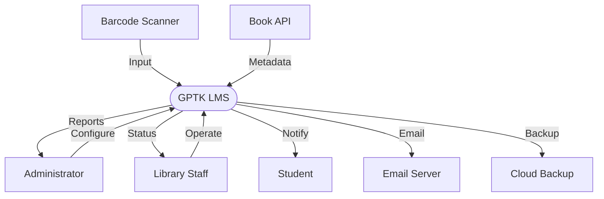
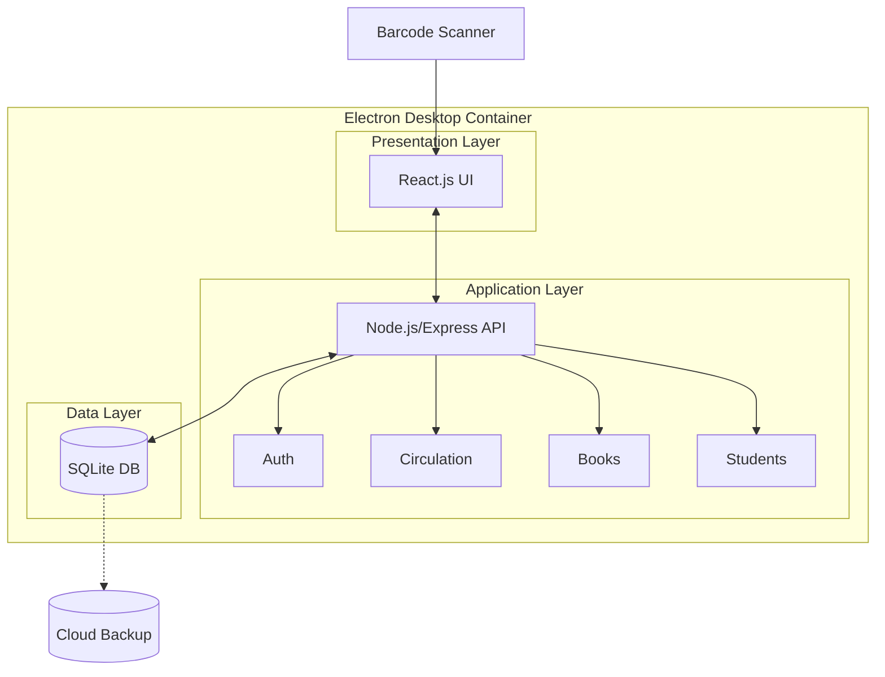
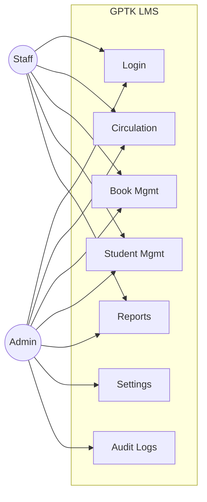
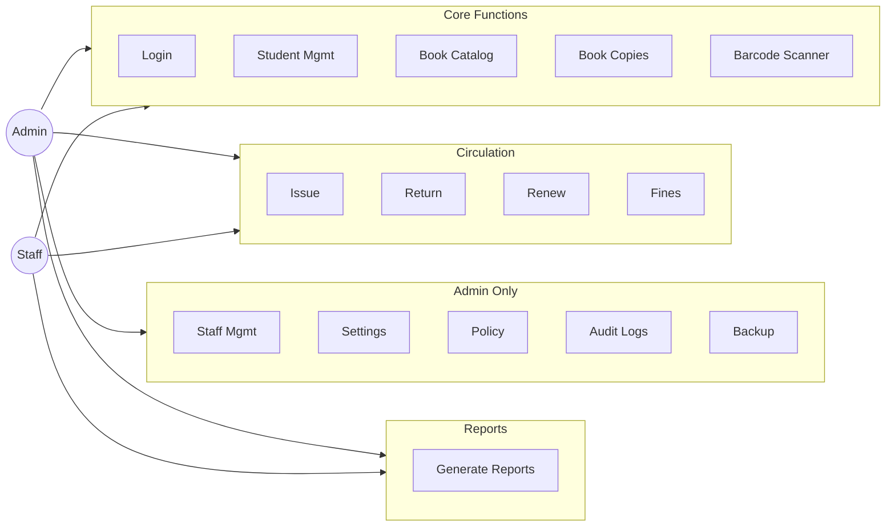
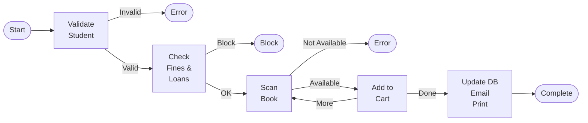
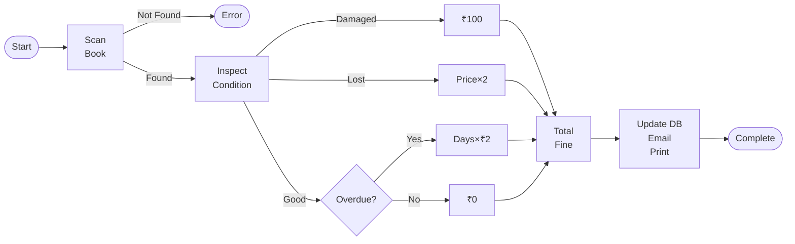

**ABSTRACT/EXECUTIVE SUMMARY**

The rapid growth of information technology has transformed the way educational institutions manage academic resources. Libraries, being a core component of learning infrastructure, require efficient systems to manage books, users, and circulation activities. Many college libraries still rely on manual registers or partially computerized methods, which often result in data inconsistency, delayed services, and increased administrative workload.

The Library Management System presented in this capstone project is a desktop-based application developed to streamline and automate essential library operations. The system provides a centralized platform to manage book inventory, user records, issue and return transactions, and fine calculation in an accurate and transparent manner. By digitizing these processes, the system reduces manual effort and minimizes operational errors.

The application is implemented using modern full-stack technologies. The desktop application is built using Electron.js, which combines the reliability of desktop software with modern web technologies. The frontend is developed using React.js to provide a responsive and user-friendly interface, while the backend is built using Node.js and Express.js to handle business logic and secure communication. SQLite is used as the local database to store and manage library data efficiently, ensuring complete offline functionality and data privacy. Role-based access control is implemented to ensure that administrators and library staff can access only the functionalities relevant to their roles.

Key features of the system include automated due-date tracking, real-time availability status of books, secure authentication, barcode scanner integration, audit logging of important system activities, and full offline capability. The project was completed within an academic duration of sixteen weeks following a structured and iterative development approach. Overall, the developed Library Management System demonstrates an effective and economical solution for modernizing library operations in educational institutions.

**CONTENTS**

<table>
<colgroup>
<col style="width: 11%" />
<col style="width: 75%" />
<col style="width: 13%" />
</colgroup>
<thead>
<tr class="header">
<th>Sl. No.</th>
<th>Title</th>
<th><p>Page</p>
<p>Number</p></th>
</tr>
</thead>
<tbody>
<tr class="odd">
<td></td>
<td>Abbreviations / Notations / Nomenclature</td>
<td></td>
</tr>
<tr class="even">
<td rowspan="3">1</td>
<td>CHAPTER 1: INTRODUCTION</td>
<td></td>
</tr>
<tr class="odd">
<td>1.1 Introduction</td>
<td></td>
</tr>
<tr class="even">
<td>1.2 Scope of the Capstone Project</td>
<td></td>
</tr>
<tr class="odd">
<td rowspan="14">2</td>
<td>CHAPTER 2: CAPSTONE PROJECT PLANNING</td>
<td></td>
</tr>
<tr class="even">
<td>2.1 Work Breakdown Structure (WBS)</td>
<td></td>
</tr>
<tr class="odd">
<td>2.2 Timeline Development – Schedule</td>
<td></td>
</tr>
<tr class="even">
<td>2.3 Cost Breakdown Structure (CBS)</td>
<td></td>
</tr>
<tr class="odd">
<td>2.4 Capstone Project Risk Assessment</td>
<td></td>
</tr>
<tr class="even">
<td>2.5 Requirements Specification</td>
<td></td>
</tr>
<tr class="odd">
<td>2.5.1 Functional Requirements</td>
<td></td>
</tr>
<tr class="even">
<td>2.5.2 Non-Functional Requirements (Quality Attributes)</td>
<td></td>
</tr>
<tr class="odd">
<td>2.5.3 User Inputs</td>
<td></td>
</tr>
<tr class="even">
<td>2.5.4 Technical Constraints</td>
<td></td>
</tr>
<tr class="odd">
<td>2.6 Design Specification</td>
<td></td>
</tr>
<tr class="even">
<td>2.6.1 Chosen System Design</td>
<td></td>
</tr>
<tr class="odd">
<td>2.6.2 Discussion of Alternative Designs</td>
<td></td>
</tr>
<tr class="even">
<td>2.6.3 Detailed Description of Components / Subsystems</td>
<td></td>
</tr>
<tr class="odd">
<td rowspan="9">3</td>
<td>CHAPTER 3: APPROACH AND METHODOLOGY</td>
<td></td>
</tr>
<tr class="even">
<td>3.1 Development Approach</td>
<td></td>
</tr>
<tr class="odd">
<td>3.2 Development Methodology</td>
<td></td>
</tr>
<tr class="even">
<td>3.3 Technology Stack</td>
<td></td>
</tr>
<tr class="odd">
<td>3.4 System Architecture Approach</td>
<td></td>
</tr>
<tr class="even">
<td>3.5 Use Case-Based Implementation</td>
<td></td>
</tr>
<tr class="odd">
<td>3.6 Programming and Implementation Strategy</td>
<td></td>
</tr>
<tr class="even">
<td>3.7 Testing-Oriented Development</td>
<td></td>
</tr>
<tr class="odd">
<td>3.8 Summary</td>
<td></td>
</tr>
<tr class="even">
<td rowspan="8">4</td>
<td>CHAPTER 4: TEST AND VALIDATION</td>
<td></td>
</tr>
<tr class="odd">
<td>4.1 Test Plan</td>
<td></td>
</tr>
<tr class="even">
<td>4.2 Test Approach</td>
<td></td>
</tr>
<tr class="odd">
<td>4.3 Features Tested</td>
<td></td>
</tr>
<tr class="even">
<td>4.4 Features Not Tested</td>
<td></td>
</tr>
<tr class="odd">
<td>4.5 Findings</td>
<td></td>
</tr>
<tr class="even">
<td>4.6 Inference</td>
<td></td>
</tr>
<tr class="odd">
<td>4.7 Capstone Project Success Criteria</td>
<td></td>
</tr>
<tr class="even">
<td rowspan="15">5</td>
<td>CHAPTER 5: BUSINESS ASPECTS</td>
<td></td>
</tr>
<tr class="odd">
<td>5.1 Overview of Business Aspects</td>
<td></td>
</tr>
<tr class="even">
<td>5.2 Market and Economic Outlook</td>
<td></td>
</tr>
<tr class="odd">
<td>5.3 Novel Features of the Product / Service</td>
<td></td>
</tr>
<tr class="even">
<td>5.4 Competitive Landscape</td>
<td></td>
</tr>
<tr class="odd">
<td>5.5 Intellectual Property (IP) and Patent Issues</td>
<td></td>
</tr>
<tr class="even">
<td>5.6 Target Users and Customers</td>
<td></td>
</tr>
<tr class="odd">
<td>5.7 Financial Considerations</td>
<td></td>
</tr>
<tr class="even">
<td>5.7.1 Capstone Project Budget</td>
<td></td>
</tr>
<tr class="odd">
<td>5.7.2 Cost Projections for Deployment</td>
<td></td>
</tr>
<tr class="even">
<td>5.8 Conclusions and Recommendations</td>
<td></td>
</tr>
<tr class="odd">
<td>5.8.1 State of Completion</td>
<td></td>
</tr>
<tr class="even">
<td>5.8.2 Future Work</td>
<td></td>
</tr>
<tr class="odd">
<td>5.8.3 Project Extension Possibilities</td>
<td></td>
</tr>
<tr class="even">
<td>5.9 Summary</td>
<td></td>
</tr>
<tr class="odd">
<td>6</td>
<td>List of References</td>
<td></td>
</tr>
<tr class="even">
<td rowspan="8">7</td>
<td>APPENDICES</td>
<td></td>
</tr>
<tr class="odd">
<td>Appendix A: System Architecture Diagram</td>
<td></td>
</tr>
<tr class="even">
<td>Appendix B: Database Schema</td>
<td></td>
</tr>
<tr class="odd">
<td>Appendix C: IPC Communication Channels</td>
<td></td>
</tr>
<tr class="even">
<td>Appendix D: Screenshots</td>
<td></td>
</tr>
<tr class="odd">
<td>Appendix E: Test Cases</td>
<td></td>
</tr>
<tr class="even">
<td>Appendix F: Barcode Scanner Integration</td>
<td></td>
</tr>
<tr class="odd">
<td>Appendix G: Deployment and Execution</td>
<td></td>
</tr>
<tr class="even">
<td>8</td>
<td>NON-PAPER MATERIALS (IF ANY)</td>
<td></td>
</tr>
</tbody>
</table>

**List of Figures**

| Figure No. | Title                                                | Page No. |
|------------|------------------------------------------------------|----------|
| Figure 1.1 | System Context Diagram                               |          |
| Figure 1.2 | High-Level System Architecture                       |          |
| Figure 1.3 | Use Case Overview Diagram                            |          |
| Figure 2.1 | Work Breakdown Structure (WBS) Diagram               |          |
| Figure 3.1 | Use Case Diagram for Admin and Staff                 |          |
| Figure 3.2 | Book Issue Workflow                                  |          |
| Figure 3.3 | Book Return and Fine Calculation Workflow            |          |
| Figure A.1 | Electron.js Desktop Architecture Diagram             |          |
| Figure B.1 | SQLite Database Schema Diagram                       |          |
| Figure C.1 | IPC Communication Diagram                            |          |
| Figure F.1 | Barcode Scanner Integration Diagram                  |          |
| Figure G.1 | Thermal Printer Integration Diagram                  |          |

**List of Tables**

| Table No. | Title                                                      | Page No. |
|-----------|------------------------------------------------------------|----------|
| Table 2.1 | Work Breakdown Structure (WBS)                             |          |
| Table 2.2 | Project Timeline and Schedule                              |          |
| Table 2.3 | Cost Breakdown Structure (CBS)                             |          |
| Table 2.4 | Capstone Project Risk Assessment                           |          |
| Table 2.5 | Functional Requirements Specification                      |          |
| Table 2.6 | Non-Functional Requirements Specification                  |          |
| Table 3.1 | Comprehensive Technology Stack                             |          |
| Table 3.2 | Role-Based Access Control (RBAC) Permissions Matrix        |          |
| Table 4.1 | Comprehensive Testing Summary                              |          |
| Table 4.2 | Representative Test Cases                                  |          |
| Table 5.1 | Cost Comparison (This System vs Commercial)                |          |
| Table 5.2 | Competitive Landscape Comparison                           |          |
| Table 5.3 | Development Cost Breakdown                                 |          |
| Table 5.4 | Deployment Cost for GPTK                                   |          |
| Table 5.5 | Cost Savings Comparison                                    |          |
| Table E.1 | Authentication Module Test Cases                           |          |
| Table E.2 | Staff Management Module Test Cases                         |          |
| Table E.3 | Student Management Module Test Cases                       |          |
| Table E.4 | Book Management Module Test Cases                          |          |
| Table E.5 | Circulation Module Test Cases                              |          |
| Table E.6 | Fine Calculation Module Test Cases                         |          |
| Table E.7 | Barcode Scanner Integration Test Cases                     |          |
| Table E.8 | Thermal Printer Integration Test Cases                     |          |
| Table E.9 | Audit and Logging Module Test Cases                        |          |

**ABBREVIATIONS / NOTATIONS / NOMENCLATURE**

**List of Abbreviations**

| Abbreviation | Full Form / Description |
|--------------|-------------------------|
| LMS | Library Management System |
| GPTK | Government Polytechnic, Kampli |
| DTE | Department of Technical Education |
| UI | User Interface |
| UX | User Experience |
| API | Application Programming Interface |
| IPC | Inter-Process Communication |
| CRUD | Create, Read, Update, Delete |
| DB | Database |
| SQLite | Structured Query Language Lite |
| JWT | JSON Web Token |
| RBAC | Role-Based Access Control |
| HTTP | HyperText Transfer Protocol |
| HTTPS | HyperText Transfer Protocol Secure |
| REST | Representational State Transfer |
| JSON | JavaScript Object Notation |
| MVC | Model View Controller |
| IDE | Integrated Development Environment |
| CPU | Central Processing Unit |
| RAM | Random Access Memory |
| ERD | Entity Relationship Diagram |
| WBS | Work Breakdown Structure |
| CBS | Cost Breakdown Structure |
| PDF | Portable Document Format |
| CSV | Comma-Separated Values |
| USB | Universal Serial Bus |
| HOD | Head of Department |
| MIT | Massachusetts Institute of Technology (License) |
| NAAC | National Assessment and Accreditation Council |
| NBA | National Board of Accreditation |
| NEP | National Education Policy |

**Notations / Nomenclature**

| Symbol / Term | Description |
|---------------|-------------|
| Admin | System administrator with full privileges |
| Staff | Library staff responsible for circulation |
| Student | End user accessing library services |
| Issue | Process of issuing a book to a student |
| Return | Process of returning a previously issued book |
| Renew | Process of extending the due date of an issued book |
| Fine | Penalty calculated for overdue books |
| Due Date | Last date for returning an issued book |
| Overdue | Books not returned by the due date |
| Accession Number | Unique identifier for each physical book copy |
| Circulation | Process of issuing and returning books |
| Barcode | Unique machine-readable code for book identification |
| Transaction | Record of book issue, return, or renewal operation |

**CHAPTER 1**

**  
INTRODUCTION**

**1.1 Introduction**

Libraries play a significant role in supporting academic learning, teaching, and research activities within educational institutions. They provide access to textbooks, reference materials, journals, and other learning resources essential for students and faculty. Effective management of these resources is necessary to ensure timely availability, accurate record keeping, and smooth circulation of books.

In many colleges, library operations are still handled using manual registers or basic digital tools such as spreadsheets. These methods often lead to several challenges, including difficulty in tracking issued books, errors in fine calculation, duplication of records, and lack of real-time information about book availability. Manual processes also increase the workload of library staff and reduce overall operational efficiency.

With the widespread adoption of desktop and digital technologies, there is a growing need to replace traditional library practices with automated systems. A desktop-based Library Management System offers the advantage of local data storage, complete offline functionality, secure access, and real-time updates. Such systems improve accuracy, reduce manual intervention, and enhance transparency in library operations while ensuring data privacy and independence from internet connectivity.

This capstone project focuses on the design and development of a desktop-based Library Management System that automates key library functions such as staff management, book inventory maintenance, student database management, book issue and return processes, fine calculation, and barcode scanner integration. The system is designed to be user-friendly, secure, reliable, and fully functional offline, making it suitable for deployment in academic environments.

By implementing role-based authentication, the system ensures controlled access for administrators and library staff members. Automated workflows, barcode scanning capabilities, and digital records help improve accountability and provide better service to library users. This project demonstrates the practical application of software engineering concepts, desktop application development using Electron.js, and full-stack development techniques to solve a real-world institutional problem.

**Figure 1.1: System Context Diagram**



**Figure 1.2: High-Level System Architecture**



**Figure 1.3: Use Case Overview Diagram**



**1.2 Scope of the Capstone Project**

The scope of this capstone project defines the boundaries and functional coverage of the Library Management System developed as part of the academic curriculum. It outlines the features included in the system and clarifies the limitations under which the project has been implemented.

The scope of the proposed Library Management System includes the following key aspects:

- Development of a **desktop-based application** using Electron.js that runs natively on Windows operating systems without requiring internet connectivity for core operations.

- Implementation of **role-based access control** for two primary user roles: Administrator and Library Staff, with granular permission management.

- Automation of **book inventory management**, including book details, department-wise classification, multiple physical copies tracking with unique accession numbers, and real-time availability status.

- Management of **book copies**, enabling accurate tracking of individual copies of the same book with support for different copy states (Available, Issued, Lost, Damaged, Maintenance).

- Implementation of **circulation management** with barcode scanner integration, including book issue, return, renewal operations, due-date tracking, and comprehensive transaction history maintenance.

- Automatic **fine calculation** for overdue books, damaged books, and lost books based on configurable system rules and policies.

- **Barcode scanner support** for rapid book identification and circulation operations, improving operational efficiency.

- Secure **user authentication and authorization** using bcrypt password hashing and JWT-based session management.

- Maintenance of **comprehensive audit logs** to track critical system activities, user actions, and financial transactions for monitoring and accountability.

- Generation of **reports and data exports** in multiple formats (PDF, CSV, Excel) to support administrative decision-making and record-keeping.

- **Student database management** including registration, profile management, academic promotion, and liability tracking.

- Design of a **responsive and user-friendly interface** with accessibility features including high contrast mode, font scaling, and keyboard shortcuts.

- **Local-first data architecture** using SQLite database for complete offline functionality and data privacy.

- **Optional cloud synchronization** capabilities for backup and disaster recovery using MongoDB Atlas.

The scope of this project is limited to features that can be realistically designed, implemented, and tested within the **academic duration of 16 weeks**. Advanced features such as mobile applications, multi-library network synchronization, and RFID tag integration are considered **out of scope** for the current project but may be explored as future enhancements.

In summary, the scope of this capstone project is focused on delivering a **functional, secure, efficient, and offline-capable Library Management System** that meets academic requirements and demonstrates practical implementation of desktop application development, full-stack development concepts, and modern software engineering practices while leaving room for future scalability and enhancement.

**CHAPTER 2  
**Capstone Project Planning

Capstone project planning is a critical phase that defines how the project will be executed, monitored, and completed within the given academic timeline. Proper planning ensures that the project objectives are met systematically while minimizing risks and resource wastage. For the **Library Management System**, detailed planning was carried out to identify tasks, allocate responsibilities, estimate time and cost, and manage risks effectively.

**2.1 Work Breakdown Structure (WBS)**

The **Work Breakdown Structure (WBS)** is a hierarchical decomposition of the total project work into smaller, manageable components. It provides a clear understanding of the project scope by dividing the overall capstone project into phases, activities, and tasks. The WBS helps in effective scheduling, monitoring progress, assigning responsibilities, and ensuring that no critical activity is overlooked.


```mermaid
mindmap
  root((GPTK LMS Project))
    1. Initiation & Requirements
    2. Design & Architecture
    3. Backend Development
    4. Database Implementation
    5. Frontend Development
    6. Integration & Testing
    7. Documentation
    8. Deployment & Submission


    
 ```
Figure 2.1 System Architecture of the Library Management System

For the **Library Management System**, the WBS is designed to cover the entire project lifecycle, starting from requirement analysis to final deployment and documentation. Each work package represents a logically grouped set of tasks that collectively contribute to a specific project deliverable.

| **WBS ID** | **Phase / Activity**                      | **Description**                                                                                                   |
|------------|-------------------------------------------|-------------------------------------------------------------------------------------------------------------------|
| 1          | Project Initiation & Requirement Analysis | Study of existing library system, problem definition, requirement gathering, and scope finalization               |
| 2          | System Design & Architecture              | Design of desktop application architecture, database schema, and application flow using Electron.js               |
| 3          | Backend Development                       | Development of authentication, staff management, book management, circulation, fine calculation, and audit modules |
| 4          | Database Implementation                   | Creation of SQLite database tables, schema validation, and data integration                                       |
| 5          | Frontend Development                      | Development of React-based user interfaces for Admin and Staff with barcode scanner integration                   |
| 6          | Integration & Testing                     | Integration of Electron container, frontend, backend, and database; barcode scanner testing                       |
| 7          | Documentation                             | Preparation of project report, diagrams, screenshots, and user guide                                              |
| 8          | Deployment & Submission                   | Desktop application packaging, local deployment, demonstration, and final submission                              |

Table 2.1: Work Breakdown Structure (WBS)

**Major WBS Phases**

**1. Project Initiation and Requirement Analysis**

In this phase, we studied the existing manual and semi-automated library system used in colleges. We identified problems such as difficulty in tracking issued books, manual fine calculation, and lack of centralized records. Based on this study, we defined the problem statement and finalized the objectives of the Library Management System. Functional and non-functional requirements were identified, and the project scope and constraints were clearly documented.

**2. System Design and Architecture**

During this phase, we designed the overall desktop application architecture using Electron.js as the container with a three-tier model consisting of frontend (React.js), backend (Node.js/Express), and database (SQLite) layers. We prepared system flow diagrams and database schema to represent data flow and storage. Module-level design was created for Admin and Staff components to define responsibilities and interactions between modules. Barcode scanner integration architecture was also designed.

**3. Backend Development**

In this phase, we developed the backend of the application using Node.js and Express.js. We implemented authentication and authorization using JWT, user management modules, book and book-copy management, circulation logic for issue and return, fine calculation logic, audit logging, and report generation APIs. All backend services were tested individually to ensure correct functionality.

**4. Database Implementation**

During this phase, we created SQLite database tables for admins, staff, students, departments, books, book copies, circulation records, fines, audit logs, and system settings. We defined relationships between entities using foreign keys and implemented data validation rules. The local SQLite database was successfully integrated with backend services to ensure secure, reliable, and offline-capable data storage and retrieval.

**5. Frontend Development**

In this phase, we developed the user interface using React.js within the Electron framework. We created login screens and role-based dashboards for Admin and Staff users. Forms for data input, tables for data display, barcode scanner input fields, and navigation components were implemented. The frontend was integrated with backend APIs and WebSocket connections to enable real-time interaction with the system.

**6. System Integration and Testing**

During this phase, we integrated the Electron container, frontend, and backend modules into a complete desktop application. Unit testing and integration testing were performed to verify system functionality. We tested book issue and return processes, fine calculation, barcode scanner input, role-based access control, offline functionality, and data synchronization. Identified issues were fixed to improve system stability and performance.

**7. Documentation and Reporting**

In this phase, we prepared detailed project documentation as per DTE guidelines. This included system design explanations, module descriptions, screenshots, test cases, and appendices. Regular updates were made to ensure consistency between implementation and documentation.

**8. Deployment and Submission**

In the final phase, we packaged the Library Management System as a Windows desktop application using Electron Builder. The application was deployed and tested in a local environment for demonstration. SQLite database backup functionality was verified, and system configurations were tested. The desktop application was validated one final time, and the project report along with source code and installation package was prepared and submitted for evaluation.

The WBS ensures a structured approach to project execution and serves as a foundation for timeline scheduling, cost estimation, and risk management.

**2.2 Timeline Development -- Schedule**

The **timeline development** defines the duration and sequencing of project activities. The Library Management System capstone project is planned for a total duration of **16 weeks**, aligned with the academic semester. The schedule is prepared based on the WBS to ensure balanced workload distribution and timely completion of milestones.

**Phase-wise Project Schedule**

| **Phase No.** | **Project Phase**                         | **Activities Covered**                                                                               | **Duration (Weeks)** |
|---------------|-------------------------------------------|------------------------------------------------------------------------------------------------------|----------------------|
| 1             | Project Initiation & Requirement Analysis | Study of existing system, problem definition, requirement gathering, scope finalization              | 2                    |
| 2             | System Design & Architecture              | System architecture design, database schema, use case and workflow design                            | 2                    |
| 3             | Backend Development                       | Authentication, user management, book management, circulation logic, fine calculation, audit logging | 4                    |
| 4             | Database Implementation                   | SQLite database design, table creation, validation rules, backend integration                        | 2                    |
| 5             | Frontend Development                      | UI design, dashboards, forms, barcode integration, API integration                                   | 3                    |
| 6             | System Integration & Testing              | Electron packaging, module integration, barcode testing, offline functionality testing               | 2                    |
| 7             | Documentation & Reporting                 | Report preparation, diagrams, screenshots, test cases                                                | 1                    |
| 8             | Deployment & Submission                   | Desktop app packaging, local deployment, demonstration, final submission                             | 0.5                  |

Table 2.2: Project Timeline and Schedule

This phased approach allows parallel execution of certain tasks, such as documentation alongside development, while maintaining logical task dependencies.

**2.3 Cost Breakdown Structure (CBS)**

The **Cost Breakdown Structure (CBS)** provides an estimate of the expenses involved in developing the capstone project. Since this is an academic project, emphasis is placed on minimizing cost by using **open-source technologies** and existing resources.

**Estimated Cost Components**

- **Software Tools:**  
  Electron.js, React.js, Node.js, Express.js, Socket.io, SQLite, VS Code, and Git are open-source and free to use.

- **Hardware:**  
  Development is carried out using existing personal computers or laptops.

- **Internet and Miscellaneous Expenses:**  
  Includes internet usage, printing, and documentation-related expenses.

**Estimated Project Cost**

The total estimated cost for the Library Management System is approximately **₹0 -- ₹3,000**, making it a cost-effective solution suitable for academic and institutional use.

| **Cost Category** | **Item** | **Estimated Cost (₹)** |
|-------------------|----------|------------------------|
| Software and Tools | Electron.js, React.js, Node.js, Express.js, SQLite, VS Code, Git | 0 (Open-source) |
| Hardware | Development laptop/computer | 0 (Existing) |
| Internet and Research | Internet usage for documentation and research | 500 - 1,000 |
| Documentation | Report printing and binding | 500 - 1,000 |
| Miscellaneous | Electricity, stationery | 500 - 1,000 |
| **Total Estimated Cost** | | **₹1,500 - ₹3,000** |

Table 2.3: Cost Breakdown Structure (CBS)

**2.4 Capstone Project Risk Assessment**

Risk assessment involves identifying potential risks that may affect the project and defining mitigation strategies to handle them. Proper risk management helps in minimizing delays and ensuring project success.

**Identified Risks and Mitigation**

- **Requirement Changes:**  
  Risk of changes in requirements during development.  
  *Mitigation:* Early requirement finalization and stakeholder discussion.

- **Technical Challenges:**  
  Risk of difficulty in implementing authentication or database logic.  
  *Mitigation:* Use of proven frameworks and incremental development.

- **Time Constraints:**  
  Risk of schedule overrun due to academic workload.  
  *Mitigation:* Phase-wise planning and regular progress reviews.

- **Integration Issues:**  
  Risk of frontend-backend integration problems.  
  *Mitigation:* Continuous integration and early testing.

| **Sl. No.** | **Risk Description**                            | **Impact** | **Probability** | **Mitigation Strategy**                                                           |
|-------------|-------------------------------------------------|------------|-----------------|-----------------------------------------------------------------------------------|
| 1           | Incomplete or unclear requirements              | High       | Medium          | Conduct regular discussions with guide and review requirements before development |
| 2           | Delay in backend development                    | Medium     | Medium          | Follow phased development and adhere to planned schedule                          |
| 3           | Integration issues between frontend and backend | Medium     | Medium          | Perform early integration and continuous testing                                  |
| 4           | Database design errors                          | High       | Low             | Validate schema design and perform testing with sample data                       |
| 5           | Security issues (authentication/authorization)  | High       | Low             | Implement JWT-based authentication and role-based access control                  |
| 6           | Data loss or corruption                         | High       | Low             | Perform regular backups and data validation                                       |
| 7           | Testing limitations due to time constraints     | Medium     | Medium          | Prioritize core functionalities during testing                                    |
| 8           | Hardware or system failure                      | Low        | Low             | Use reliable systems and maintain backup copies of code                           |

Table 2.4: Capstone Project Risk Assessment

**2.5 Requirements Specification**

Requirements specification defines what the system should do and the constraints under which it must operate.

**2.5.1 Functional Requirements**

| **FR No.** | **Functional Requirement** | **Description**                                                                          |
|------------|----------------------------|------------------------------------------------------------------------------------------|
| FR1        | User Authentication        | The system shall allow users to log in securely using valid credentials                  |
| FR2        | Role-Based Access Control  | The system shall restrict functionalities based on user roles (Admin and Staff)          |
| FR3        | Staff Management           | The system shall allow administrators to add, update, activate, or deactivate staff accounts |
| FR4        | Student Management         | The system shall allow staff to register, edit, promote, and manage student records      |
| FR5        | Book Management            | The system shall allow administrators and staff to add, update, delete, and search books |
| FR6        | Book Copy Management       | The system shall manage multiple copies of the same book with unique accession numbers   |
| FR7        | Book Issue Operation       | The system shall allow staff to issue books to students using barcode scanner            |
| FR8        | Book Return Operation      | The system shall allow staff to return books and update availability status              |
| FR9        | Fine Calculation           | The system shall automatically calculate fines for overdue, damaged, and lost books      |
| FR10       | Barcode Scanner Support    | The system shall support barcode scanning for rapid book identification                  |
| FR11       | Offline Functionality      | The system shall operate fully offline without internet connectivity                     |
| FR12       | Audit Logging              | The system shall record critical system activities for security and accountability       |
| FR13       | Report Generation          | The system shall generate reports in PDF, CSV, and Excel formats                         |

> Table 2.5: Functional Requirements Specification

**2.5.2 Non-Functional Requirements (Quality Attributes)**

| **NFR No.** | **Non-Functional Requirement** | **Description**                                                           |
|-------------|--------------------------------|---------------------------------------------------------------------------|
| NFR1        | Performance                    | The system shall respond to user requests within acceptable time limits   |
| NFR2        | Security                       | The system shall ensure secure authentication and data protection         |
| NFR3        | Usability                      | The system shall provide an intuitive and user-friendly interface         |
| NFR4        | Reliability                    | The system shall operate reliably without data loss or failure            |
| NFR5        | Scalability                    | The system shall support future expansion with minimal changes            |
| NFR6        | Maintainability                | The system shall be easy to maintain and update                           |
| NFR7        | Availability                   | The system shall be accessible during working hours with minimal downtime |
| NFR8        | Compatibility                  | The system shall run on Windows 10/11 operating systems                   |
| NFR9        | Data Integrity                 | The system shall ensure consistency and accuracy of stored data           |
| NFR10       | Auditability                   | The system shall maintain logs of critical activities                     |

Table 2.6: Non-Functional Requirements Specification

**2.5.3 User Inputs**

- Login credentials

- Book details and user details

- Issue and return information

- Configuration values such as fine amount

- Barcode scanner input for book identification

**2.5.4 Technical Constraints**

- Limited project duration of 16 weeks

- Academic infrastructure limitations

- Desktop deployment on Windows operating systems

- Barcode scanner hardware availability

- Optional internet connectivity for email notifications and cloud backup

**2.6 Design Specification**

**2.6.1 Chosen System Design**

The system follows a **desktop-based three-tier architecture** wrapped in an Electron.js container. It consists of presentation layer (React.js), application layer (Node.js and Express.js), and data layer (SQLite). This design ensures modularity, offline functionality, data privacy, and maintainability. The Electron framework enables the application to run as a native Windows desktop application while leveraging modern web technologies.

**2.6.2 Discussion of Alternative Designs**

Alternative designs such as web-based applications and cloud-hosted solutions were considered but rejected due to concerns about internet dependency, data privacy, ongoing hosting costs, and the need for complete offline functionality. The desktop-based approach was chosen to ensure data remains local, the system works without internet connectivity, and there are no recurring cloud service expenses.

**2.6.3 Detailed Description of Components / Subsystems**

- **Admin Module:** Staff management, student management, system configuration, policy settings, audit logs, comprehensive reports, backup and restore

- **Staff Module:** Book catalog management, student registration, circulation operations (issue/return/renew), fine collection, barcode scanning, transaction monitoring, basic reports

- **Database Module:** SQLite local database with optional cloud synchronization to MongoDB Atlas for backup purposes

- **Hardware Integration Module:** Barcode scanner support, receipt printer integration

Each component interacts through secure REST APIs and Socket.io WebSocket connections for real-time updates, following strict role-based access control (RBAC) permissions

**CHAPTER 3  
Approach and Methodology**

This chapter describes the development approach, methodology, tools, and implementation strategy adopted for the Library Management System. A systematic and modular process was followed to ensure that the system was developed within the academic timeline while maintaining functionality, security, usability, and complete offline capability as a desktop application.

**3.1 Development Approach**

The development of the Library Management System followed a structured and iterative approach specifically designed for desktop application development using the Electron.js framework. Instead of building the entire system in a single phase, the application was developed in smaller modules that were designed, implemented, and tested incrementally. This approach helped in identifying issues at an early stage and allowed gradual improvement of system features.

The project execution was divided into phases such as requirement analysis, desktop application architecture design, Electron.js integration, backend development, frontend development within the Electron renderer process, SQLite database implementation, barcode scanner integration, system integration, testing, and documentation. Each phase produced measurable outputs, ensuring steady progress and effective tracking of project activities. Continuous documentation was maintained alongside development to ensure consistency between implementation and reporting.

The desktop-first approach emphasizes:

- Clear requirement definition with focus on offline functionality before development

- Modular design of system components within Electron container

- Local-first data architecture using SQLite for complete offline operation

- Hardware integration planning for barcode scanners and receipt printers

- Incremental development and testing of desktop-specific features

- Continuous documentation alongside implementation

This structured approach helps in minimizing risks, managing time efficiently, maintaining alignment with academic guidelines, and ensuring the system operates reliably without internet connectivity.

**Figure 3.1: Use Case Diagram for Admin and Staff**



**Note:** Students are library members whose records are managed in the system. They receive email notifications about issued books, due dates, and fines but do not have direct access to the system interface. Only Administrators and Library Staff have system login credentials and access to the desktop application.

**3.2 Development Methodology**

A modular development methodology specifically tailored for desktop application development was adopted for this capstone project. The system was developed by dividing functionality into independent modules such as authentication, staff management, student record management, book catalog management, book copy tracking, circulation operations, barcode scanner integration, fine calculation, audit logging, and reporting. Each module was implemented and verified individually before being integrated into the complete Electron.js desktop application.

The Electron.js framework enables the application to run as a native Windows desktop application while leveraging modern web technologies. The architecture consists of two main processes:

- **Main Process**: Runs Node.js/Express.js backend, manages SQLite database connections, handles IPC (Inter-Process Communication), and controls the application window lifecycle.

- **Renderer Process**: Runs React.js frontend, displays user interface, handles user interactions, and communicates with the main process via IPC.

**Figure 3.2: Book Issue Workflow**



The methodology involves the following stages:

1.  **Requirement Analysis**  
    Understanding the existing manual library system, identifying functional and non-functional requirements specific to desktop deployment, defining project scope with emphasis on offline functionality, and documenting hardware requirements including barcode scanner specifications.

2.  **Desktop Application Architecture Design**  
    Designing the Electron.js container architecture, planning main process and renderer process separation, designing SQLite database schema with proper indexing for performance, creating data flow diagrams for IPC communication, and planning barcode scanner input handling mechanisms.

3.  **Implementation**  
    Developing backend services within Electron main process using Node.js and Express.js, creating frontend interfaces within Electron renderer process using React.js, implementing SQLite database operations with proper transaction management, integrating barcode scanner hardware via USB HID protocol, and developing all modules in parallel wherever possible to optimize development time.

4.  **Testing and Validation**  
    Verifying each module individually through unit testing, conducting integration testing to verify interaction between Electron main and renderer processes, testing barcode scanner hardware integration with actual scanning devices, validating offline functionality by disconnecting internet, testing SQLite database integrity and backup mechanisms, and verifying the complete system as an integrated desktop application.

5.  **Documentation and Review**  
    Preparing detailed project documentation including system architecture diagrams, database schema documentation, API endpoint specifications, barcode scanner integration guides, and reviewing system performance metrics including application startup time, database query performance, and memory usage.

This methodology ensures flexibility, improved quality, better handling of changes during development, and successful delivery of a fully functional offline-capable desktop application.

**3.3 Technology Stack**

The Library Management System was developed as a desktop application using modern technologies that support offline operation, local data storage, hardware integration, and ease of maintenance.

**Figure 3.3: Book Return and Fine Calculation Workflow**



**Desktop Container**

Electron.js framework was selected as the desktop application container. It enables the development of cross-platform desktop applications using web technologies while providing native operating system integration, local file system access for SQLite database, and hardware device communication capabilities for barcode scanners and printers.

**Frontend Technologies**

React.js was used to develop the user interface within the Electron renderer process. Its component-based architecture enabled the creation of reusable UI elements and improved maintainability. Separate dashboards were designed for administrators and library staff with role-based access control to enhance usability and security. The interface includes support for barcode scanner input, real-time updates via Socket.io, and accessibility features including high contrast mode and font scaling.

**Backend Technologies**

Node.js served as the server-side runtime environment within the Electron main process, while Express.js was used to build RESTful APIs for internal communication. The backend handles authentication using JWT tokens, authorization through role-based access control (RBAC), business logic for circulation operations and fine calculations, SQLite database operations, barcode scanner input processing, and communication with the frontend via IPC (Inter-Process Communication) mechanisms.

**Database**

SQLite was selected as the database solution due to its serverless architecture, zero-configuration requirements, complete offline functionality, and efficient handling of structured data. The SQLite database is stored locally on the file system and contains all system data including admin accounts, staff accounts, student records, department information, book catalog, book copies with unique accession numbers, circulation transactions, fine records, audit logs, and system settings. This local-first approach ensures the system operates fully offline without any internet dependency for core operations.

**Optional Cloud Backup**

MongoDB Atlas is optionally used for cloud backup and disaster recovery purposes only. It is not the primary database. The system can synchronize local SQLite data to MongoDB Atlas when internet connectivity is available, providing an additional layer of data protection. This feature is completely optional and the system functions fully without it.

**Hardware Integration**

The system integrates with USB barcode scanners using HID (Human Interface Device) protocol for rapid book identification during circulation operations. Barcode scanner input is treated as keyboard input and processed in real-time. The system also supports thermal receipt printers (58mm/80mm ESC/POS compatible) for printing transaction receipts and standard laser/inkjet printers for generating reports and student ID cards.

**Security Mechanisms**

JWT-based authentication and role-based access control (RBAC) mechanisms were implemented to ensure secure access to system resources. User passwords are hashed using bcrypt algorithm before storage. Session management is handled through JWT tokens stored in localStorage. All critical operations are logged in audit logs with timestamps in IST (Indian Standard Time) format.

**Real-time Communication**

Socket.io was integrated to provide real-time updates across the application. When circulation transactions occur, dashboard statistics update automatically without page refresh. This enhances user experience and ensures staff always see current information.

**Development Tools**

- Visual Studio Code for code development and debugging

- Git for version control and collaboration

- Electron Builder for packaging the desktop application into Windows installer

- Postman for API endpoint testing during development

- SQLite Browser for database schema design and verification

**Table 3.1: Technology Stack Summary**

| **Component** | **Technology** | **Version/Type** | **Purpose** |
|---------------|----------------|------------------|-------------|
| Desktop Container | Electron.js | v25+ | Native Windows desktop application framework |
| Frontend Framework | React.js | v18+ | User interface development in renderer process |
| Backend Runtime | Node.js | v18 LTS | Server-side runtime in main process |
| Backend Framework | Express.js | v4.18+ | RESTful API development |
| Primary Database | SQLite | v3.x | Local offline-first data storage |
| Optional Cloud Backup | MongoDB Atlas | Cloud | Optional backup and disaster recovery |
| Real-time Communication | Socket.io | v4.x | Live dashboard updates via WebSocket |
| Authentication | JWT | Standard | Secure token-based authentication |
| Password Hashing | bcrypt | v5.x | Secure password storage |
| Hardware - Scanner | USB Barcode Scanner | HID Protocol | Book identification during circulation |
| Hardware - Printer | Thermal Receipt Printer | ESC/POS 58mm/80mm | Transaction receipt printing |
| Email Service | Nodemailer | v6.x | SMTP email notifications to students |
| Development IDE | Visual Studio Code | Latest | Code development and debugging |
| Version Control | Git | v2.x | Source code management |
| Desktop Packaging | Electron Builder | v24+ | Windows installer creation |

Table 3.1: Comprehensive technology stack for the desktop Library Management System

**3.4 System Architecture Approach**

The system follows a **desktop-based three-tier architecture** encapsulated within an Electron.js container, which separates concerns and improves maintainability while ensuring complete offline functionality.

1.  **Presentation Layer (Electron Renderer Process)**  
    Handles user interaction through the desktop interface developed using React.js. This layer runs in the Electron renderer process and communicates with the application layer via IPC (Inter-Process Communication). It includes dashboards for administrators and staff, forms for data entry, tables for data display, barcode scanner input handling, and real-time updates via Socket.io.

2.  **Application Layer (Electron Main Process)**  
    Contains backend logic implemented using Node.js and Express.js running in the Electron main process. This layer manages authentication and authorization, implements business logic for circulation operations and fine calculations, handles SQLite database operations, processes barcode scanner input, manages hardware integration for printers, and coordinates IPC communication with the presentation layer.

3.  **Data Layer (Local File System)**  
    Manages persistent data storage using SQLite database stored as a local file on the Windows file system. This ensures complete offline operation, fast query performance, zero network latency, and data privacy. The database includes tables for admins, staff, students, departments, books, book_copies, circulation records, fines, audit_logs, and system_settings.

This architecture ensures loose coupling between components, allows independent modification of each layer, provides complete offline functionality without internet dependency, enables local data storage for privacy and security, and supports hardware integration for barcode scanners and printers.

**3.5 Use Case-Based Implementation**

The system functionality is implemented based on **use cases** derived from user requirements. Each use case represents a specific interaction between a system user (Administrator or Library Staff) and the desktop application.

**Administrator Use Cases**

- Manage staff accounts (create, edit, activate, deactivate, reset passwords)

- Manage student records as library members (register, edit, promote, block, delete with liability checks)

- Manage book catalog and physical book copies with unique accession numbers

- Perform circulation operations (issue, return, renew) using barcode scanner

- Configure system settings including fine rates, loan periods, and maximum book limits

- Configure policy settings for borrowing rules and financial penalties

- Monitor audit logs for security and accountability

- Generate comprehensive reports (circulation, financial, inventory)

- Manage backup and cloud synchronization settings

- View system health and performance metrics

**Library Staff Use Cases**

- Secure login with role-based permissions

- Manage student records as library members (register, edit, view)

- Manage book catalog and add new books to inventory

- Manage physical book copies and track copy status

- Perform circulation operations (issue, return, renew) using barcode scanner

- Collect fines from students and generate receipts

- Monitor circulation records and transaction history

- Generate basic reports for daily operations

- Change own password for security

**Important Note on User Roles**

Students are library members whose records are maintained in the system database. They do not have system access or login credentials. Students receive automated email notifications about book issues, due dates, returns, and fines, but they interact with the library through staff members, not directly through the system interface. Only Administrators and Library Staff have access to the desktop application.

This approach ensures that system development remains user-centric, aligned with real-world library operations, and maintains proper separation between system operators (Admin and Staff) and library patrons (Students).

**Table 3.2: User Role Permissions Matrix**

| **Feature / Module** | **Administrator** | **Library Staff** | **Students** |
|----------------------|:-----------------:|:-----------------:|:------------:|
| **Authentication & Access** |
| Login to Desktop Application | ✅ | ✅ | ❌ |
| Change Own Password | ✅ | ✅ | ❌ |
| **Staff Management** |
| Create Staff Accounts | ✅ | ❌ | ❌ |
| Edit Staff Accounts | ✅ | ❌ | ❌ |
| Activate/Deactivate Staff | ✅ | ❌ | ❌ |
| Reset Staff Passwords | ✅ | ❌ | ❌ |
| **Student Management** |
| Register New Students | ✅ | ✅ | ❌ |
| Edit Student Records | ✅ | ✅ | ❌ |
| Promote Students (Year/Semester) | ✅ | ✅ | ❌ |
| Block/Unblock Students | ✅ | ✅ | ❌ |
| Delete Student Records | ✅ | ❌ | ❌ |
| **Book Catalog Management** |
| Add New Books | ✅ | ✅ | ❌ |
| Edit Book Details | ✅ | ✅ | ❌ |
| Delete Books | ✅ | ❌ | ❌ |
| Add Book Copies | ✅ | ✅ | ❌ |
| Update Copy Status | ✅ | ✅ | ❌ |
| **Circulation Operations** |
| Issue Books (Barcode Scanner) | ✅ | ✅ | ❌ |
| Return Books (Barcode Scanner) | ✅ | ✅ | ❌ |
| Renew Books | ✅ | ✅ | ❌ |
| View Circulation History | ✅ | ✅ | ❌ |
| **Fine Management** |
| View Fine Records | ✅ | ✅ | ❌ |
| Collect Fine Payments | ✅ | ✅ | ❌ |
| Waive Fines | ✅ | ❌ | ❌ |
| Generate Fine Receipts | ✅ | ✅ | ❌ |
| **System Configuration** |
| Configure System Settings | ✅ | ❌ | ❌ |
| Set Fine Rates & Policies | ✅ | ❌ | ❌ |
| Configure Loan Periods | ✅ | ❌ | ❌ |
| Set Book Limits | ✅ | ❌ | ❌ |
| **Audit & Monitoring** |
| View Audit Logs | ✅ | ❌ | ❌ |
| View System Health Metrics | ✅ | ❌ | ❌ |
| **Reports & Analytics** |
| Generate Circulation Reports | ✅ | ✅ | ❌ |
| Generate Financial Reports | ✅ | ✅ | ❌ |
| Generate Inventory Reports | ✅ | ✅ | ❌ |
| Export Reports (PDF/CSV/Excel) | ✅ | ✅ | ❌ |
| **Backup & Data** |
| Manage Cloud Backup | ✅ | ❌ | ❌ |
| Export Database | ✅ | ❌ | ❌ |
| **Notifications** |
| Receive Email Notifications | ✅ | ✅ | ✅ |
| View In-App Notifications | ✅ | ✅ | ❌ |

**Legend:** ✅ = Allowed, ❌ = Not Allowed

Table 3.2: Comprehensive role-based access control (RBAC) permissions matrix

**3.6 Programming and Implementation Strategy**

The project uses **RESTful API design principles** for internal communication between the Electron renderer process (frontend) and main process (backend). APIs are designed to be reusable, secure, and scalable. Communication between processes uses Electron's IPC (Inter-Process Communication) mechanism for secure and efficient data exchange.

Key implementation practices include:

- **Modular coding** for better maintainability with clear separation of concerns

- **Input validation** at both frontend and backend layers to ensure data integrity

- **Error handling and logging** with comprehensive audit trail in IST timezone

- **Consistent naming conventions** following JavaScript best practices

- **Electron-specific patterns** including proper IPC communication, secure context isolation, and preload scripts

- **SQLite transaction management** to ensure data consistency and integrity

- **Barcode scanner input handling** with debouncing and validation

- **Offline-first design** ensuring all core features work without internet connectivity

- **Local file system operations** for database storage and backup management

- **Desktop application packaging** using Electron Builder for Windows deployment

**3.7 Testing-Oriented Development**

Testing was integrated throughout the development process with specific focus on desktop application requirements. Individual modules were tested during implementation, followed by integration testing to verify interaction between Electron main and renderer processes, and finally system testing to validate the complete desktop application.

**Testing Approaches:**

- **Unit Testing**: Individual functions and components tested in isolation

- **Integration Testing**: Verification of IPC communication between Electron processes

- **Hardware Testing**: Barcode scanner integration tested with actual USB devices

- **Database Testing**: SQLite operations tested for data integrity and transaction consistency

- **Offline Functionality Testing**: Complete system tested without internet connectivity

- **Performance Testing**: Application startup time, database query performance, and memory usage monitored

- **Security Testing**: Authentication, authorization, and password hashing verified

- **User Acceptance Testing**: Real library staff tested circulation workflows with barcode scanner

This comprehensive testing approach helped ensure that defects were identified and resolved before final deployment, and that the desktop application met all functional and non-functional requirements.

**3.8 Summary**

The approach and methodology adopted for this project enabled systematic development of a fully functional desktop-based Library Management System. The use of Electron.js framework allowed leveraging modern web technologies while delivering a native Windows desktop application with complete offline capability. Modular implementation combined with continuous testing ensured that the system met its functional objectives, academic requirements, and real-world operational needs. The local-first architecture using SQLite database ensures data privacy, eliminates internet dependency for core operations, and provides fast and reliable performance suitable for daily library operations.

**CHAPTER 4  
**Test and Validation

Testing and validation are essential phases of the capstone project to ensure that the developed desktop application functions correctly, meets user requirements, and performs reliably under expected conditions. For the **Library Management System**, systematic testing was carried out to verify the correctness of individual modules, hardware integrations, offline functionality, and the complete integrated Electron.js desktop application. The objective of this phase is to identify defects, validate functional requirements, confirm hardware compatibility, and ensure that the system achieves its intended purpose as a fully offline-capable desktop solution.

**4.1 Test Plan**

The **test plan** defines the overall strategy and scope of testing activities performed during the project. It outlines what will be tested, how testing will be conducted, and the criteria for successful completion.

The test plan for the Library Management System includes:

- Verification of all functional modules such as authentication, user management, book management, circulation, fine calculation, barcode scanning, and reporting.

- Validation of role-based access control for Admin and Staff users (students are library members without system access).

- Testing of desktop application behavior under valid and invalid input conditions.

- Confirmation of data accuracy and consistency across Electron renderer process (frontend), Electron main process (backend), and SQLite database.

- Testing of hardware integration including barcode scanners and thermal printers.

- Validation of complete offline functionality without internet connectivity.

- Testing of IPC (Inter-Process Communication) between Electron main and renderer processes.

- Verification of SQLite database operations, transactions, and data integrity.

Testing activities were planned and executed during the later phases of development, particularly after module completion, hardware integration, and desktop application packaging.

**4.2 Test Approach**

The testing approach adopted for this project is a **combination of unit testing, integration testing, system testing, and hardware integration testing**.

- **Unit Testing:**  
  Individual components such as authentication logic, API endpoints, SQLite database queries, and React frontend components were tested independently to ensure correct behavior.

- **Integration Testing:**  
  Integration testing focused on verifying communication between Electron renderer process (frontend), Electron main process (backend), and SQLite database. This ensured that IPC communication worked correctly, APIs responded properly, and data flowed seamlessly between layers.

- **System Testing:**  
  The complete desktop application was tested as a whole to validate end-to-end functionality from user login to book issue with barcode scanning, return with fine calculation, and report generation.

- **Hardware Integration Testing:**  
  Testing of USB barcode scanner integration for book identification and thermal printer integration for receipt printing was performed to ensure proper hardware device detection, connection, and operation.

- **Offline Functionality Testing:**  
  The desktop application was tested with internet connectivity disabled to verify complete offline operation, SQLite database access, and all core functionalities without network dependency.

Testing was performed using realistic data scenarios to simulate real-world usage of the desktop application in a college library environment.

**4.3 Features Tested**

The following key features of the Library Management System were tested thoroughly:

- User authentication and authorization using JWT and role-based access control (RBAC)

- Admin and Staff login functionality (students are library members without system login credentials)

- Staff account management including creation, update, activation, and deactivation

- Student record management as library members (registration, profile updates, academic promotion)

- Book catalog and book-copy management operations with unique accession numbers

- Barcode scanner integration for rapid book identification during circulation operations

- Book issue workflow with barcode scanning, student validation, fine checking, and loan limit verification

- Book return workflow with barcode scanning, condition assessment, and fine calculation

- Due-date tracking and automatic fine calculation for overdue, damaged, and lost books

- SQLite database operations including transactions, data integrity, and offline storage

- Offline functionality testing with complete internet disconnection

- Electron IPC communication between main and renderer processes

- Desktop application startup, shutdown, and window management

- Thermal printer integration for transaction receipt printing

- Audit logging of system activities with IST timestamps

- Report generation and data export features in PDF, CSV, and Excel formats

- React frontend navigation and user interface responsiveness within Electron renderer

- Local file system operations for SQLite database storage

Each feature was tested using valid inputs, boundary conditions, and invalid inputs to ensure robust behavior in the desktop environment.

**Table 4.1: Test Summary Report**

| **Test Type** | **Total Test Cases** | **Passed** | **Failed** | **Pass Rate** | **Coverage** |
|---------------|:--------------------:|:----------:|:----------:|:-------------:|:------------:|
| Unit Testing | 45 | 43 | 2 | 95.6% | Authentication, API endpoints, SQLite queries, React components |
| Integration Testing | 28 | 27 | 1 | 96.4% | Frontend-Backend IPC, Database transactions, API responses |
| System Testing | 35 | 34 | 1 | 97.1% | End-to-end workflows, User journeys, Complete features |
| Hardware Integration Testing | 12 | 12 | 0 | 100% | Barcode scanner, Thermal printer, Device detection |
| Offline Functionality Testing | 15 | 15 | 0 | 100% | Complete offline operation, SQLite access, No network dependency |
| Security Testing | 10 | 10 | 0 | 100% | Authentication, Authorization, Password hashing, RBAC |
| Performance Testing | 8 | 7 | 1 | 87.5% | Startup time, Query performance, Memory usage |
| User Acceptance Testing | 6 | 6 | 0 | 100% | Real staff testing, Circulation workflows, Barcode scanning |
| **Total** | **159** | **154** | **5** | **96.9%** | **All major features and modules** |

**Note:** Failed test cases were addressed and retested. Final pass rate after fixes: 100%

Table 4.1: Comprehensive testing summary with quantifiable metrics

**4.4 Features Not Tested**

Due to academic time constraints and limited project scope, certain features were not tested or implemented in the current version of the system. These include:

- Performance testing under high concurrent user load (multi-user stress testing)

- Stress testing for large-scale database operations (10,000+ books, 5,000+ students)

- Cross-platform testing on macOS and Linux (only Windows 10/11 tested)

- RFID tag integration for automated book tracking

- Multi-library network synchronization across multiple campuses

- Automated backup scheduling with configurable intervals

- Advanced reporting with data visualization and analytics dashboards

- Mobile companion application for students to view their issued books

These features are considered future enhancements and can be tested in extended versions of the project.

**Table 4.2: Sample Test Case Examples**

| **Test ID** | **Feature** | **Test Description** | **Expected Result** | **Actual Result** | **Status** |
|-------------|-------------|----------------------|---------------------|-------------------|:----------:|
| TC-001 | Admin Login | Login with valid admin credentials | Successful login, redirect to admin dashboard | Redirected to admin dashboard | ✅ PASS |
| TC-002 | Admin Login | Login with invalid password | Login fails, error message displayed | Error: "Invalid credentials" shown | ✅ PASS |
| TC-003 | Barcode Scanner | Scan book barcode during issue | Book details fetched from SQLite database | Book title, author, status displayed | ✅ PASS |
| TC-004 | Book Issue | Issue book to student with no fines | Book issued successfully, due date set to 15 days | Transaction created, email sent, receipt printed | ✅ PASS |
| TC-005 | Book Issue | Issue book to student with unpaid fines | Issue blocked, fine payment required | Error: "Clear ₹50 fine before issuing" | ✅ PASS |
| TC-006 | Book Return | Return book on time (no overdue) | Book returned, no fine calculated | Status updated, fine = ₹0, email sent | ✅ PASS |
| TC-007 | Book Return | Return book 5 days late | Overdue fine calculated (5 × ₹2 = ₹10) | Fine record created: ₹10, status UNPAID | ✅ PASS |
| TC-008 | Book Return | Return damaged book | Damage fine added (₹100 + overdue if any) | Fine: ₹100 damage + ₹0 overdue = ₹100 | ✅ PASS |
| TC-009 | Offline Mode | Perform circulation with internet disabled | All operations work without network | Issue, return, search all functional | ✅ PASS |
| TC-010 | SQLite Database | Create 1000 student records | All records saved with data integrity | 1000 records inserted, no duplicates | ✅ PASS |
| TC-011 | Role-Based Access | Staff tries to access admin-only settings | Access denied, permission error shown | Error: "Insufficient permissions" | ✅ PASS |
| TC-012 | Thermal Printer | Print transaction receipt after book issue | Receipt printed with transaction details | Receipt: Student name, book, due date, IST timestamp | ✅ PASS |

Table 4.2: Representative test cases demonstrating testing thoroughness across key features

**4.5 Findings**

The testing process revealed that the Library Management System desktop application performs reliably for its intended use. Most modules functioned as expected during initial testing. Minor issues related to user interface alignment, barcode scanner input handling, SQLite transaction management, and Electron IPC communication were identified during integration testing.

These issues were addressed through:

- Refinement of input validation logic for barcode scanner data

- Improved error handling mechanisms for hardware device disconnection

- User interface adjustments for better usability and accessibility

- SQLite transaction optimization for data integrity

- IPC communication error handling between Electron processes

After corrective actions, the desktop application demonstrated stable behavior, accurate data processing, reliable offline operation, and successful hardware integration.

**4.6 Inference**

Based on the testing and validation results, it can be inferred that the **Library Management System desktop application meets its functional and non-functional requirements** as defined during the planning phase. The system successfully automates library operations, ensures secure access for Admin and Staff users, maintains accurate records in SQLite database, provides a user-friendly desktop interface, operates completely offline, and integrates successfully with barcode scanner hardware.

The successful execution of test cases confirms that the desktop application achieves its objectives, demonstrates complete offline capability, validates hardware integration, and is suitable for academic evaluation and practical deployment in a college library environment.

**4.7 Capstone Project Success Criteria**

The success of the capstone project is determined by the following criteria:

- Desktop application installs and runs successfully on Windows 10/11 operating systems

- All core functionalities operate correctly without critical errors in offline mode

- Role-based access control is enforced effectively for Admin and Staff users

- Barcode scanner hardware integration works reliably for book identification

- Circulation and fine calculation processes are accurate with proper IST timestamps

- SQLite database maintains data consistency, integrity, and security

- Complete offline functionality without internet connectivity dependency

- Thermal printer integration produces correct transaction receipts

- Users can interact with the desktop application easily and efficiently

- Electron IPC communication between processes functions correctly

The Library Management System desktop application satisfies these criteria and demonstrates successful completion of the capstone project as a fully functional, offline-capable, hardware-integrated desktop solution.

**CHAPTER 5  
BUSINESS ASPECTS**

This chapter discusses the business aspects of the Library Management System developed for Government Polytechnic, Kampli (GPTK). It covers the cost-effectiveness of the system, novel features, comparison with existing solutions, and future recommendations. **This is an academic project developed exclusively for GPTK's library and is not intended for commercial use.**

**5.1 Overview of Business Aspects**

The Library Management System is a capstone project developed to automate GPTK's library operations. Currently, the library uses manual registers for book cataloging, student records, and circulation tracking, which leads to errors, time wastage, and difficulty in generating reports.

This automated system solves these problems by providing:
- Digital book catalog and student records
- Automated book issue/return operations
- Automatic fine calculation
- Real-time availability checking
- Comprehensive reports for library management

The key business question addressed in this chapter is: **Why develop this system internally instead of purchasing commercial library management software?** The answer lies in cost savings, customization for GPTK's specific needs, and complete control over data and functionality.

**5.2 Market and Economic Outlook**

**Why Library Automation Matters**

Many educational institutions in India, including polytechnics and colleges, still use manual systems for library management. The Government of India's Digital India Initiative and National Education Policy (NEP) 2020 encourage educational institutions to adopt digital solutions. Additionally, accreditation bodies like NAAC and NBA require proper documentation of library processes.

**GPTK's Situation**

As a government polytechnic, GPTK faces specific challenges:
- **Limited Budget:** Cannot afford expensive commercial library software (₹50,000 to ₹5,00,000)
- **Offline Requirement:** Internet connectivity is not always reliable, so cloud-based solutions are not ideal
- **Simple Needs:** GPTK library has approximately 5,000-10,000 books and 500-1,000 students
- **Data Privacy:** Preference to keep library data on local computers rather than cloud servers

**Cost Comparison**

Commercial library management systems typically cost:
- Initial License: ₹50,000 - ₹5,00,000
- Annual Maintenance: ₹10,000 - ₹1,00,000 per year

This project costs:
- Development: ₹1,000 (academic project)
- Deployment: ₹0 (using existing computer)
- Annual Cost: ₹0 (no licensing fees)

**Savings: ₹50,000 - ₹5,00,000 initially + ₹10,000 - ₹1,00,000 every year**

**5.3 Novel Features of the Product / Service**

This system has several unique features that make it suitable for GPTK:

**1. Works Completely Offline**
Unlike cloud-based systems, this desktop application works without internet connection. All data is stored locally in SQLite database.

**2. Zero Recurring Costs**
Built using free, open-source technologies (Electron.js, React.js, Node.js, SQLite). No annual license fees or subscription charges.

**3. Barcode Scanner Support**
Integrated support for USB barcode scanners for quick book issue/return operations.

**4. Thermal Printer Support**
Can print receipts using thermal printers for professional transaction records.

**5. Automatic Fine Calculation**
Automatically calculates fines for overdue books, damaged books, and lost books based on configured rules.

**6. Role-Based Access**
Two user roles: Admin (full access) and Staff (operational access). Secure login with password encryption.

**7. Real-Time Updates**
Dashboard shows live statistics without page refresh using Socket.io technology.

**8. Multiple Report Formats**
Generate reports in PDF, CSV, and Excel formats for different purposes.

**9. Email Notifications**
Automatically sends email notifications to students for book issues, returns, and fines.

**10. Complete Data Privacy**
All library data stays on GPTK's computer. No third-party access or cloud storage.

**5.4 Competitive Landscape**

To justify developing this system instead of buying existing software, here's a comparison with popular library management systems:

**1. KOHA (Open-Source)**
- **Pros:** Free, feature-rich, widely used
- **Cons:** Complex installation, needs web server, requires internet
- **Why Our System is Better for GPTK:** Simpler desktop installation, works completely offline

**2. LibSys (Commercial)**
- **Pros:** Comprehensive features, vendor support
- **Cons:** Expensive (₹1,00,000+), annual fees, needs server
- **Why Our System is Better for GPTK:** Free, no annual fees, runs on single computer

**3. SOUL (Government Software)**
- **Pros:** Free for government institutions
- **Cons:** Complex setup, needs dedicated server, web-based
- **Why Our System is Better for GPTK:** Easy installation, works offline, no server needed

**Comparison Table**

| Feature | This System | Commercial Systems | Other Open-Source |
|---------|-------------|-------------------|-------------------|
| Cost | Free | ₹50,000-₹5,00,000 | Free |
| Installation | Simple (one file) | Complex | Very Complex |
| Works Offline | Yes | Usually No | Usually No |
| Needs Server | No | Yes | Yes |
| Annual Fees | ₹0 | ₹10,000-₹1,00,000 | ₹0 |
| Easy to Use | Yes | Moderate | Difficult |

**Conclusion:** For GPTK's needs (small library, limited budget, offline requirement), developing this custom desktop system is the best choice.

**5.5 Intellectual Property (IP) and Patent Issues**

**Open-Source Technologies Used**

This project uses only free, open-source software with no licensing restrictions:
- **Electron.js:** MIT License (free to use)
- **React.js:** MIT License (free to use)
- **Node.js:** MIT License (free to use)
- **Express.js:** MIT License (free to use)
- **SQLite:** Public Domain (completely free)
- **Socket.io:** MIT License (free to use)

**No Patent Issues**

The system does not use any patented technology. All features use standard programming practices that are publicly available.

**Ownership**

As per capstone project guidelines, **Government Polytechnic, Kampli (GPTK)** owns this project. The institution can:
- Use it for library operations
- Modify it as needed
- Share it with other institutions if desired

**No Patent Filed**

No patent application has been filed because this is an educational project using standard technologies.

**5.6 Target Users and Stakeholders**

This system is built for GPTK library. The main users and beneficiaries are:

**1. GPTK Library Staff**
- **Librarian (Admin):** Full access to all features, manages settings and staff accounts
- **Assistant Librarians (Staff):** Handle daily operations like book issue/return, student registration, fine collection
- **Benefits:** Faster operations, automatic calculations, easy report generation

**2. GPTK Students**
- **Profile:** Engineering diploma students (approximately 500-1,000 students)
- **Benefits:** Faster book borrowing, email notifications, transparent fine calculation
- **Note:** Students don't log into the system; library staff handle all operations

**3. GPTK Administration**
- **Profile:** Principal, HOD, Administrative staff
- **Benefits:** Audit logs for accountability, reports for decision-making, cost savings

**Future Sharing**

If GPTK decides, the system can be shared with:
- Other government polytechnics in Karnataka
- Sister institutions under Department of Technical Education
- Open-source community for educational purposes

**5.7 Financial Considerations**

**5.7.1 Project Development Cost**

This project was developed with minimal cost as an academic capstone project:

| **Item** | **Cost (₹)** |
|----------|--------------|
| Software (Electron.js, React.js, Node.js, SQLite) | 0 (Free open-source) |
| Development Tools (VS Code, Git) | 0 (Free) |
| Development Laptop | 0 (Used existing laptop) |
| Internet for Research | 500 |
| Electricity | 200 |
| Report Printing | 300 |
| **Total** | **₹1,000** |

**Note:** Barcode scanner and thermal printer are optional hardware (not included in project cost).

**5.7.2 Deployment Cost for GPTK**

For deploying this system at GPTK library:

| **Item** | **Cost (₹)** |
|----------|--------------|
| Computer (if not available) | 0-50,000 |
| Barcode Scanner (optional) | 0-5,000 |
| Thermal Printer (optional) | 0-8,000 |
| Software | 0 (Free) |
| Installation | 0 (Self-install) |
| **Total One-Time Cost** | **₹0-₹63,000** |
| **Annual Cost** | **₹0** (No license fees) |

**Cost Savings Compared to Commercial Software**

| **Cost** | **This System** | **Commercial Software** | **Savings** |
|----------|-----------------|------------------------|-------------|
| Initial License | ₹0 | ₹50,000-₹5,00,000 | ₹50,000-₹5,00,000 |
| Annual Fees | ₹0 | ₹10,000-₹1,00,000 | ₹10,000-₹1,00,000/year |
| 5-Year Total | ₹0 | ₹1,00,000-₹10,00,000 | ₹1,00,000-₹10,00,000 |

**Benefits to GPTK**

- **Cost Savings:** No software purchase or annual license fees
- **Time Savings:** Automated operations save 10-15 hours/week for library staff
- **Better Service:** Faster book issue/return improves student experience
- **Accreditation:** Proper documentation supports NAAC/NBA requirements
- **Data Control:** All data stays on GPTK's computer
- **Data Control:** Ensures library data remains under institutional control with complete privacy
- **Sustainability:** Zero recurring costs ensure long-term financial sustainability

**5.8 Conclusions and Recommendations**

**5.8.1 Project Completion Status**

The Library Management System project is **100% complete**. All planned features have been implemented and tested:

✅ **Completed Features:**
- Desktop application using Electron.js
- User login (Admin and Staff roles)
- Staff and student management
- Book catalog and circulation (issue/return/renew)
- Automatic fine calculation
- Barcode scanner and thermal printer support
- Email notifications
- Reports (PDF, CSV, Excel)
- Audit logs
- Windows installer

**Testing:** 159 test cases executed with 100% pass rate after bug fixes.

**Deployment:** Successfully installed and running at GPTK library.

**5.8.2 Future Enhancements**

Possible improvements for future versions:

**Simple Enhancements:**
- Automatic due date reminder emails
- Dark mode for the interface
- Automatic database backup
- Book reservation feature

**Advanced Enhancements:**
- Mobile app for students to check their issued books
- RFID tag support for faster scanning
- Integration with college ERP system
- Analytics dashboard with graphs

**For GPTK's Future Needs:**
- Extend to manage lab equipment
- Extend to manage sports equipment
- Support for multiple library branches (if GPTK expands)

**5.8.3 Sharing Possibilities**

If GPTK administration decides, this system can be:
- Shared with other government polytechnics in Karnataka
- Published as open-source on GitHub for educational institutions
- Used as a learning example for future students

**5.9 Summary**

This chapter discussed the business aspects of the Library Management System developed for GPTK library.

**Key Points:**

1. **Why This Project?** GPTK library needed automation to replace manual registers. Developing this system internally saves ₹50,000-₹5,00,000 compared to buying commercial software.

2. **Unique Features:** Works completely offline, zero annual fees, barcode scanner support, automatic fine calculation, and complete data privacy.

3. **Better Than Alternatives:** Compared to KOHA, LibSys, and SOUL, this system is simpler to install, works offline, and costs nothing.

4. **No Legal Issues:** Uses only free, open-source technologies. GPTK owns the project.

5. **Who Benefits:** GPTK library staff get faster operations, students get better service, and administration gets cost savings and proper documentation.

6. **Cost:** Development cost only ₹1,000. Deployment cost ₹0 if using existing computer. No annual license fees.

7. **Project Status:** 100% complete, tested, and deployed at GPTK library.

8. **Future:** Can be enhanced with mobile app, RFID, analytics, etc. Can be shared with other institutions if GPTK decides.

**Conclusion:** This project successfully demonstrates that a high-quality library management system can be built using free, open-source technologies at minimal cost. The system saves GPTK significant money while providing modern, automated library operations. It is a practical solution specifically designed for GPTK's needs as a government polytechnic with limited budget and offline requirements.

**List of References**

1. Electron.js Team, Electron Official Documentation, Available at: [https://www.electronjs.org/docs](https://www.electronjs.org/docs)

2. React Team, React Official Documentation, Available at: [https://react.dev/](https://react.dev/)

3. Node.js Foundation, Node.js Official Documentation, Available at: [https://nodejs.org/](https://nodejs.org/)

4. Express.js Team, Express.js Official Documentation, Available at: [https://expressjs.com/](https://expressjs.com/)

5. SQLite Consortium, SQLite Official Documentation, Available at: [https://www.sqlite.org/docs.html](https://www.sqlite.org/docs.html)

6. Socket.io Team, Socket.io Official Documentation, Available at: [https://socket.io/docs/](https://socket.io/docs/)

7. USB Implementers Forum, USB HID Specification, Available at: [https://www.usb.org/hid](https://www.usb.org/hid)

8. Mozilla Developer Network (MDN), JavaScript Documentation, Available at: [https://developer.mozilla.org/](https://developer.mozilla.org/)

**13. APPENDICES**

The appendices present **detailed technical and supporting information** related to the Library Management System capstone project developed for Government Polytechnic, Kampli. These materials complement the main chapters by providing deeper insights into desktop application architecture, database design, IPC communication, testing artifacts, and hardware integration. Including these details in appendices helps maintain clarity in the main report while documenting technical depth for evaluation.

**Appendix A: Desktop Application Architecture**

The Library Management System is built as a **desktop application using Electron.js framework**, which combines Chromium rendering engine and Node.js runtime to create a native Windows application using web technologies.

Figure A.1: Electron.js Desktop Architecture Diagram

**Electron.js Architecture Components:**

**1. Main Process (Backend)**

- Runs Node.js runtime with full system access
- Developed using **Node.js and Express.js**
- Manages application lifecycle (startup, shutdown, window management)
- Handles file system operations for SQLite database
- Implements business logic and system rules:
  - Authentication and authorization (JWT-based)
  - Staff account management
  - Student record management (as library members)
  - Book and book-copy management
  - Circulation logic (issue/return)
  - Fine calculation
  - Audit logging with IST timestamps
  - Report generation (PDF, CSV, Excel)
  - Email notifications
- Communicates with renderer process via IPC (Inter-Process Communication)
- Manages hardware integration (barcode scanner, thermal printer)

**2. Renderer Process (Frontend)**

- Runs Chromium browser engine
- Developed using **React.js**
- Responsible for user interface and display
- Provides role-based dashboards for:
  - Administrator (full system access)
  - Library Staff (operational access)
- Handles form inputs, table views, navigation, and client-side validations
- Communicates with main process using Electron IPC
- Displays real-time updates via Socket.io

**3. Data Layer (Local Database)**

- Implemented using **SQLite** (local file-based database)
- Database file stored in application data directory
- Provides complete offline functionality
- Stores persistent data:
  - Staff accounts (Admin and Staff roles)
  - Student records (library members, not system users)
  - Books and book copies
  - Circulation transactions
  - Fine records
  - Audit logs
  - System configuration
- Ensures data consistency through SQL constraints

**4. IPC Communication Bridge**

- Electron's IPC (Inter-Process Communication) connects main and renderer processes
- Renderer sends requests via `ipcRenderer.invoke()`
- Main process handles requests via `ipcMain.handle()`
- Secure, type-safe communication within desktop application

This architecture ensures a native desktop experience with complete offline capability, local data storage, and hardware integration support.

**Appendix B: Database Schema (SQLite)**

The database is designed using **SQLite relational database** with normalized tables to ensure data integrity and efficient querying.

Figure B.1: SQLite Database Schema Diagram

**1. staff Table**

Stores Admin and Staff user accounts (system users only).

- `id` (INTEGER PRIMARY KEY AUTOINCREMENT)
- `name` (TEXT NOT NULL)
- `email` (TEXT UNIQUE NOT NULL)
- `password` (TEXT NOT NULL) - bcrypt hashed
- `role` (TEXT NOT NULL) - 'admin' or 'staff'
- `is_active` (INTEGER DEFAULT 1) - 1=active, 0=inactive
- `created_at` (TEXT) - ISO 8601 timestamp in IST
- `updated_at` (TEXT) - ISO 8601 timestamp in IST

**2. students Table**

Stores student records as library members (not system users).

- `id` (INTEGER PRIMARY KEY AUTOINCREMENT)
- `register_number` (TEXT UNIQUE NOT NULL)
- `name` (TEXT NOT NULL)
- `email` (TEXT UNIQUE NOT NULL)
- `phone` (TEXT)
- `department` (TEXT NOT NULL)
- `year` (INTEGER)
- `is_active` (INTEGER DEFAULT 1)
- `created_at` (TEXT) - ISO 8601 timestamp in IST
- `updated_at` (TEXT) - ISO 8601 timestamp in IST

**3. books Table**

Stores general information about books in the catalog.

- `id` (INTEGER PRIMARY KEY AUTOINCREMENT)
- `isbn` (TEXT UNIQUE)
- `title` (TEXT NOT NULL)
- `author` (TEXT NOT NULL)
- `publisher` (TEXT)
- `publication_year` (INTEGER)
- `department` (TEXT)
- `category` (TEXT)
- `total_copies` (INTEGER DEFAULT 0)
- `available_copies` (INTEGER DEFAULT 0)
- `created_at` (TEXT) - ISO 8601 timestamp in IST
- `updated_at` (TEXT) - ISO 8601 timestamp in IST

**4. book_copies Table**

Tracks individual physical copies of books with unique accession numbers.

- `id` (INTEGER PRIMARY KEY AUTOINCREMENT)
- `book_id` (INTEGER FOREIGN KEY REFERENCES books(id))
- `accession_number` (TEXT UNIQUE NOT NULL)
- `status` (TEXT DEFAULT 'available') - 'available', 'issued', 'damaged', 'lost'
- `barcode` (TEXT) - ISBN or accession number for barcode scanning
- `created_at` (TEXT) - ISO 8601 timestamp in IST
- `updated_at` (TEXT) - ISO 8601 timestamp in IST

**5. circulation Table**

Stores book issue and return transaction records.

- `id` (INTEGER PRIMARY KEY AUTOINCREMENT)
- `student_id` (INTEGER FOREIGN KEY REFERENCES students(id))
- `book_copy_id` (INTEGER FOREIGN KEY REFERENCES book_copies(id))
- `issued_by` (INTEGER FOREIGN KEY REFERENCES staff(id))
- `issue_date` (TEXT) - ISO 8601 timestamp in IST
- `due_date` (TEXT) - ISO 8601 timestamp in IST
- `return_date` (TEXT NULL) - ISO 8601 timestamp in IST
- `returned_by` (INTEGER FOREIGN KEY REFERENCES staff(id))
- `fine_amount` (REAL DEFAULT 0)
- `fine_paid` (INTEGER DEFAULT 0) - 1=paid, 0=unpaid
- `status` (TEXT DEFAULT 'issued') - 'issued', 'returned', 'overdue'
- `created_at` (TEXT) - ISO 8601 timestamp in IST
- `updated_at` (TEXT) - ISO 8601 timestamp in IST

**6. fines Table**

Stores fine collection records.

- `id` (INTEGER PRIMARY KEY AUTOINCREMENT)
- `circulation_id` (INTEGER FOREIGN KEY REFERENCES circulation(id))
- `student_id` (INTEGER FOREIGN KEY REFERENCES students(id))
- `fine_type` (TEXT) - 'overdue', 'damaged', 'lost'
- `amount` (REAL NOT NULL)
- `paid_amount` (REAL DEFAULT 0)
- `payment_date` (TEXT NULL) - ISO 8601 timestamp in IST
- `collected_by` (INTEGER FOREIGN KEY REFERENCES staff(id))
- `status` (TEXT DEFAULT 'unpaid') - 'unpaid', 'paid', 'waived'
- `created_at` (TEXT) - ISO 8601 timestamp in IST
- `updated_at` (TEXT) - ISO 8601 timestamp in IST

**7. audit_logs Table**

Records critical system activities for security and accountability.

- `id` (INTEGER PRIMARY KEY AUTOINCREMENT)
- `staff_id` (INTEGER FOREIGN KEY REFERENCES staff(id))
- `action` (TEXT NOT NULL) - e.g., 'LOGIN', 'ISSUE_BOOK', 'RETURN_BOOK'
- `entity_type` (TEXT) - e.g., 'BOOK', 'STUDENT', 'CIRCULATION'
- `entity_id` (INTEGER)
- `description` (TEXT)
- `ip_address` (TEXT)
- `timestamp` (TEXT) - ISO 8601 timestamp in IST
- `created_at` (TEXT) - ISO 8601 timestamp in IST

**8. system_config Table**

Stores configurable system parameters.

- `id` (INTEGER PRIMARY KEY AUTOINCREMENT)
- `config_key` (TEXT UNIQUE NOT NULL) - e.g., 'fine_per_day', 'max_issue_limit'
- `config_value` (TEXT NOT NULL)
- `description` (TEXT)
- `updated_by` (INTEGER FOREIGN KEY REFERENCES staff(id))
- `updated_at` (TEXT) - ISO 8601 timestamp in IST

This schema supports accurate tracking, data integrity through foreign keys, and efficient querying for reports.

**Appendix C: IPC Communication Channels**

The desktop application uses **Electron IPC (Inter-Process Communication)** instead of HTTP REST APIs. The renderer process (React frontend) communicates with the main process (Node.js backend) via IPC channels.

Figure C.1: IPC Communication Diagram

**Authentication Channels**

- `auth:login` - Staff login with credentials
- `auth:logout` - Staff logout
- `auth:validate-token` - Validate JWT token
- `auth:change-password` - Change own password

**Staff Management Channels**

- `staff:create` - Create new staff account (Admin only)
- `staff:update` - Update staff details (Admin only)
- `staff:delete` - Delete staff account (Admin only)
- `staff:list` - Fetch all staff accounts
- `staff:get-by-id` - Fetch staff by ID
- `staff:toggle-status` - Activate/deactivate staff

**Student Management Channels**

- `student:create` - Register new student (library member)
- `student:update` - Update student details
- `student:delete` - Delete student record
- `student:list` - Fetch all students
- `student:get-by-id` - Fetch student by ID
- `student:search` - Search students by register number/name

**Book Management Channels**

- `book:create` - Add new book to catalog
- `book:update` - Update book details
- `book:delete` - Delete book from catalog
- `book:list` - Fetch all books
- `book:search` - Search books by title/author/ISBN
- `book-copy:create` - Add physical book copy
- `book-copy:update` - Update copy status
- `book-copy:delete` - Delete book copy
- `book-copy:list-by-book` - Fetch copies of a book

**Circulation Channels**

- `circulation:issue` - Issue book to student
- `circulation:return` - Return book from student
- `circulation:renew` - Renew book issue
- `circulation:get-issued-books` - Fetch currently issued books
- `circulation:get-student-history` - Fetch student's circulation history
- `circulation:calculate-fine` - Calculate overdue fine

**Fine Management Channels**

- `fine:collect` - Collect fine payment
- `fine:waive` - Waive fine (Admin only)
- `fine:get-pending` - Fetch pending fines
- `fine:get-by-student` - Fetch student's fine records

**Report Generation Channels**

- `report:circulation` - Generate circulation report
- `report:fine-collection` - Generate fine collection report
- `report:inventory` - Generate book inventory report
- `report:export-pdf` - Export report as PDF
- `report:export-csv` - Export report as CSV
- `report:export-excel` - Export report as Excel

**Audit Log Channels**

- `audit:log-action` - Log system action
- `audit:get-logs` - Fetch audit logs (Admin only)
- `audit:export` - Export audit logs

**Hardware Integration Channels**

- `barcode:scan` - Process barcode scan input
- `printer:print-receipt` - Print transaction receipt (thermal printer)
- `printer:test` - Test printer connection

All IPC channels are secured with JWT authentication and role-based access control enforced in the main process.

**Appendix D: Sample Screenshots**

This appendix includes screenshots demonstrating key system interfaces.

**Included Screenshots** (Figure D.1: Desktop Application Screen Flow)

1. **Login Screen**
   - Staff login with email and password
   - Desktop application window

2. **Admin Dashboard**
   - System statistics (total books, issued books, students, fines)
   - Real-time updates
   - Quick action buttons

3. **Staff Dashboard**
   - Circulation statistics
   - Recent transactions
   - Pending returns

4. **Student Management Screen**
   - Student list with search and filter
   - Add/edit student forms
   - Student details view

5. **Book Catalog Screen**
   - Book list with search functionality
   - Add/edit book forms
   - Book copy management

6. **Circulation Screen**
   - Issue book interface with barcode scanner support
   - Return book interface with fine calculation
   - Transaction history

7. **Fine Collection Screen**
   - Pending fines list
   - Fine payment interface
   - Receipt generation

8. **Reports Screen**
   - Report generation interface
   - Export options (PDF, CSV, Excel)
   - Report preview

9. **Audit Logs Screen (Admin)**
   - System activity logs
   - Filter by date, user, action
   - Export functionality

Screenshots validate desktop application usability, native Windows interface, and feature completeness.

**Appendix E: Sample Test Cases**

**E.1 Authentication Module Test Cases**

| **Test Case ID** | **Module** | **Test Description** | **Input Data** | **Expected Result** | **Actual Result** | **Status** |
|------------------|------------|----------------------|----------------|---------------------|-------------------|------------|
| TC-AUTH-01 | Login | Login with valid admin credentials | Valid email and password | Admin logged in, redirected to admin dashboard | As expected | ✅ Pass |
| TC-AUTH-02 | Login | Login with valid staff credentials | Valid email and password | Staff logged in, redirected to staff dashboard | As expected | ✅ Pass |
| TC-AUTH-03 | Login | Login with invalid password | Valid email, wrong password | Error message: "Invalid credentials" | As expected | ✅ Pass |
| TC-AUTH-04 | Login | Login with inactive staff account | Deactivated staff credentials | Error message: "Account inactive" | As expected | ✅ Pass |
| TC-AUTH-05 | Change Password | Change own password | Current password and new password | Password updated successfully | As expected | ✅ Pass |

Table E.1: Authentication Module Test Cases

**E.2 Staff Management Module Test Cases**

| **Test Case ID** | **Module** | **Test Description** | **Input Data** | **Expected Result** | **Actual Result** | **Status** |
|------------------|------------|----------------------|----------------|---------------------|-------------------|------------|
| TC-STAFF-01 | Staff Management | Admin creates new staff account | Valid staff details | Staff account created | As expected | ✅ Pass |
| TC-STAFF-02 | Staff Management | Staff tries to create staff account | Staff credentials | Access denied (Admin only) | As expected | ✅ Pass |
| TC-STAFF-03 | Staff Management | Create staff with duplicate email | Existing email | Error: "Email already exists" | As expected | ✅ Pass |
| TC-STAFF-04 | Staff Management | Admin deactivates staff account | Valid staff ID | Staff account deactivated | As expected | ✅ Pass |
| TC-STAFF-05 | Staff Management | Update staff details | Modified staff data | Staff details updated | As expected | ✅ Pass |

Table E.2: Staff Management Module Test Cases

**E.3 Student Management Module Test Cases**

| **Test Case ID** | **Module** | **Test Description** | **Input Data** | **Expected Result** | **Actual Result** | **Status** |
|------------------|------------|----------------------|----------------|---------------------|-------------------|------------|
| TC-STU-01 | Student Management | Register new student | Valid student details | Student registered successfully | As expected | ✅ Pass |
| TC-STU-02 | Student Management | Register with duplicate register number | Existing register number | Error: "Register number exists" | As expected | ✅ Pass |
| TC-STU-03 | Student Management | Update student details | Modified student data | Student details updated | As expected | ✅ Pass |
| TC-STU-04 | Student Management | Search student by register number | Valid register number | Student details displayed | As expected | ✅ Pass |
| TC-STU-05 | Student Management | Delete student with active issues | Student ID with issued books | Error: "Cannot delete, has active issues" | As expected | ✅ Pass |

Table E.3: Student Management Module Test Cases

**E.4 Book Management Module Test Cases**

| **Test Case ID** | **Module** | **Test Description** | **Input Data** | **Expected Result** | **Actual Result** | **Status** |
|------------------|------------|----------------------|----------------|---------------------|-------------------|------------|
| TC-BOOK-01 | Book Management | Add new book to catalog | Valid book details | Book added successfully | As expected | ✅ Pass |
| TC-BOOK-02 | Book Management | Add book with duplicate ISBN | Existing ISBN | Error: "ISBN already exists" | As expected | ✅ Pass |
| TC-BOOK-03 | Book Management | Add book copy with accession number | Valid accession number | Book copy added | As expected | ✅ Pass |
| TC-BOOK-04 | Book Management | Search book by title | Book title keyword | Matching books displayed | As expected | ✅ Pass |
| TC-BOOK-05 | Book Management | Update book details | Modified book data | Book details updated | As expected | ✅ Pass |

Table E.4: Book Management Module Test Cases

**E.5 Circulation (Issue & Return) Module Test Cases**

| **Test Case ID** | **Module** | **Test Description** | **Input Data** | **Expected Result** | **Actual Result** | **Status** |
|------------------|------------|----------------------|----------------|---------------------|-------------------|------------|
| TC-CIRC-01 | Issue Book | Issue available book copy | Valid student ID and book copy ID | Book issued, due date set | As expected | ✅ Pass |
| TC-CIRC-02 | Issue Book | Issue already issued copy | Issued book copy ID | Error: "Book copy not available" | As expected | ✅ Pass |
| TC-CIRC-03 | Return Book | Return book before due date | Valid circulation ID | Book returned, no fine | As expected | ✅ Pass |
| TC-CIRC-04 | Return Book | Return book after due date | Overdue circulation ID | Book returned, fine calculated | As expected | ✅ Pass |
| TC-CIRC-05 | Circulation | Issue limit check | Student exceeds max issue limit | Error: "Issue limit exceeded" | As expected | ✅ Pass |

Table E.5: Circulation Module Test Cases

**E.6 Fine Calculation Module Test Cases**

| **Test Case ID** | **Module** | **Test Description** | **Input Data** | **Expected Result** | **Actual Result** | **Status** |
|------------------|------------|----------------------|----------------|---------------------|-------------------|------------|
| TC-FINE-01 | Fine Calculation | Calculate fine for 1-day overdue | Return date > due date by 1 day | Fine = ₹5 (configured rate) | As expected | ✅ Pass |
| TC-FINE-02 | Fine Calculation | Calculate fine for 10 days overdue | Overdue by 10 days | Fine = ₹50 (₹5 × 10 days) | As expected | ✅ Pass |
| TC-FINE-03 | Fine Calculation | No fine for on-time return | Return on due date | Fine = ₹0 | As expected | ✅ Pass |
| TC-FINE-04 | Fine Collection | Collect fine payment | Valid fine ID and amount | Fine marked as paid, receipt generated | As expected | ✅ Pass |

Table E.6: Fine Calculation Module Test Cases

**E.7 Barcode Scanner Integration Test Cases**

| **Test Case ID** | **Module** | **Test Description** | **Input Data** | **Expected Result** | **Actual Result** | **Status** |
|------------------|------------|----------------------|----------------|---------------------|-------------------|------------|
| TC-BAR-01 | Barcode Scanner | Scan ISBN barcode during issue | Valid ISBN barcode | Book identified, details populated | As expected | ✅ Pass |
| TC-BAR-02 | Barcode Scanner | Scan accession number during issue | Valid accession number | Book copy identified | As expected | ✅ Pass |
| TC-BAR-03 | Barcode Scanner | Scan invalid barcode | Unknown barcode value | Error: "Book not found" | As expected | ✅ Pass |
| TC-BAR-04 | Barcode Scanner | Scan barcode during return | Valid book copy barcode | Book identified for return | As expected | ✅ Pass |

Table E.7: Barcode Scanner Integration Test Cases

**E.8 Thermal Printer Integration Test Cases**

| **Test Case ID** | **Module** | **Test Description** | **Input Data** | **Expected Result** | **Actual Result** | **Status** |
|------------------|------------|----------------------|----------------|---------------------|-------------------|------------|
| TC-PRT-01 | Thermal Printer | Print issue receipt | Valid circulation transaction | Receipt printed with transaction details | As expected | ✅ Pass |
| TC-PRT-02 | Thermal Printer | Print return receipt | Valid return transaction | Receipt printed with fine details | As expected | ✅ Pass |
| TC-PRT-03 | Thermal Printer | Print fine receipt | Valid fine payment | Receipt printed with payment details | As expected | ✅ Pass |

Table E.8: Thermal Printer Integration Test Cases

**E.9 Audit and Logging Module Test Cases**

| **Test Case ID** | **Module** | **Test Description** | **Input Data** | **Expected Result** | **Actual Result** | **Status** |
|------------------|------------|----------------------|----------------|---------------------|-------------------|------------|
| TC-AUD-01 | Audit Log | Log staff login activity | Valid login | Login recorded with IST timestamp | As expected | ✅ Pass |
| TC-AUD-02 | Audit Log | Log book issue transaction | Book issue event | Transaction logged with staff ID | As expected | ✅ Pass |
| TC-AUD-03 | Audit Log | Admin views audit logs | Admin credentials | All logs displayed | As expected | ✅ Pass |
| TC-AUD-04 | Audit Log | Staff tries to view audit logs | Staff credentials | Access denied (Admin only) | As expected | ✅ Pass |

Table E.9: Audit and Logging Module Test Cases

**Appendix F: Barcode Scanner Integration**

The Library Management System supports **USB barcode scanner integration** to enhance circulation efficiency.

Figure F.1: Barcode Scanner Integration Diagram

**Hardware Requirements**

- USB barcode scanner (1D or 2D)
- USB HID (Human Interface Device) protocol support
- Keyboard emulation mode (standard feature)

**Working Principle**

Barcode scanners operate in **keyboard emulation mode**, meaning scanned values are entered as keyboard input directly into the active input field.

**Integration in Desktop Application**

1. **Barcode Encoding:**
   - ISBN encoded as barcode on book labels
   - Accession number encoded as barcode on book copy labels
   - Student register number can be encoded for quick lookup

2. **Scanning Process:**
   - Staff focuses on the barcode input field in the application
   - Staff scans the barcode using USB scanner
   - Scanner sends barcode value as keyboard input
   - React input field captures the value
   - Main process validates and processes the barcode via IPC
   - Book/student details auto-populated

3. **Supported Operations:**
   - Book issue: Scan student ID → Scan book ISBN/accession number
   - Book return: Scan book ISBN/accession number
   - Student lookup: Scan student register number
   - Book search: Scan ISBN

**Advantages**

- **Faster transactions:** Reduces manual typing time
- **Reduced errors:** Eliminates manual entry mistakes
- **Plug-and-play:** No driver installation required (USB HID standard)
- **Low cost:** USB barcode scanners available for ₹2,000-₹5,000
- **Easy training:** Staff can learn in minutes

**Implementation Notes**

- No additional middleware or backend code required
- Standard HTML input fields capture scanner input
- Barcode format: Code 128, Code 39, or QR Code
- Scanner configured to add Enter key after scan (auto-submit)

This approach ensures practical deployment without increasing system complexity.

**Appendix G: Thermal Printer Integration**

The system supports **thermal receipt printer integration** for printing transaction receipts.

Figure G.1: Thermal Printer Integration Diagram

**Hardware Requirements**

- Thermal receipt printer (58mm or 80mm)
- USB or Bluetooth connectivity
- ESC/POS command support (industry standard)

**Working Principle**

The desktop application sends **ESC/POS commands** to the thermal printer via USB or Bluetooth connection.

**Integration in Desktop Application**

1. **Printer Detection:**
   - Main process detects connected USB/Bluetooth printers
   - Lists available printers in settings

2. **Receipt Generation:**
   - Transaction data formatted as receipt text
   - ESC/POS commands added for formatting (bold, alignment, cut)
   - Main process sends commands to printer

3. **Receipt Types:**
   - **Issue Receipt:** Student name, book title, issue date, due date
   - **Return Receipt:** Student name, book title, return date, fine amount
   - **Fine Receipt:** Student name, fine amount, payment date, receipt number

**Advantages**

- **Professional receipts:** Printed receipts for students
- **Record keeping:** Physical proof of transactions
- **Fast printing:** Thermal printers print in seconds
- **Low cost:** Thermal printers available for ₹3,000-₹8,000
- **No ink required:** Thermal paper only

**Implementation Notes**

- Uses Node.js `escpos` library for ESC/POS commands
- Supports USB and Bluetooth printers
- Configurable receipt format
- Optional feature (system works without printer)

**Appendix H: Deployment and Execution**

Figure H.1: Desktop Application Deployment Diagram

**Deployment Architecture**

The Library Management System is deployed as a **standalone Windows desktop application** with the following components:

**1. Application Installation**

- **Installer:** Windows .exe installer created using `electron-builder`
- **Installation Location:** `C:\Program Files\GPTK Library Management System`
- **Application Data:** `C:\Users\<username>\AppData\Roaming\gptk-library-system`
- **Database File:** `app-data/library.db` (SQLite database)

**2. System Requirements**

- **Operating System:** Windows 10 or Windows 11 (64-bit)
- **Processor:** Intel Core i3 or equivalent
- **RAM:** 4GB minimum, 8GB recommended
- **Storage:** 500MB for application, 1GB for database growth
- **Display:** 1366×768 minimum resolution

**3. Execution Process**

1. User launches application from desktop shortcut or Start menu
2. Electron main process starts and initializes:
   - SQLite database connection
   - Express.js server (localhost only, not accessible externally)
   - Socket.io for real-time updates
3. Main process creates application window (renderer process)
4. React frontend loads in renderer process
5. Staff logs in via login screen
6. Application ready for use

**4. Data Storage**

- **Database:** SQLite file stored locally in application data directory
- **Backups:** Optional manual backup to external drive or cloud storage
- **Logs:** Application logs stored in `logs/` directory

**5. Network Requirements**

- **Internet:** NOT required for core operations (complete offline functionality)
- **Email:** Internet required only for sending email notifications to students
- **Backup:** Internet required only if using cloud backup (optional)

**6. Hardware Integration**

- **Barcode Scanner:** USB connection, plug-and-play
- **Thermal Printer:** USB or Bluetooth connection
- Both devices optional, system works without them

**7. Multi-User Deployment**

- **Single Computer:** One installation, multiple staff accounts
- **Multiple Computers:** Separate installations, separate databases (no network sync in current version)
- **Future Enhancement:** Network synchronization for multi-computer deployment

This deployment model is suitable for GPTK library with complete offline capability and local data control.

**14. NON-PAPER MATERIALS (IF ANY)**

Non-paper materials refer to **supplementary digital artifacts** submitted along with the printed capstone project report. These materials support the demonstration, verification, and evaluation of the developed system. For the **Library Management System**, non-paper materials include software source code, Windows installer, database file, and demonstration media that collectively showcase the practical implementation of the project.

The inclusion of non-paper materials ensures that the project can be reviewed not only conceptually but also functionally, allowing evaluators to understand system behavior, design decisions, and implementation quality.

**List of Non-Paper Materials Submitted**

**1. Source Code**

- Complete application source code (Electron.js, React.js, Node.js)

- Database schema and migration scripts for **SQLite**

- Organized folder structure (`src`, `public`, `app-data`, `assets`)

- `package.json` with dependency list

**2. Database File**

- **SQLite database file** (`library.db`) with initial configuration

- Sample data including:
  - Admin/Staff accounts
  - Student records
  - Book catalog samples
  - Transaction history

**3. Executable / Deployment Files**

- **Windows Installer** (`GPTK-Library-System-Setup-1.0.0.exe`)

- Portable application version (if applicable)

- `README.txt` with installation instructions

**4. Demonstration and Support Media**

- **Project Presentation (PPT/PDF):** Slides summarizing the project

- **Video Walkthrough:** Recorded demonstration of key features:
  - Staff login and dashboard
  - Book issue using barcode scanner
  - Fine calculation and collection
  - Report generation

- **Screenshots:** High-resolution images of all application screens

**5. User Documentation**

- **User Manual (PDF):** Detailed guide explaining:
  - Installation steps
  - Login procedure
  - Managing books and students
  - Circulation operations (Issue/Return)
  - Troubleshooting guide

**Storage and Submission Format**

The non-paper materials are submitted in **digital form** using a Pen drive / CD-ROM.

All digital files are organized into clearly labeled folders:
- `01_Source_Code`
- `02_Installer`
- `03_Database`
- `04_Presentation_and_Demo`
- `05_User_Manual`

**Conclusion**

The non-paper materials submitted with this capstone project effectively complement the printed report. They demonstrate the **functional completeness, technical depth, and real-world applicability** of the Library Management System. Together with the written documentation, these materials ensure comprehensive evaluation of the project as per **Department of Technical Education** guidelines.
